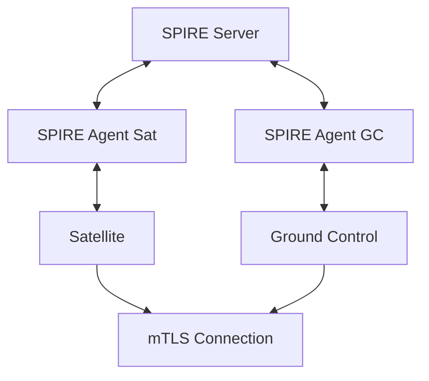

# Harbor Satellite Quick Start Guide

Harbor Satellite extends Harbor container registry to edge computing environments. This guide helps you get started with the authentication method that fits your use case.

## Prerequisites

Before you begin, ensure you have:

- A **Harbor registry instance** with the satellite adapter installed. You can find it in the [harbor-next satellite branch](https://github.com/container-registry/harbor-next/tree/satellite).
- **Credentials** with permission to create robot accounts in the registry

- The latest version of **Dagger** installed. [Download and install Dagger](https://docs.dagger.io/install).
- (Optional) **Docker** and **Docker Compose** for non-Dagger setups. [Install Docker](https://docs.docker.com/get-docker/).

## Step 1: Configure Ground Control
```bash
HARBOR_USERNAME=admin
HARBOR_PASSWORD=Harbor12345
HARBOR_URL=http://localhost:8080

PORT=9090
ADMIN_PASSWORD=SecurePass123
SESSION_DURATION_HOURS=24
LOCKOUT_DURATION_MINUTES=15

# Password Policy (optional)
PASSWORD_MIN_LENGTH=8
PASSWORD_MAX_LENGTH=128
PASSWORD_REQUIRE_UPPERCASE=true
PASSWORD_REQUIRE_LOWERCASE=true
PASSWORD_REQUIRE_NUMBER=true
PASSWORD_REQUIRE_SPECIAL=false

DB_HOST=127.0.0.1 # For Dagger use DB_HOST=pgservice
DB_PORT=5432
DB_DATABASE=groundcontrol
DB_USERNAME=postgres
DB_PASSWORD=password
```

> **Note:** By default, passwords must be at least 8 characters and contain uppercase, lowercase, and a number.
You can also directly edit this [example](ground-control/.env.example) available in the repository.

Ground Control is the central service that manages satellite configurations. Let’s set it up.

1. Clone the Harbor Satellite repository (if not already done):
   ```bash
   git clone https://github.com/container-registry/harbor-satellite.git
   cd harbor-satellite
   ```
2. Navigate to the `ground-control` directory:
   ```bash
   cd ground-control
   ```
3. Create a `.env` file using the provided example:
   ```bash
   cp .env.example .env
   ```
4. Edit the `.env` file with your configuration:

   ```env
   # Harbor Registry Credentials
   HARBOR_USERNAME=admin
   HARBOR_PASSWORD=Harbor12345
   HARBOR_URL=http://localhost:8080

   # Ground Control Settings
   PORT=9090
   ADMIN_PASSWORD=SecurePass123
   SESSION_DURATION_HOURS=24

   # Password Policy (optional)
   PASSWORD_MIN_LENGTH=8
   PASSWORD_REQUIRE_UPPERCASE=true
   PASSWORD_REQUIRE_LOWERCASE=true
   PASSWORD_REQUIRE_NUMBER=true
   ```

   > **Note:** _Database settings are configured in docker-compose.yml. For Dagger, set `DB_HOST=pgservice`._
   > **Note:** _ADMIN_PASSWORD must meet the password policy requirements (default: 8+ chars with uppercase, lowercase, and number)._

## Step 2: Start Ground Control

Choose one of the following options to start Ground Control

### Option 1: Using Makefile (Recommended for Developers)

1. Start Ground Control in development mode with hot reloading:

   ```bash
   make dev
   ```

   > **Note:** This uses `docker-compose.dev.yml` with volume mounts and Air for hot reloading, avoiding rebuilds on code changes.

2. Start Ground Control in production mode:

   ```bash
   make prod
   ```

3. Stop Ground Control:

   ```bash
   make stop
   ```

4. View logs:

   ```bash
   make logs
   ```

### Option 2: Using Docker Compose (Recommended for End Users)

1. Start Ground Control:

   ```bash
   docker compose up
   ```

   > **Tip:** _Use `-d` to run in detached mode. Verify the service is running with `docker ps`._

### Option 3: Build and Run Binary (Alternative for End Users)

1. Build the Ground Control binary:

   ```bash
   dagger call build-dev --platform "linux/amd64" --component "ground-control" export --path=./gc-dev
   ```

2. Run the binary:

   ```bash
   ./gc-dev
   ```

### Option 4: Using Dagger (Recommended for Developers)

1. Start Ground Control with Dagger:

   ```bash
   dagger call run-ground-control up
   ```

## Step 3: Verify Ground Control Health

Check if Ground Control is running

   ```bash
   curl http://localhost:9090/health
   ```

A `200 OK` response indicates Ground Control is healthy.

## Step 4: Login to Ground Control

Authenticate with the admin credentials to get a session token:

```bash
curl -X POST http://localhost:9090/login \
  -H "Content-Type: application/json" \
  -d '{
    "username": "admin",
    "password": "SecurePass123"
  }'
```

Save the token from the response for subsequent API calls:

```bash
export TOKEN="<token-from-response>"
```

> **Note:** The Bearer token is valid for 24 hours by default. Configure `SESSION_DURATION_HOURS` in `.env` to change this.

## Step 5: Create a Group for Artifacts

A **group** is just a set of images that the satellite needs to replicate from the upstream registry. It also contains information about all the artifacts present in it.

> **Note:** _You must modify the body given below according to your registry._

Use the following `curl` command to create a group. Modify the JSON body to match your registry and artifacts:

```bash
curl -X POST http://localhost:9090/groups/sync \
  -H "Content-Type: application/json" \
  -H "Authorization: Bearer $TOKEN" \
  -d '{
    "group": "group1",
    "registry": "http://localhost:8080",
    "artifacts": [
      {
        "repository": "library/alpine",
        "tag": ["latest"],
        "type": "docker",
        "digest": "sha256:5a6ee6c36824d527a0fe91a2a7c160c2e286bbeae46cd931c337ac769f1bd930",
        "deleted": false
      }
    ]
  }'
```

> **Note:** _Replace `repository`, `tag`, and `digest` with your artifact details. Use `docker inspect` or Harbor's UI to find the digest._

## Step 6: Configure the Satellite

Now you need to create a config artifact for the satellite. An example is given [example](https://github.com/container-registry/harbor-satellite/blob/main/examples/config.json). This artifact tells the satellite where the ground control is located and defines how and when to replicate artifacts from it. It also includes details about the local OCI-compliant registry, specified separately under its own field.



- Zero-trust, certificate-based identity
- Automatic certificate rotation
- Multiple attestation methods: join token, X.509 certificate, TPM
- No shared secrets between components

[Get started with SPIFFE/SPIRE](deploy/quickstart/README.md)

## Comparison

| | Token-based ZTR | SPIFFE/SPIRE |
|---|---|---|
| Setup complexity | Low | Medium |
| Infrastructure | Ground Control only | Ground Control + SPIRE Server + Agents |
| Authentication | One-time token | mTLS with X.509 SVIDs |
| Certificate rotation | N/A | Automatic |
| Best for | Dev, testing, small deployments | Production, fleet-scale deployments |

## Further Reading

- [Architecture overview](docs/architecture/README.md)
- [SPIFFE quickstart guide](deploy/quickstart/spiffe/README.md)
- [ADR: Ground Control authentication](docs/decisions/0004-ground-control-authentication.md)
- [ADR: SPIFFE identity and security](docs/decisions/0005-spiffe-identity-and-security.md)

## Need Help?

- Explore the [Harbor Satellite documentation](https://docs.goharbor.io).
- Join the [Harbor community](https://community.goharbor.io) for support.
- Open an issue on GitHub: https://github.com/container-registry/harbor-satellite/issues
