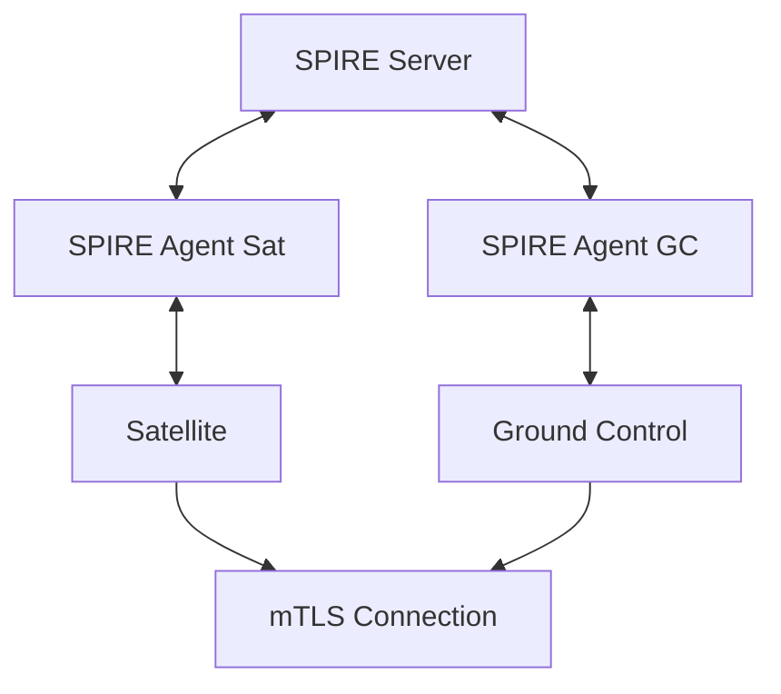

# Harbor Satellite Quick Start Guide

Harbor Satellite extends Harbor container registry to edge computing environments. This guide helps you get started with the authentication method that fits your use case.

## Prerequisites

- A Harbor registry instance with the satellite adapter installed. See [harbor-next](https://github.com/container-registry/harbor-next/tree/satellite).
- Credentials with permission to create robot accounts in the registry.
- [Task](https://taskfile.dev/installation/) installed.
- (Optional) [Docker](https://docs.docker.com/get-docker/) and Docker Compose.

## Choose Your Authentication Method

Harbor Satellite supports two authentication approaches for satellites to register with Ground Control.

### Token-based ZTR (Development and Testing)

Simple one-time token authentication. An admin registers a satellite via the Ground Control API and receives a token. The satellite uses this token to bootstrap itself.

- No additional infrastructure required
- Good for local development, CI/CD, and quick testing
- Token is single-use with a configurable TTL

[Get started with Token-based ZTR](deploy/no-spiffe/quickstart.md)

### SPIFFE/SPIRE (Recommended for Production)

Cryptographic identity using X.509 certificates via the SPIFFE framework and SPIRE runtime. Satellites authenticate to Ground Control using mutual TLS with automatically rotated certificates.



- Zero-trust, certificate-based identity
- Automatic certificate rotation
- Multiple attestation methods: join token, X.509 certificate, TPM
- No shared secrets between components

[Get started with SPIFFE/SPIRE](deploy/quickstart/README.md)

## Comparison

| | Token-based ZTR | SPIFFE/SPIRE |
|---|---|---|
| Setup complexity | Low | Medium |
| Infrastructure | Ground Control only | Ground Control + SPIRE Server + Agents |
| Authentication | One-time token | mTLS with X.509 SVIDs |
| Certificate rotation | N/A | Automatic |
| Best for | Dev, testing, small deployments | Production, fleet-scale deployments |

## Further Reading

- [Architecture overview](docs/architecture/README.md)
- [SPIFFE quickstart guide](deploy/quickstart/spiffe/README.md)
- [ADR: Ground Control authentication](docs/decisions/0004-ground-control-authentication.md)
- [ADR: SPIFFE identity and security](docs/decisions/0005-spiffe-identity-and-security.md)

## Registry Data Directory

The satellite stores registry data in a configurable location. By default, it uses a `zot` subdirectory inside the configuration directory (`~/.config/satellite/zot`).

You can override the storage location using:

**Command-line flag:**
```bash
./bin --token "<your-token>" --ground-control-url "http://127.0.0.1:8080" --registry-data-dir "/custom/path"
```

**Environment variable:**
```bash
export REGISTRY_DATA_DIR="/custom/path"
./bin --token "<your-token>" --ground-control-url "http://127.0.0.1:8080"
```

The flag takes precedence over the environment variable, which takes precedence over the default path.
## Need Help?

- Explore the [Harbor Satellite documentation](https://docs.goharbor.io).
- Join the [Harbor community](https://community.goharbor.io) for support.
- Open an issue on GitHub: https://github.com/container-registry/harbor-satellite/issues
