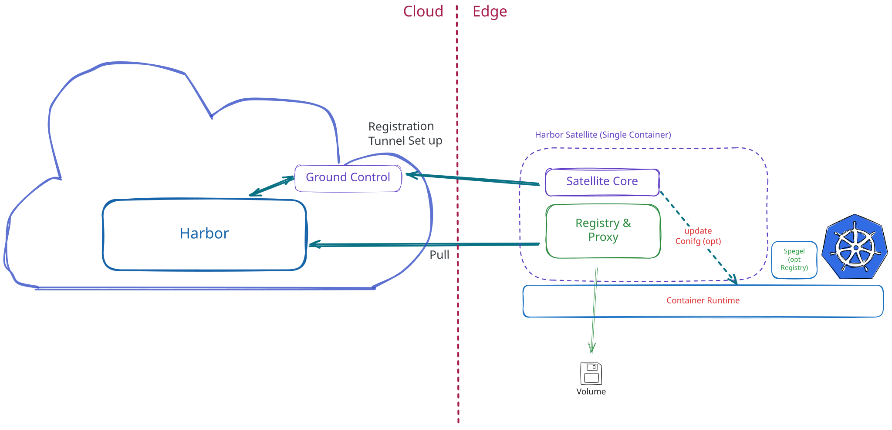
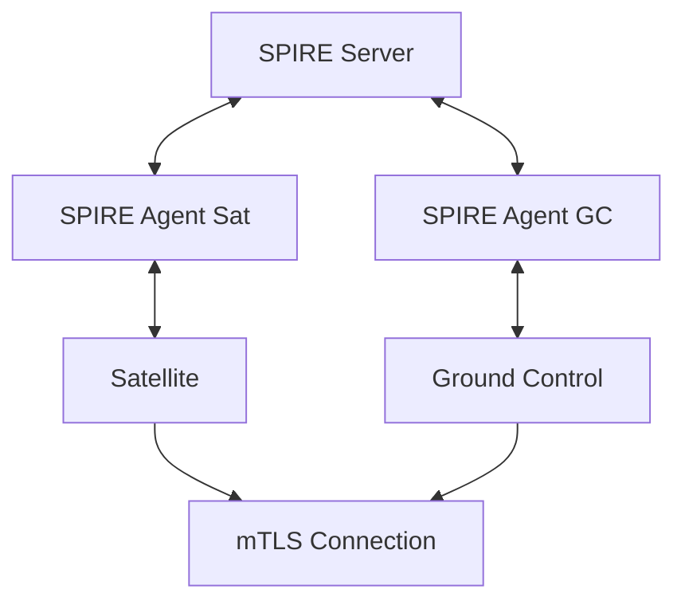
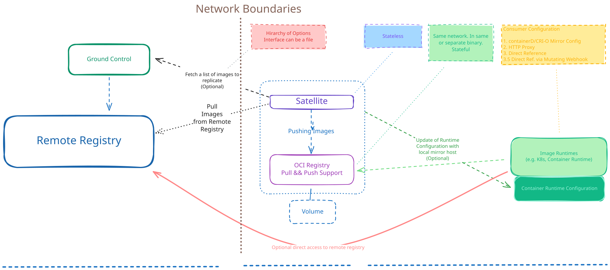
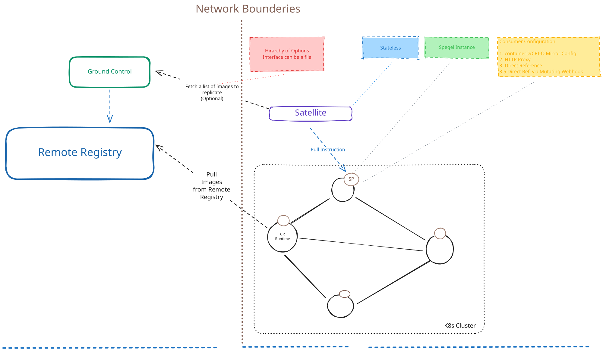
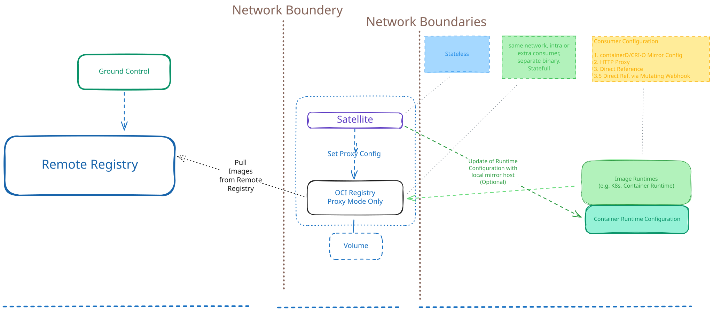

# Harbor Satellite: Container Artifacts at the Edge

[](LICENSE)

Harbor Satellite brings your central [Harbor](https://goharbor.io) registry to edge and air-gapped locations. A small agent at each site keeps a local copy of exactly the artifacts that site is assigned, while Ground Control manages the whole fleet from one place: which sites exist, what each one should hold, and whether it is in sync.

It is built for platform and engineering teams who run containers outside the data center and need a controlled, auditable way to get software there.

**Website and docs:** [satellite.container-registry.com](https://satellite.container-registry.com/)

## Is This For You?

Harbor Satellite fits if you operate containers in places like:

- Retail stores, branches, factories, or warehouses running a small cluster per site
- Ships, trains, vehicles, remote or mobile sites with intermittent connectivity
- Telco cell sites and far-edge compute with thousands of locations
- Air-gapped or highly isolated networks with restricted ingress/egress
- Multi-region setups that need images close to workloads

And you are running into problems like:

- Pods fail to start because the central registry is unreachable
- The same image is pulled over a thin WAN link once per node, per site
- There is no single view of which image versions are present at which site
- Running and upgrading a full registry at every location is not operationally feasible
- Edge devices need registry access without hand-managed credentials

## What You Get

| | |
|---|---|
| **Desired-state replication** | Define groups of artifacts centrally and assign them to sites. Each satellite pulls exactly its assigned artifacts from Harbor and keeps them in sync. |
| **Local copies that survive outages** | Replicated artifacts persist on local disk. When Harbor or Ground Control is unreachable, existing content stays and sync resumes when the link returns. |
| **Fleet visibility** | Satellites send periodic heartbeats with sync status and optional CPU, memory and storage metrics. Ground Control lists active and stale satellites. |
| **Zero-touch onboarding** | Register with a one-time token, or with a SPIFFE/SPIRE identity over mTLS (join token, X.509 PoP, or SSH PoP attestation). Ground Control provisions a Harbor robot account per satellite. |
| **Audit logging** | Security-relevant events from Ground Control and satellites to syslog or OpenTelemetry. See the [audit logging guide](docs/guides/audit-logging.md). |
| **Runtime integration** | With a BYO registry, the satellite configures containerd, CRI-O, Podman, or Docker to use it as a mirror with upstream fallback. |
| **Small footprint** | Single binary, unattended operation. Linux builds for amd64, arm64 and more; container images for amd64, arm64, ppc64le, s390x and riscv64. |
| **API and CLI** | Ground Control has an OpenAPI 3 spec ([`spec/`](spec/)) and a `groundcontrol` CLI. |

## How It Works



<p align="center"><em>Basic Harbor Satellite Diagram</em></p>

1. You define **groups** of artifacts (repository, tag, digest) and **configs** in Ground Control, then assign them to satellites.
2. A satellite **registers** with Ground Control, either with a one-time token or with a SPIFFE identity over mTLS, and receives Harbor robot credentials.
3. Ground Control publishes each satellite's **desired state** to Harbor. The satellite fetches it and **replicates** the listed artifacts from Harbor into its local store.
4. Workloads consume the artifacts through one of the [delivery modes](#getting-artifacts-to-workloads).
5. The satellite **reports status** back to Ground Control, giving you a fleet-wide view of what is present where.

### Components

| Component | Runs in | Role |
|---|---|---|
| **Harbor** | Cloud | Central source of truth for all artifacts. Standard Harbor v2 API. |
| **Ground Control** | Cloud | Fleet management: onboarding, groups, configs, credentials, status. Separate service backed by PostgreSQL. |
| **Satellite** | Edge | Registers, syncs desired state, replicates artifacts, optionally configures the container runtime |
| **SPIRE** (optional) | Cloud and edge | Issues X.509 identities for mTLS between satellites and Ground Control |

### Getting Artifacts to Workloads

| Mode | How | Status |
|---|---|---|
| **Local OCI store** (default) | Artifacts are written to an OCI image layout on disk (`<config-dir>/oci`, managed with ORAS). The satellite does not expose a registry endpoint in this mode. | Available |
| **BYO registry** | The satellite replicates into a registry you run at the site (for example `registry:2`). Workloads pull from it, and container runtimes can be configured to mirror through it. | Available |
| **Direct delivery** | For k3s and RKE2, the satellite writes image tarballs into the node's image import directory. | Experimental |
| **Transparent proxy** | The satellite serves artifacts from its local store and upstream as an OCI registry, with policy enforcement ([ADR-0009](docs/decisions/0009-transparent-oci-registry-proxy.md)). | In progress |

## Getting Started

Prerequisites:

- A Harbor v2 instance and credentials that can create projects and robot accounts
- Docker and Docker Compose for the compose-based quickstarts

Pick the path that matches where you are:

| Goal | Start here |
|---|---|
| Try it locally, dev or test | [Token-based quickstart](examples/deploy/no-spiffe/quickstart.md) |
| Production with zero-trust identity | [SPIFFE/SPIRE quickstarts](examples/deploy/README.md) |
| Install binaries, containers, Helm | [Installation docs](https://satellite.container-registry.com/docs/installation/) |
| Run Ground Control | [Ground Control guide](docs/guides/ground-control.md) |
| Reference setup on k3s | [k3s reference architecture](docs/guides/k3s-reference-architecture.md) |

Published container images: `registry.goharbor.io/harbor-satellite/satellite` and `registry.goharbor.io/harbor-satellite/ground-control`. Binaries and packages are on the [releases page](https://github.com/container-registry/harbor-satellite/releases).

### Choose Your Authentication Method

#### Token-based ZTR (Development and Testing)

An admin creates the satellite through the Ground Control API and receives a one-time token. The satellite uses it to bootstrap itself.

- No additional infrastructure required
- Good for local development, CI/CD, and quick testing
- Token is single-use and expires after 24 hours

#### SPIFFE/SPIRE (Recommended for Production)

Cryptographic identity using X.509 SVIDs via the SPIFFE framework and SPIRE runtime. Satellites authenticate to Ground Control using mutual TLS with automatically rotated certificates.



- Certificate-based identity between satellites and Ground Control, with automatic rotation
- Attestation methods: join token, X.509 PoP, SSH PoP. The embedded SPIRE server in Ground Control supports join tokens only.
- Harbor pulls still use the per-satellite robot account that Ground Control provisions

| | Token-based ZTR | SPIFFE/SPIRE |
|---|---|---|
| Setup complexity | Low | Medium |
| Infrastructure | Ground Control only | Ground Control + SPIRE Server + Agents |
| Satellite to Ground Control | One-time token, then robot credentials | mTLS with X.509 SVIDs |
| Satellite to Harbor | Robot account | Robot account |
| Best for | Dev, testing, small deployments | Production, fleet-scale deployments |

### Running the Satellite

The satellite requires the Ground Control URL, the Harbor registry URL as reachable from the satellite, and a token unless SPIFFE is enabled:

```bash
harbor-satellite \
  --ground-control-url https://gc.example.com \
  --harbor-registry-url https://harbor.example.com \
  --token "<your-token>"
```

Every flag has an environment variable equivalent (`GROUND_CONTROL_URL`, `HARBOR_REGISTRY_URL`, `TOKEN`, ...), except `--mirrors`, `--json-logging` and `--fallback-only`.

### OCI Store Directory

By default, the satellite replicates content into an OCI image layout at `<config-dir>/oci`: `~/.config/satellite/oci` on Linux, `~/Library/Application Support/satellite/oci` on macOS. Override the location with `--registry-data-dir` or `REGISTRY_DATA_DIR`. The flag takes precedence over the environment variable, which takes precedence over the default path.

### BYO (Bring Your Own) Registry

To replicate into a registry at the site instead of the local OCI layout:

| CLI Flag | Env Var | Description |
|---|---|---|
| `--byo-registry` | `BYO_REGISTRY` | Enable BYO mode |
| `--registry-url` | `REGISTRY_URL` | External registry URL (required if BYO) |
| `--registry-username` | `REGISTRY_USERNAME` | External registry username (optional) |
| `--registry-password` | `REGISTRY_PASSWORD` | External registry password (optional) |

A Docker Compose setup with `registry:2` as a sidecar is available:

```bash
task byo-up    # start satellite + registry:2
task byo-down  # stop and cleanup
```

### Container Runtime Configuration

In BYO mode the satellite can point local runtimes at the site registry as a mirror, with fallback to upstream. Without BYO these options print a warning and change nothing.

```bash
harbor-satellite ... --byo-registry --registry-url http://127.0.0.1:5000 \
  --mirrors=containerd:docker.io,quay.io --mirrors=podman:docker.io
```

| Runtime | Config location | Notes |
|---|---|---|
| containerd | `/etc/containerd/certs.d/<registry>/hosts.toml` | Mirrors any registry, sets `config_path` in `config.toml` |
| CRI-O | `/etc/containers/registries.conf` | Mirrors any registry, shared with Podman |
| Podman | `/etc/containers/registries.conf` | Mirrors any registry |
| Docker | `/etc/docker/daemon.json` | docker.io only, use `--mirrors=docker:true` |

Updating runtime config requires root. Docker needs a service restart to apply changes.

### Direct Delivery (Experimental)

On k3s and RKE2 nodes, `--direct-delivery` (`DIRECT_DELIVERY`) writes replicated images as tarballs into `/var/lib/rancher/k3s/agent/images` or `/var/lib/rancher/rke2/agent/images`, where the runtime imports them. Use `--image-dir` (`IMAGE_DIR`) for a custom path.

## Distribution Patterns

### Pattern 1: Replicate from a remote registry to the edge (implemented)

The satellite copies complete OCI artifact graphs from Harbor to the site, either into its local OCI layout or into a BYO registry. Content is pre-positioned during connected periods and stays available when the link drops.

_Example: IoT devices at a site with limited connectivity need to run containerized workloads but cannot reliably reach central Harbor. The satellite pre-positions the required images, and a BYO registry or direct delivery makes them available to workloads._


<p align="center"><em>Use case #1</em></p>

### Pattern 2: Replicate to a local Spegel registry (in progress)

The satellite sends pull instructions to [Spegel](https://github.com/spegel-org/spegel) instances running on each node of a Kubernetes cluster. One node pulls from the remote registry and shares the image peer-to-peer with the other nodes, so each node does not pull individually. Network boundaries are the same as in Pattern 1.

_Example: a larger edge site where a single local registry cannot keep up with demand. Images are spread across nodes, and the satellite tells the cluster when, where, and what to pull._


<p align="center"><em>Use case #2</em></p>

### Pattern 3: Proxy through the local store (in progress)

The satellite acts as a transparent OCI registry proxy. It enforces policy and serves allowed content from upstream or from its local OCI layout ([ADR-0009](docs/decisions/0009-transparent-oci-registry-proxy.md)).

_Example: the central side cannot produce a list of images for a site ahead of time. The satellite forwards requests upstream and keeps the results, so images stay available without a pre-compiled list._


<p align="center"><em>Use case #3</em></p>

## Why Not Run Harbor at Every Site?

- Harbor is not designed for edge devices: multiple processes, a database, no unattended mode.
- Harbor can behave unpredictably with poor or no connectivity.
- Operating hundreds or thousands of Harbor instances is not feasible.
- A plain registry mirror does not give you central control over which artifacts are present where.

Harbor Satellite keeps Harbor as the central source of truth and puts only what is needed at the edge: a single process that keeps its local content independently of the central instance and catches up when connectivity returns.

## Security

- Satellites authenticate to Ground Control with a single-use token or a SPIFFE X.509 SVID over mTLS. The heartbeat endpoint requires either the SVID or the satellite's robot credentials.
- Ground Control provisions a Harbor robot account per satellite. Robot accounts expire after `ROBOT_DURATION_DAYS` (default 30).
- Ground Control uses Argon2id password hashing, account lockout, and rate limiting on login and registration endpoints.
- Satellite config at rest can be encrypted with AES-256-GCM, bound to the device fingerprint (`app_config.encrypt_config`, Linux only, off by default).
- Container images are signed with Cosign; release archives ship with SBOMs.

Design details: [ADR-0004 Ground Control authentication](docs/decisions/0004-ground-control-authentication.md), [ADR-0005 SPIFFE identity and security](docs/decisions/0005-spiffe-identity-and-security.md).

## Status and Roadmap

Harbor Satellite is in active development. Implemented today: Ground Control with API and CLI, token and SPIFFE registration, desired-state replication into a local OCI store or BYO registry, status reporting, audit logging, runtime mirror configuration (BYO), and experimental direct delivery for k3s/RKE2.

In progress:

- Transparent OCI registry proxy (Pattern 3, [ADR-0009](docs/decisions/0009-transparent-oci-registry-proxy.md)), which will let workloads pull from the satellite without a BYO registry
- Spegel-based distribution (Pattern 2)

Compatibility with every container registry and edge device cannot be guaranteed. If you are evaluating Harbor Satellite for your environment, [reach out](https://container-registry.com/contact/).

## Documentation

- [Project website](https://satellite.container-registry.com/): [overview](https://satellite.container-registry.com/docs/overview/), [architecture](https://satellite.container-registry.com/docs/architecture/), [installation](https://satellite.container-registry.com/docs/installation/)
- [Guides](docs/guides/): Ground Control, audit logging, k3s reference architecture
- [Architecture decision records](docs/decisions/)
- [Contributing](CONTRIBUTING.md) and [Taskfile reference](taskfiles/README.md)
- Website source: [`website/`](website/README.md)

## Community, Discussion, Contribution, and Support

Harbor Satellite is part of the Harbor CNCF project.

- [#harbor-satellite on CNCF Slack](https://cloud-native.slack.com/archives/C06NE6EJBU1) (request an invite at [slack.cncf.io](https://slack.cncf.io/))
- [GitHub issues](https://github.com/container-registry/harbor-satellite/issues)

## License

[Apache License 2.0](LICENSE)
