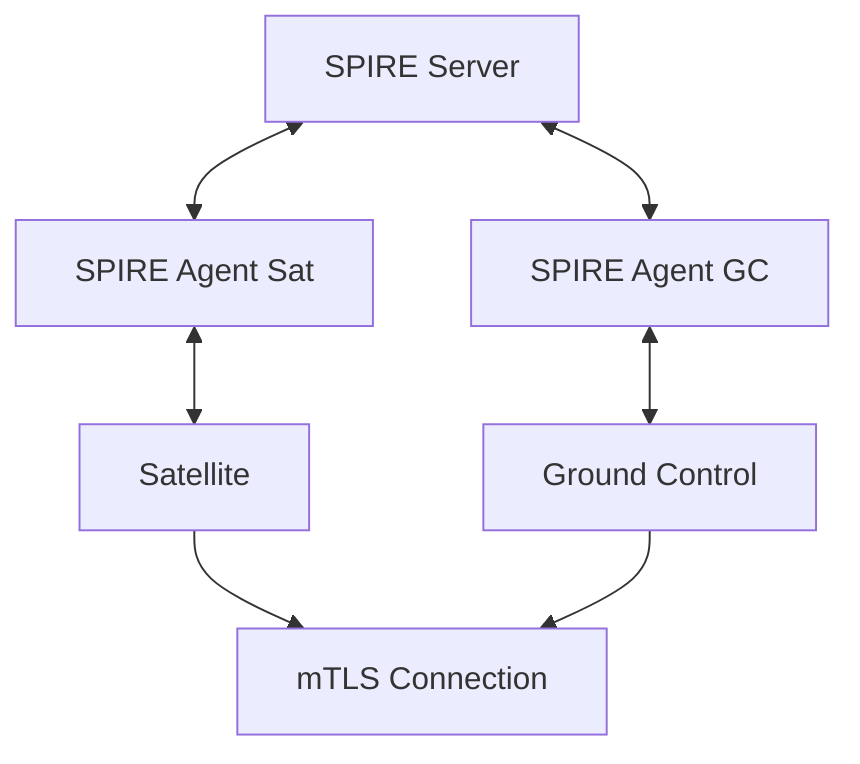

# Harbor Satellite Quickstart

## Deployment Options

### With SPIFFE (Zero-Trust Identity)

Uses SPIFFE/SPIRE for cryptographic identity verification, mTLS, and automatic certificate rotation.

See [spiffe/](spiffe/) for all options.

| Attestation Method | Description | Guide |
|-------------------|-------------|-------|
| Join Token | One-time tokens, simplest setup | [spiffe/join-token/](spiffe/join-token/) |
| X.509 PoP | Pre-provisioned X.509 certificates | [spiffe/x509pop/](spiffe/x509pop/) |
| SSH PoP | SSH host certificates | [spiffe/sshpop/](spiffe/sshpop/) |

### Without SPIFFE

Token-based authentication without SPIFFE/SPIRE.

See [no-spiffe quickstart](../no-spiffe/quickstart.md).

## Common Files

- `common/docker-compose.base.yml` - Shared PostgreSQL

## Architecture



## Endpoints

| Component | Port | Description |
|-----------|------|-------------|
| SPIRE Server | 8081 | Central identity authority |
| Ground Control | 8080 | Fleet management API |
| PostgreSQL | 5432 | Ground Control database |

## Troubleshooting

### SPIRE Server not starting
```bash
docker logs spire-server
```

### Agent not attesting
```bash
docker logs spire-agent-gc
docker exec spire-server /opt/spire/bin/spire-server agent list \
    -socketPath /tmp/spire-server/private/api.sock
```

### Workload not receiving SVID
```bash
docker exec spire-server /opt/spire/bin/spire-server entry show \
    -socketPath /tmp/spire-server/private/api.sock
```
