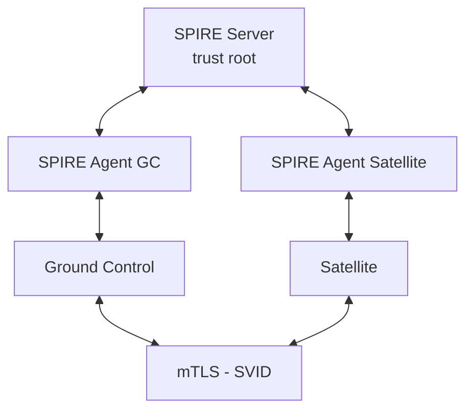

# SPIFFE/SPIRE Quickstart

Harbor Satellite uses SPIFFE for zero-trust identity between Ground Control and Satellites. SPIRE provides the runtime that issues and rotates X.509 SVIDs for mTLS.

## Attestation Methods

Choose the method that fits your environment:

| Method | Description | Use Case |
|--------|-------------|----------|
| [join-token](join-token/) | One-time tokens from SPIRE server | Development, testing, CI/CD |
| [x509pop](x509pop/) | Pre-provisioned X.509 certificates | Production, existing PKI |
| [sshpop](sshpop/) | SSH host certificates | Environments with SSH CA infrastructure |

## Deployment Modes

### External SPIRE (Phase 1 - Available Now)

SPIRE server and agents run as separate containers alongside GC and satellite. Each quickstart has an `external/` directory with separate `gc/` and `sat/` setups.

### Embedded SPIRE (Phase 2 - Planned)

SPIRE server/agent embedded directly in GC and satellite binaries. Each quickstart has an `embedded/` directory with a placeholder.

## Quick Start

Pick an attestation method and run:

```bash
# Example: join-token
cd join-token/external/gc && ./setup.sh
cd ../sat && ./setup.sh
```

## Architecture



## Directory Structure

```
spiffe/
  join-token/
    README.md              # Full quickstart guide
    external/
      gc/                  # Ground Control + SPIRE server + agent
      sat/                 # Satellite + SPIRE agent
    embedded/              # Phase 2 placeholder
  x509pop/
    README.md
    external/
      gc/
      sat/
    embedded/
  sshpop/
    README.md
    external/
      gc/
      sat/
    embedded/
```
