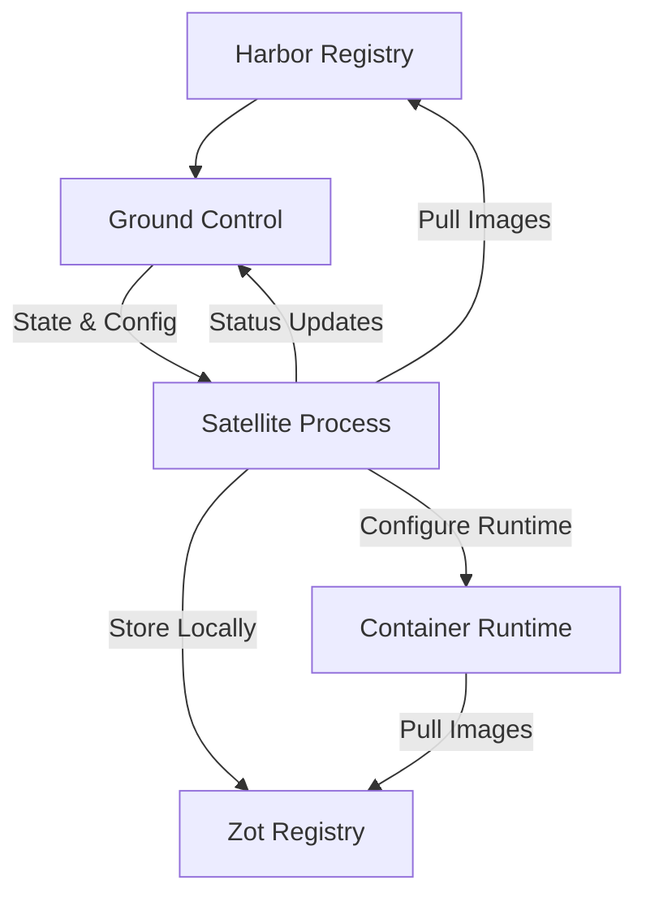
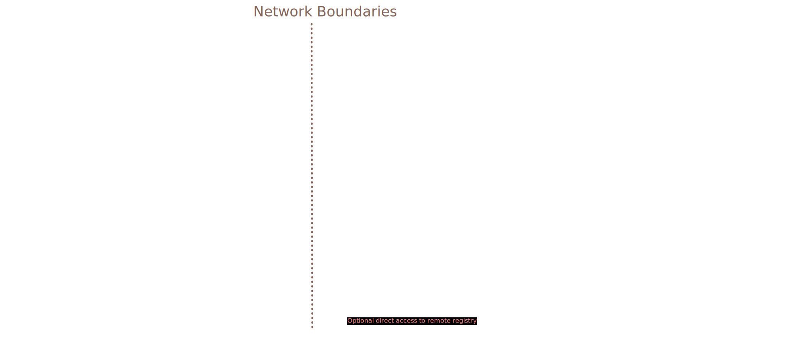
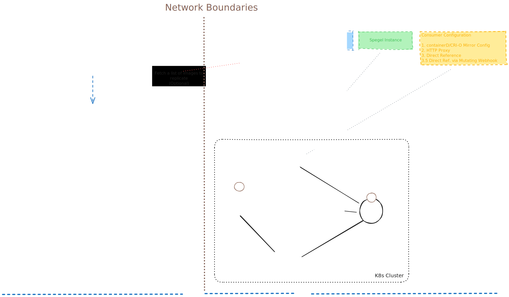
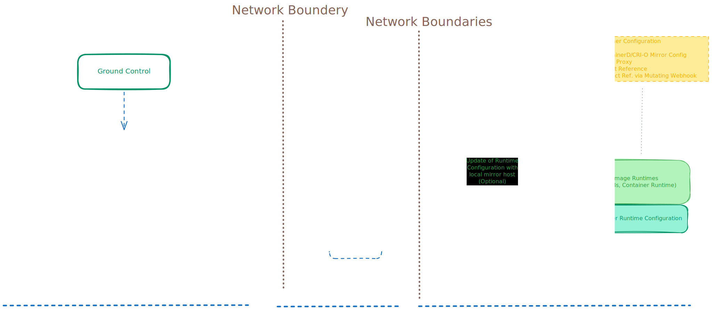

# Harbor Satellite Architecture

Harbor Satellite extends Harbor container registry capabilities to edge computing environments through a distributed architecture that ensures reliable container image availability even in challenging connectivity conditions.

## Architecture Overview

This document provides a high-level overview of Harbor Satellite architecture. For detailed component documentation, see the [architecture directory](architecture/):

- [System Overview](architecture/overview.md) - Detailed system architecture
- [Component Details](architecture/components.md) - Individual component specifications
- [Use Cases](architecture/use-cases.md) - Deployment patterns and scenarios
- [Design Decisions](decisions/) - Architecture Decision Records (ADRs)

## Core Components

### Cloud Side (Central)

#### Ground Control
Central management service that orchestrates satellite fleets:
- **Device Management** - Registration and grouping of edge locations
- **State Management** - Desired vs actual state enforcement
- **Configuration Distribution** - Centralized policy and config management
- **Monitoring & Health** - Fleet-wide visibility and health checks

#### Harbor Registry (Extended)
Central Harbor instance with satellite extension:
- **Artifact Management** - Source of truth for container images
- **Robot Account Integration** - Authentication for satellite communication
- **Policy Engine** - Replication rules and access controls
- **Audit & Compliance** - Tracking and governance

### Edge Side (Satellite)

#### Satellite Process
Lightweight agent running on edge locations:
- **State Synchronization** - Pulls desired state from Ground Control  
- **Image Replication** - Fetches and stores required container images
- **Runtime Integration** - Configures container runtimes for local registry
- **Health Reporting** - Status and telemetry back to Ground Control

#### Local Registry (Zot)
OCI-compliant registry for on-site image storage:
- **Image Storage** - Local cache of required container images
- **Registry API** - Standard OCI Distribution API
- **Performance Optimization** - Fast local image serving
- **Offline Operation** - Continues serving during network outages

## Communication Flow

## Key Architecture Principles

### Edge-First Design
- **Autonomous Operation** - Satellites function independently when disconnected
- **Minimal Resources** - Optimized for resource-constrained environments
- **Fault Tolerance** - Graceful degradation during network failures
- **Security** - Zero-trust identity and secure communication

### Declarative Management
- **Desired State** - Ground Control defines what images should be available
- **Reconciliation** - Satellites continuously sync to desired state
- **Idempotent Operations** - Safe to retry and re-run operations
- **Configuration as Code** - Versioned, auditable configuration management

### Scalable Fleet Management
- **Hierarchical Organization** - Groups and individual satellite management
- **Efficient Distribution** - Bandwidth-optimized image distribution
- **Centralized Visibility** - Fleet-wide monitoring and management
- **Heterogeneous Support** - Multiple architectures and deployment patterns

## Deployment Patterns

### Use Case 1: Registry Mirror with Local Fallback

Satellite replicates images from central Harbor to local Zot registry. Container runtimes are configured to prefer local registry with remote fallback.

### Use Case 2: P2P Distribution with Spegel

Satellite coordinates with Spegel for peer-to-peer image distribution across cluster nodes, reducing bandwidth and improving performance.

### Use Case 3: Transparent Proxy

Satellite operates in proxy mode, handling registry requests transparently and caching images locally for subsequent requests.

## Security Architecture

### Identity and Authentication
- **SPIFFE/SPIRE Integration** - Workload identity for zero-trust communication
- **Robot Accounts** - Harbor-managed service accounts for API access
- **Certificate Management** - Automated TLS certificate provisioning
- **Mutual TLS** - Encrypted communication between all components

### Network Security
- **Configurable Endpoints** - Flexible network topology support
- **Firewall Friendly** - Outbound-only connections from satellites
- **Air-Gap Support** - Offline operation capabilities

## Data Flow and State Management

### Configuration Distribution
1. **Policy Definition** - Administrators define image distribution policies in Harbor
2. **State Generation** - Ground Control generates desired state artifacts
3. **State Distribution** - Satellites pull state updates on configurable schedules
4. **Local Reconciliation** - Satellites ensure local state matches desired state

### Image Replication
1. **State Analysis** - Satellite compares local images with desired state
2. **Delta Calculation** - Identifies missing or outdated images
3. **Efficient Transfer** - Downloads only required image layers
4. **Local Storage** - Updates local Zot registry with new images
5. **Verification** - Validates image integrity and signatures

### Runtime Integration
1. **Mirror Configuration** - Updates container runtime mirror configs
2. **Host Configuration** - Modifies registry resolution (hosts.toml, registries.conf)
3. **Service Restart** - Signals runtime to reload configuration
4. **Fallback Handling** - Ensures fallback to remote registry when needed

## Next Steps

- **Deep Dive**: Read [detailed component architecture](architecture/overview.md)
- **Design Context**: Review [architecture decisions](decisions/README.md)
- **Deployment**: See [deployment guides](deployment/) for implementation
- **Configuration**: Check [configuration reference](configuration.md) for customization options

---

*For technical questions or architecture discussions, join [#harbor-satellite on CNCF Slack](https://cloud-native.slack.com/archives/C06NE6EJBU1)*