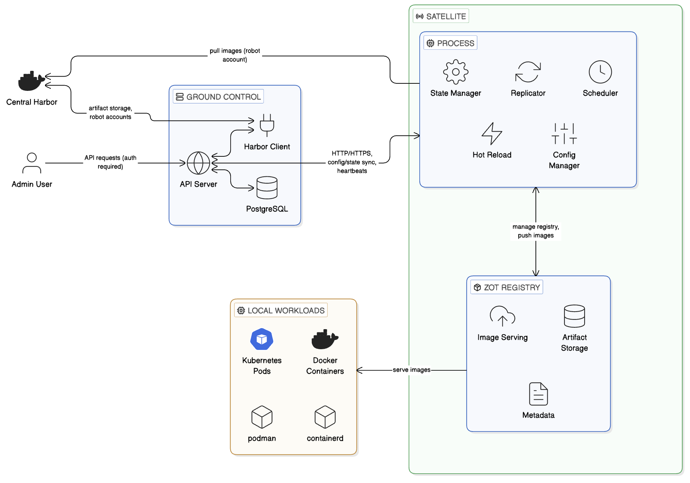

# Architecture Documentation

This document provides comprehensive architecture documentation for Harbor Satellite, including system design, component interactions, data flows, and deployment patterns.

## Table of Contents

- [Overview](#overview)
- [System Architecture](#system-architecture)
- [Components](#components)
- [Data Flow](#data-flow)
- [State Management](#state-management)
- [Authentication and Security](#authentication-and-security)
- [Deployment Patterns](#deployment-patterns)
- [Scalability and Performance](#scalability-and-performance)

## Overview

Harbor Satellite is a registry fleet management and artifact distribution solution that extends Harbor container registry to edge computing environments. It enables decentralized container registries at edge locations while maintaining centralized management and control.

### Key Design Principles

1. **Decentralization**: Independent operation at edge locations
2. **Resilience**: Local image availability even with network issues
3. **Centralized Management**: Single point of control via Ground Control
4. **Lightweight**: Minimal resource footprint at edge
5. **Security**: Token-based authentication and secure communication

## System Architecture

### High-Level Architecture


```
┌─────────────────────────────────────────────────────────────┐
│                    Harbor Registry                           │
│  (Central container registry with satellite extension)       │
└───────────────────────┬─────────────────────────────────────┘
                        │
                        │ Artifact Storage
                        │ Robot Account Management
                        ▼
┌─────────────────────────────────────────────────────────────┐
│                    Ground Control                            │
│  - Satellite Management                                      │
│  - Configuration Management                                  │
│  - State Orchestration                                       │
│  - API Server (Port 9090)                                    │
│  - PostgreSQL Database                                       │
└───────────────────────┬─────────────────────────────────────┘
                        │
                        │ HTTP/HTTPS
                        │ Configuration & State Sync
                        ▼
┌─────────────────────────────────────────────────────────────┐
│                    Satellite (Edge)                          │
│  - State Replication                                          │
│  - Artifact Synchronization                                  │
│  - Local Registry Management                                 │
│  - Container Runtime Integration                             │
│  - Health Reporting                                          │
└───────────────────────┬─────────────────────────────────────┘
                        │
                        │ Local Network
                        ▼
┌─────────────────────────────────────────────────────────────┐
│              Local Registry (Zot)                            │
│  - OCI Artifact Storage                                      │
│  - Image Serving                                             │
│  - Metadata Management                                       │
└───────────────────────┬─────────────────────────────────────┘
                        │
                        │ Container Pull
                        ▼
┌─────────────────────────────────────────────────────────────┐
│              Local Workloads                                 │
│  - Kubernetes Pods                                           │
│  - Docker Containers                                      │
│  - Containerd/Podman Containers                              │
└─────────────────────────────────────────────────────────────┘
```

## Components

### Ground Control

Ground Control is the central management component that orchestrates the Harbor Satellite system.

#### Responsibilities

- **Satellite Management**: Registration, configuration, and monitoring
- **Configuration Management**: Centralized configuration storage and distribution
- **State Orchestration**: Managing desired state for artifact distribution
- **User Management**: Authentication and authorization
- **Group Management**: Organizing artifacts into groups for distribution
- **Health Monitoring**: Tracking satellite status and health

#### Architecture

```
┌─────────────────────────────────────────┐
│         HTTP API Server                │
│  - RESTful API (Port 9090)             │
│  - Authentication Middleware            │
│  - Request Routing                      │
└──────────────┬──────────────────────────┘
               │
       ┌───────┴───────┐
       │               │
       ▼               ▼
┌─────────────┐  ┌─────────────┐
│  Database   │  │   Harbor    │
│ (PostgreSQL)│  │   Client    │
└─────────────┘  └─────────────┘
```

#### Key Features

- **Database**: PostgreSQL for persistent storage
- **Harbor Integration**: Creates robot accounts and manages artifacts
- **State Artifacts**: Stores configuration and state as OCI artifacts in Harbor
- **Session Management**: Token-based authentication with configurable expiration
- **Password Policy**: Configurable password requirements

### Satellite

The Satellite component runs at edge locations and manages local container images.

#### Responsibilities

- **State Replication**: Fetching desired state from Ground Control
- **Artifact Synchronization**: Pulling images from Harbor and pushing to local registry
- **Local Registry Management**: Managing embedded Zot registry or external registry
- **Container Runtime Integration**: Configuring CRIs to use local registry as mirror
- **Health Reporting**: Sending status updates to Ground Control
- **Configuration Hot Reload**: Applying configuration changes without restart

#### Architecture

```
┌─────────────────────────────────────────┐
│         Satellite Process               │
│  - State Manager                        │
│  - Replicator                           │
│  - Scheduler                            │
│  - Config Manager                       │
│  - Hot Reload Manager                 │
└──────────────┬──────────────────────────┘
       ┌────────┴────────┐
       │                 │
       ▼                 ▼
┌─────────────┐    ┌─────────────┐
│   Zot       │    │  Ground     │
│  Registry   │    │  Control    │
└─────────────┘    └─────────────┘
```

#### Key Features

- **Embedded Zot**: Default OCI-compliant registry
- **External Registry Support**: Can use existing registries
- **CRI Integration**: Automatic configuration of container runtimes
- **Hot Reload**: Configuration changes without restart
- **Metrics Collection**: CPU, memory, and storage metrics

### Local Registry (Zot)

Zot is an OCI-compliant container registry used as the local storage for images.

#### Responsibilities

- **Image Storage**: Storing container images and layers
- **Image Serving**: Serving images to local workloads
- **Metadata Management**: Managing image manifests and tags
- **Garbage Collection**: Cleaning up unused layers

#### Configuration

Zot configuration is embedded in the satellite configuration and supports:
- Storage configuration (root directory, GC settings)
- HTTP server configuration (address, port, TLS)
- Logging configuration
- Extension configuration

## Data Flow

### State Replication Flow

```
1. Satellite → Ground Control: Request state (periodic)
2. Ground Control → Harbor: Fetch state artifact
3. Ground Control → Satellite: Return state configuration
4. Satellite → Harbor: Pull images using robot account
5. Satellite → Local Registry: Push images to Zot
6. Satellite → Ground Control: Report status
```

### Configuration Update Flow

```
1. Admin → Ground Control: Update configuration via API
2. Ground Control → Harbor: Store config as OCI artifact
3. Ground Control → Database: Update config record
4. Satellite → Ground Control: Fetch updated config (periodic)
5. Satellite: Hot reload configuration
6. Satellite → Ground Control: Report config digest
```

### Image Pull Flow (Local Workload)

```
1. Workload → Local Registry: Pull image request
2. Local Registry → Workload: Serve image (if available)
3. If not available:
   - Workload → Upstream Registry: Pull image (fallback)
```

### Heartbeat Flow

```
1. Satellite → Ground Control: Send heartbeat
2. Ground Control → Database: Store status
3. Ground Control: Update last_seen timestamp
```

## State Management

### State Artifacts

State artifacts are OCI artifacts stored in Harbor that contain:
- **Group State**: List of artifacts to replicate
- **Satellite State**: Combined state for a satellite (multiple groups)
- **Config State**: Configuration for satellites

### State Structure

**Group State:**
```json
{
  "group": "group1",
  "registry": "http://localhost:8080",
  "artifacts": [
    {
      "repository": "library/alpine",
      "tag": ["latest"],
      "type": "docker",
      "digest": "sha256:...",
      "deleted": false
    }
  ]
}
```

**Satellite State:**
```json
{
  "states": [
    "https://harbor.example.com/satellite/group-state/group1/state:latest"
  ],
  "config": "config1"
}
```

### State Synchronization

1. **Periodic Sync**: Satellites fetch state at configurable intervals
2. **Change Detection**: Satellites compare digests to detect changes
3. **Incremental Updates**: Only changed artifacts are replicated
4. **Conflict Resolution**: Ground Control is the source of truth

## Authentication and Security

### Authentication Methods

1. **Session Tokens**: For admin/user API access
   - Obtained via `/login` endpoint
   - Stored in database with expiration
   - Invalidated on logout or password change

2. **Satellite Tokens (ZTR)**: For satellite registration
   - One-time use tokens
   - Exchanged for robot account credentials
   - Deleted after use

3. **Robot Accounts**: For Harbor registry access
   - Created per satellite
   - Scoped to specific projects
   - Managed by Ground Control

### Security Features

- **Password Policy**: Configurable password requirements
- **Account Lockout**: Automatic lockout after failed attempts
- **Token Expiration**: Configurable session duration
- **HTTPS Support**: TLS encryption for API communication
- **Network Isolation**: Edge locations can be air-gapped

## Deployment Patterns

### Basic Edge Registry

```
[Central Harbor] <-> [Ground Control] <-> [Satellite] <-> [Local Registry] <-> [Workloads]
```

**Use Cases:**
- Remote deployments
- Development environments
- Air-gapped environments
- Edge computing deployments

### Multi-Site Deployment

```
[Central Harbor] <-> [Ground Control]
                          │
        ┌─────────────────┼─────────────────┐
        │                 │                 │
   [Satellite 1]    [Satellite 2]    [Satellite 3]
        │                 │                 │
   [Site 1]          [Site 2]          [Site 3]
```

**Use Cases:**
- Multiple edge locations
- Global distribution
- Regional deployments

### Planned Deployment Patterns

#### Spegel Registry Pattern

```
[Central Harbor] <-> [Satellite] <-> [Spegel Nodes] <-> [Workloads]
```

**Features:**
- Peer-to-peer distribution
- Bandwidth optimization
- Cluster-wide caching

#### Proxy Registry Pattern

```
[Central Harbor] <-> [Satellite (Proxy)] <-> [Workloads]
```

**Features:**
- Request forwarding
- Access control
- Network isolation

## Scalability and Performance

### Scalability Considerations

- **Horizontal Scaling**: Multiple satellites per Ground Control
- **Database Scaling**: PostgreSQL can be scaled independently
- **Registry Scaling**: Zot supports horizontal scaling
- **Network Optimization**: Incremental sync reduces bandwidth

### Performance Optimizations

- **Incremental Sync**: Only changed artifacts are replicated
- **Local Caching**: Images cached at edge locations
- **Parallel Operations**: Multiple artifacts replicated concurrently
- **Compression**: Image layers are compressed
- **Deduplication**: Zot supports layer deduplication

### Resource Requirements

**Ground Control:**
- CPU: 1-2 cores
- Memory: 512MB - 1GB
- Storage: Depends on database size

**Satellite:**
- CPU: 1-2 cores
- Memory: 512MB - 2GB
- Storage: Depends on image cache size

**Zot Registry:**
- CPU: 1 core
- Memory: 256MB - 1GB
- Storage: Depends on image storage

## Related Documentation

- [Getting Started Guide](getting-started.md) - Initial setup
- [Configuration Reference](configuration.md) - Configuration options
- [API Reference](api-reference.md) - Ground Control API
- [Components Guide](architecture/components.md) - Detailed component documentation
- [Use Cases](architecture/use-cases.md) - Deployment patterns
