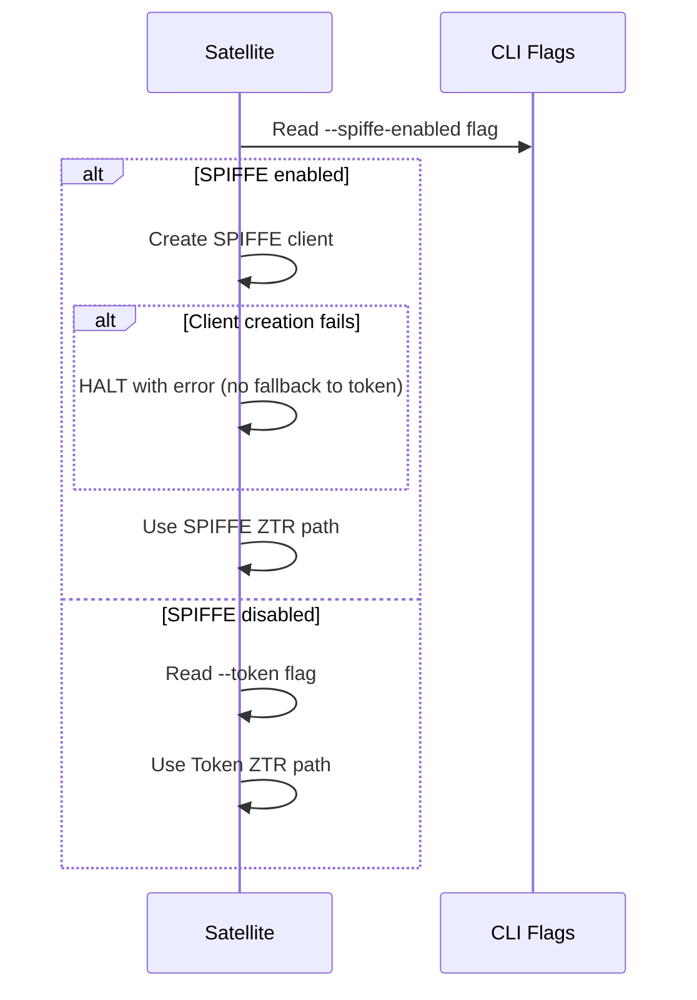
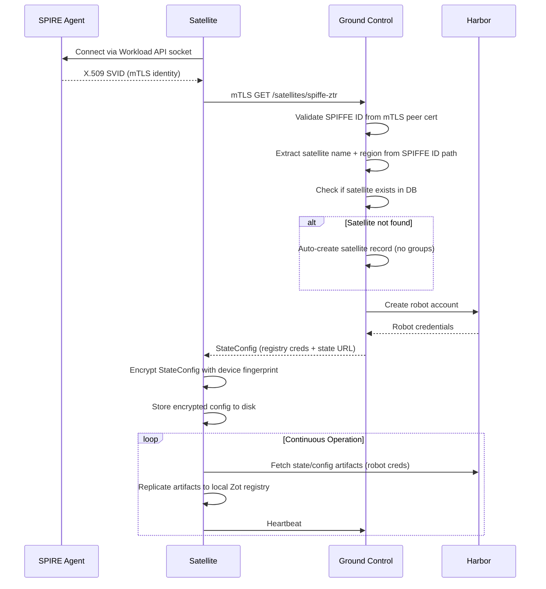
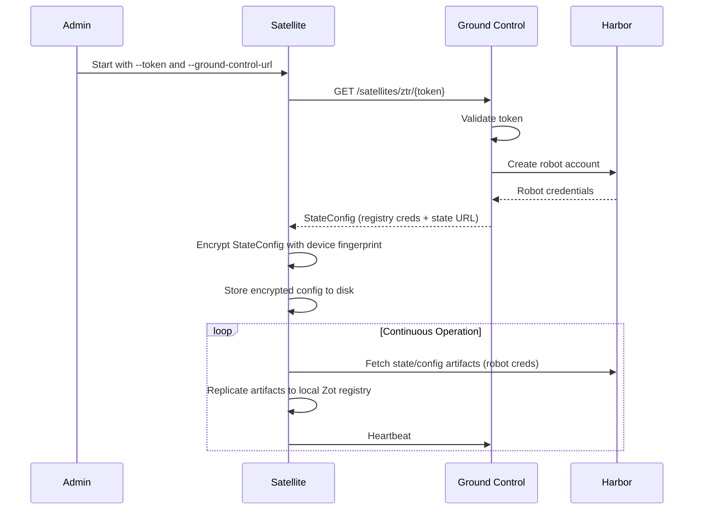
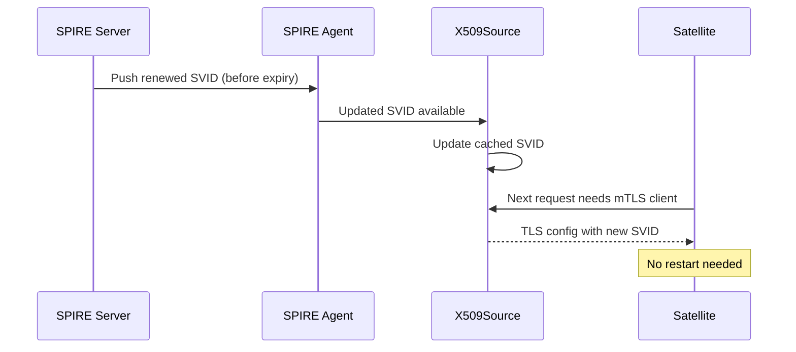
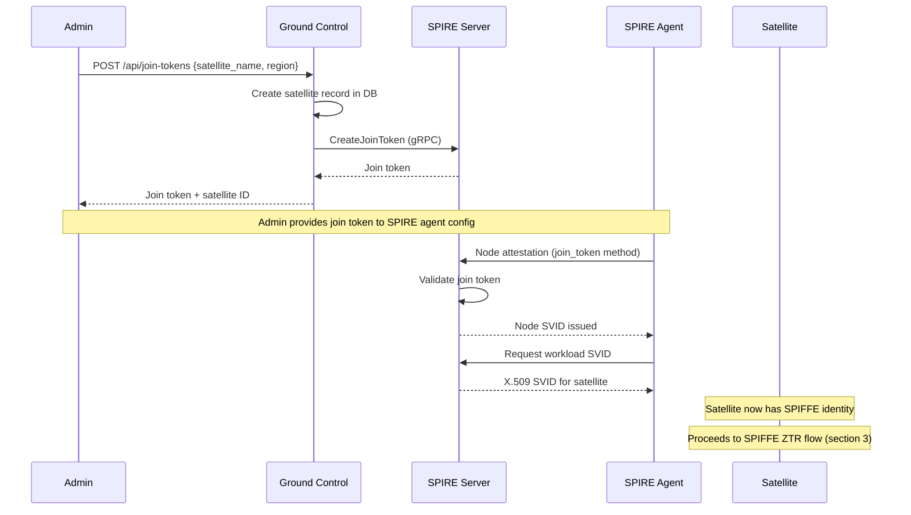
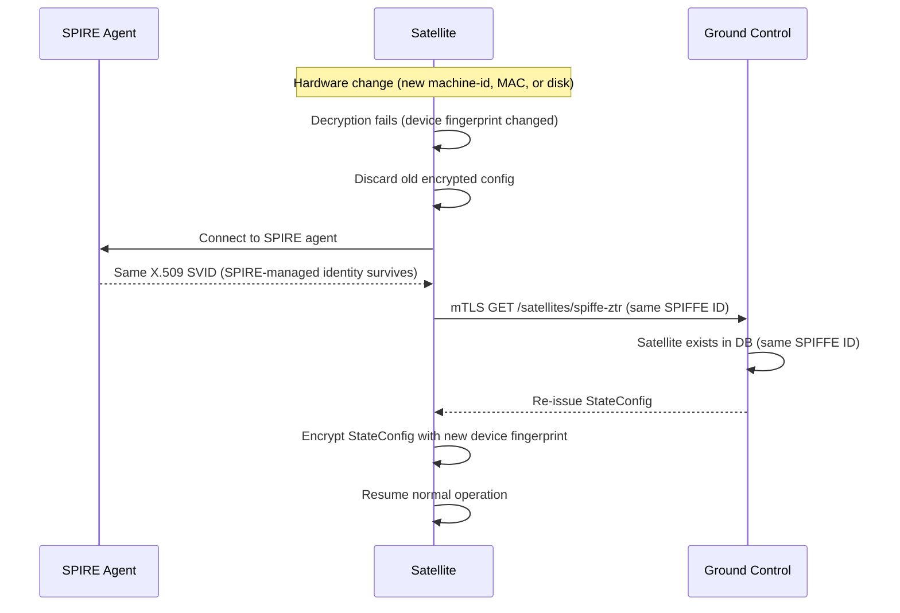
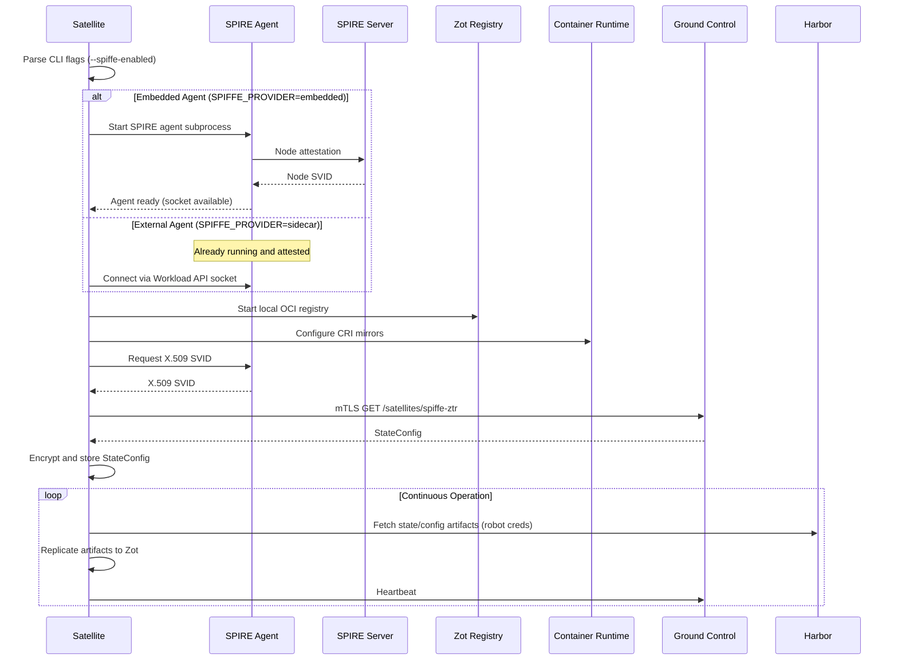

# SPIFFE Identity and Security

## Context and Problem Statement

Satellites deployed at edge locations need cryptographic identity without pre-shared secrets. The current token-based Zero Touch Registration (ZTR) requires manual token distribution per satellite, which does not scale to large fleets. Configuration files stored at rest contain registry credentials that need protection. The system needs mutual authentication between satellites and Ground Control.

## Decision Drivers

- Zero-touch fleet onboarding at scale
- Mutual TLS authentication (both sides verify identity)
- Hardware-bound config encryption (all builds, not just SPIFFE-enabled)
- Must not break existing token-based ZTR
- Must support minimal builds without SPIFFE dependencies
- Flexible SPIRE deployment: embedded or external on both satellite and Ground Control sides

## Considered Options

- Option 1: Token-only authentication (status quo)
- Option 2: SPIFFE/SPIRE with X.509 SVIDs
- Option 3: Custom mTLS with manual CA management

## Decision Outcome

Chosen option: "SPIFFE/SPIRE with X.509 SVIDs" as an additional authentication path alongside token-based ZTR. Token and SPIFFE paths are mutually exclusive at runtime. Existing token-based ZTR is preserved unchanged for deployments that do not use SPIFFE.

### Consequences

- Good: Zero-touch fleet onboarding at scale via SPIFFE/SPIRE standard
- Good: Mutual authentication removes need for pre-shared secrets
- Good: Hardware-bound config encryption with SPIFFE ID rebind on hardware change
- Good: Existing token path preserved (mutually exclusive, not degraded)
- Good: Flexible deployment (embedded or external SPIRE on both sides)
- Good: Auto-registration reduces admin overhead
- Neutral: Requires SPIRE infrastructure for SPIFFE-enabled deployments
- Bad: Adds SPIFFE dependency and operational complexity for adopters

---

## Component Requirements

### SPIRE Deployment Modes (Phase 1)

Both Ground Control and Satellite support embedded and external SPIRE:

| Component | Embedded | External |
|-----------|----------|----------|
| Ground Control | Embedded SPIRE server (subprocess) | External SPIRE server (sidecar/standalone) |
| Satellite | Embedded SPIRE agent (subprocess) - TO IMPLEMENT | External SPIRE agent (sidecar/standalone) |

Config: `SPIFFE_PROVIDER=embedded` (default) or `SPIFFE_PROVIDER=sidecar`

### Trust Relationships (Phase 1)

```
SPIRE Server (in GC or external)
    |
    +-- SPIRE Agent (in Satellite or external)
            |
            +-- Satellite workload gets X.509 SVID
```

Admin creates trust between SPIRE server and agent via join token, TPM, or cloud attestation.

### Future Deployment Modes

- Peer grouping: one satellite acts as SPIRE agent, other satellites in the group share it
- GC as SPIRE agent: satellite communicates with GC to get tokens directly

---

## Implementation Summary

### 1. Authentication Paths

| Path | Method | Use Case |
|------|--------|----------|
| Satellite ZTR (token) | One-time token in URL | Bootstrap when SPIFFE disabled |
| Satellite ZTR (SPIFFE) | mTLS with X.509 SVID | Bootstrap when SPIFFE enabled |
| Satellite sync | Robot credentials | Ongoing state replication after ZTR |

Key rules:
- Token and SPIFFE ZTR are mutually exclusive (if/else at `satellite.go:35`, no fallback)
- If SPIFFE is enabled and client creation fails, satellite halts with error
- Token ZTR is never a fallback for SPIFFE



### 2. Attestation Methods

| Method | Status | How It Works |
|--------|--------|-------------|
| Join token | Implemented, E2E tested | Admin generates token via GC API, passes to SPIRE agent |
| TPM (DevID) | Planned (phase 2) | SPIRE native plugin. Zero-touch hardware-rooted attestation. |
| Cloud (AWS/GCP/Azure) | Planned (phase 2) | SPIRE native plugins. Instance identity auto-verified. |

Phase 2 goal: automate attestation. Cloud satellites use cloud identity. Edge satellites with TPM use hardware attestation.

### 3. SPIFFE ZTR and Auto-Registration Flow

When a satellite with a valid SPIFFE ID calls `/satellites/spiffe-ztr`:

1. Satellite obtains X.509 SVID from SPIRE agent (embedded or external)
2. Satellite sends mTLS GET to GC at `/satellites/spiffe-ztr`
3. GC validates SPIFFE ID via mTLS peer certificate
4. GC extracts satellite name and region from SPIFFE ID path
5. GC checks if satellite exists in DB
6. If not found: auto-create satellite record (no groups assigned; admin assigns later)
7. Create robot account in Harbor for this satellite
8. Return StateConfig (registry creds + state URL)
9. Satellite encrypts and stores StateConfig with device fingerprint



Token ZTR follows a simpler path for comparison:



### 4. Admin Approval Flow (Phase 2)

1. Satellite attests with SPIRE agent (e.g., via TPM)
2. Satellite calls GC with valid SPIFFE ID
3. GC sees unknown satellite, creates record with `pending_approval` status
4. Satellite starts heartbeating but has no state to replicate (no groups, no robot account)
5. Unapproved satellites do NOT receive robot accounts or StateConfig
6. Admin reviews pending satellites via GC API and approves
7. On next heartbeat, satellite learns it is approved
8. GC creates robot account in Harbor, assigns StateConfig
9. Satellite receives creds and begins normal operation
10. Admin assigns groups independently (satellite replicates nothing until groups are assigned)

### 5. Satellite SPIFFE Client

File: `internal/spiffe/client.go`

- Connects to SPIRE agent via Workload API socket (embedded or external)
- Obtains X.509 SVID, creates mTLS HTTP client
- `WaitForSVID()` for bootstrap sequencing
- SVID rotation is transparent (X509Source auto-updates, fresh HTTP client per request)
- CLI flags: `--spiffe-enabled`, `--spiffe-endpoint-socket`, `--spiffe-expected-server-id`



### 6. Embedded SPIRE Agent in Satellite (Phase 1 - TO IMPLEMENT)

- Mirror the pattern from GC's `embedded_server.go`
- Create `internal/spiffe/embedded_agent.go`: subprocess manager for `spire-agent run`
- Start/stop with readiness polling, graceful shutdown
- Config generation: trust domain, attestation method
- SPIRE server address must be explicitly configured (no assumption that GC runs the server)
- Config: `SPIRE_SERVER_ADDRESS` env var or CLI flag
- Satellite connects to its own embedded agent's socket

### 7. Ground Control SPIFFE Provider

- `provider.go`: SidecarProvider (external) and StaticProvider
- `embedded_server.go`: embedded SPIRE server subprocess manager
- `server_client.go`: gRPC client (CreateJoinToken, CreateWorkloadEntry)
- `authorizer.go`: SatelliteAuthorizer, RegionAuthorizer, PatternAuthorizer
- `middleware.go`: RequireSPIFFEAuth, DualAuthMiddleware
- `source.go`: X509Source wrapper with rotation watching
- Embedded and external are equal production options

### 8. Join Token Flow

- `POST /api/join-tokens`: generate token via embedded SPIRE (admin only)
- Generating a join token creates the satellite record (no pre-registration needed)
- Groups and configs are assigned independently after satellite creation
- Token used by SPIRE agent for `join_token` attestation
- E2E tested: `TestSpiffeJoinTokenE2E` in `.dagger/e2e.go:635`
- Note: `POST /satellites/{satellite}/join-token` should be removed (redundant)



### 9. SPIFFE ID Structure

```
spiffe://<trust-domain>/gc/main
spiffe://<trust-domain>/satellite/region/<region>/<name>
```

### 10. Trust Domain

- Dev default: `harbor-satellite.local` (when `APP_ENV` != `production`)
- Production: must configure `SPIFFE_TRUST_DOMAIN` env var
- When `APP_ENV=production` and trust domain is unset or default, startup fails

### 11. Device Identity and Config Encryption

- `internal/identity/device_linux.go`: SHA-256 fingerprint from machine-id + MAC + disk serial
- `internal/crypto/aes_provider.go`: AES-256-GCM, Argon2id key derivation (OWASP 2024)
- `internal/secure/config.go`: encrypted config-at-rest, version 1 envelope
- Device-bound: config cannot migrate between machines
- Encryption must work in ALL builds (currently broken in nospiffe build tag; must be decoupled)

Hardware recovery: SPIFFE ID survives hardware change (SPIRE-managed). Local encrypted config is lost. Satellite re-does ZTR with same SPIFFE ID. GC re-issues StateConfig. New config encrypted with new device fingerprint.



### 12. TLS Support

- `internal/tls/config.go`: cert/key/CA loading, client and server configs
- Skip-verify for development only
- SPIFFE mTLS uses auto-rotating SVIDs
- Minimum TLS 1.2

### 13. Build Tags

- Default: full build (SPIFFE + crypto + identity)
- `nospiffe` tag: stub SPIFFE implementations, token-only operation
- Encryption and device identity must work in all builds (decouple from nospiffe)
- Satellite stubs: `client_stub.go` (SPIFFE only)
- GC stubs: `provider_stub.go`, `middleware_stub.go`, `embedded_server_stub.go`, `server_client_stub.go`, `server_spiffe_stub.go`

### 14. Rate Limiting

- IP-based sliding window on ZTR and login endpoints
- `RemoteAddr` only (ignores X-Forwarded-For to prevent spoofing)

---

## Satellite Startup Sequence (SPIFFE Flow)

1. Start satellite with `--spiffe-enabled` and SPIRE config
2. If embedded agent: satellite starts SPIRE agent subprocess, waits for readiness
3. If external agent: satellite connects to agent socket
4. Start Zot registry, configure CRI mirrors
5. Satellite connects to SPIRE agent, obtains SVID
6. ZTR scheduler runs: sends mTLS request to GC
7. GC auto-registers satellite, returns StateConfig
8. Satellite encrypts and stores StateConfig
9. State replication scheduler begins



---

## Validation

- E2E: `TestSpiffeJoinTokenE2E` in `.dagger/e2e.go`
- `nospiffe` build compiles without SPIFFE dependencies
- Token-based ZTR works when SPIFFE disabled
- Embedded SPIRE agent in satellite (to be implemented and tested)

## Implementation Gaps (Phase 1, Priority Order)

1. Embedded SPIRE agent in satellite: not yet implemented (blocks full SPIFFE flow without external agent)
2. Config encryption decoupled from nospiffe tag: all builds must encrypt config at rest
3. `authorizer.go` missing nospiffe stub: breaks nospiffe compilation
4. `generateJoinTokenHandler` SPIRE API integration commented out for pre-registered satellites

## Future Work

- Phase 2: TPM-based node attestation (SPIRE native `tpm_devid` plugin)
- Phase 2: Cloud attestation (AWS `aws_iid`, GCP `gcp_iit`, Azure `azure_msi`)
- Phase 2: Admin approval flow (`pending_approval` satellite status)
- Phase 2: Peer satellite grouping (shared SPIRE agent)
- Phase 2: GC-as-agent flow (satellite gets tokens from GC directly)
- Phase 3: HSM key storage for SPIRE server signing keys (GC side)
- Phase 3: HSM identity store on satellite for certs, credentials, and identity material

## Source Files

- `internal/satellite/satellite.go:35-55` - ZTR path selection
- `internal/state/spiffe_registration.go` - SPIFFE ZTR process
- `internal/state/registration_process.go` - Token ZTR process
- `internal/spiffe/client.go` - Workload API client
- `internal/identity/device_linux.go` - Device fingerprinting
- `internal/crypto/aes_provider.go` - AES encryption
- `internal/crypto/provider_stub.go` - nospiffe stub (no-op)
- `internal/identity/device_stub.go` - nospiffe stub (errors)
- `internal/secure/config.go` - Config encryption wrapper
- `pkg/config/manager.go` - EncryptConfig flag, write logic
- `ground-control/internal/spiffe/` - All GC SPIFFE files
- `ground-control/internal/server/routes.go` - Route structure
- `ground-control/internal/server/spire_handlers.go` - Join token handlers
- `.dagger/e2e.go:635` - SPIFFE E2E test
- `deploy/quickstart/spiffe/` - SPIFFE quickstart configs
