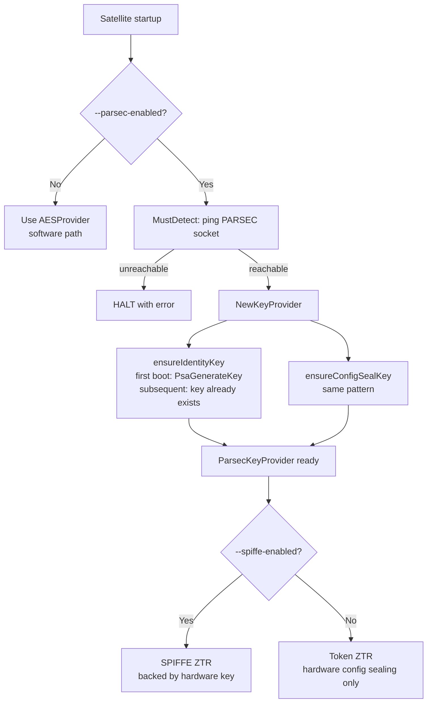

# PARSEC Hardware-Backed Identity for Edge Satellites

## Context and Problem Statement

Satellites deployed at edge locations are physically accessible and operate in untrusted
environments. The current security model is entirely software-based: device identity is derived
from a software fingerprint (machine-id + MAC address + disk serial), and configuration
encryption uses an AES key derived from that fingerprint. This means:

- Software keys can be extracted by an attacker with physical device access
- Software fingerprints can be spoofed or cloned to a different machine
- Encrypted configs can be copied and decrypted on unauthorised hardware
- Ground Control cannot cryptographically verify that a satellite is running on a specific,
  authorised physical device

ADR-0005 (SPIFFE/SPIRE Identity) establishes the identity and mTLS model but defers hardware
attestation to Phase 2 (TPM node attestation via SPIRE `tpm_devid` plugin) and hardware key
storage to Phase 3 (HSM identity store on satellite). This ADR defines how PARSEC fulfils
those phases.

See: [harbor-satellite#327](https://github.com/container-registry/harbor-satellite/issues/327)

## Decision Drivers

- Private keys must not be exportable from edge devices, even under physical attack
- Config encryption must be bound to specific hardware — a copy of the config file must be
  unreadable on any other device
- Must work alongside the existing SPIFFE/SPIRE model (ADR-0005), not replace it
- Must not break or degrade existing software-only deployments (VMs, development environments)
- No compile-time dependency on any specific hardware library (TPM SDK, TrustZone, SGX)
- Must be optional — deployments without hardware security modules should be unaffected
- Operational model must be consistent with how SPIRE is deployed (external daemon, not bundled)

## Considered Options

- **Option 1: CNCF PARSEC as an optional hardware security plugin** (this ADR)
- **Option 2: Direct TPM2 integration via `go-tpm`**
- **Option 3: PKCS#11 integration via `crypto11`**
- **Option 4: Status quo — software device fingerprint only**

## Decision Outcome

Chosen option: **Option 1 — CNCF PARSEC as an optional hardware security plugin**, because it
is the only option that satisfies the no-hardware-coupling driver while supporting TPM 2.0, ARM
TrustZone, Intel SGX, and PKCS#11 HSMs through a single API. PARSEC is an existing CNCF project
with a Go client library already present in this repository.

PARSEC is **complementary to SPIRE**, not a replacement. It provides the hardware root-of-trust
that SPIRE's `tpm_devid` plugin requires for Phase 2 node attestation. The existing SPIFFE/SPIRE
ZTR flow (ADR-0005) is unchanged.

When `--parsec-enabled` is not set, the satellite operates exactly as it does today. PARSEC
support compiles out entirely via build tag.

### Consequences

- Good: Private keys generated in hardware are non-exportable — physical device compromise does
  not expose identity keys
- Good: Config sealing uses a hardware-resident AES key — encrypted configs are unreadable on any
  other device
- Good: Platform-agnostic — the same satellite binary works with TPM 2.0, TrustZone, and PKCS#11
  HSMs without recompilation
- Good: Enables ADR-0005 Phase 2 (SPIRE `tpm_devid` attestation) and Phase 3 (HSM identity store)
- Good: Existing software-only deployments are entirely unaffected
- Good: Operational model is consistent with SPIRE — both are external daemons managed by the host OS
- Neutral: Requires the PARSEC service to be running on the host OS when `--parsec-enabled` is set
- Neutral: First-boot key generation is a one-time operation that cannot be repeated without
  destroying the hardware key (intentional — re-generation means re-registration with Ground Control)
- Bad: Adds operational complexity for deployments that want hardware security
- Bad: Air-gapped enrollment (USB-based CSR delivery) is not addressed in this ADR — separate work

---

## Component Requirements

### Build Tag

PARSEC support is gated behind the `parsec` build tag. This is independent of the `nospiffe`
tag. All combinations are valid:

| Build | SPIFFE | PARSEC |
|---|---|---|
| `go build ./...` | enabled | disabled |
| `go build -tags nospiffe ./...` | disabled (stubs) | disabled |
| `go build -tags parsec ./...` | enabled | enabled |

Default builds have zero PARSEC dependency — the `internal/parsec/` package compiles to stubs.

### New Package: `internal/parsec/`

```
internal/parsec/
  config.go          # Config struct, DefaultConfig(), named key constants   [no tag]
  detect.go          # Detect()/MustDetect() — ping daemon socket           [parsec]
  detect_stub.go     # returns ErrParsecNotAvailable                        [!parsec]
  signer.go          # Signer: crypto.Signer backed by hardware key         [parsec]
  provider.go        # KeyProvider: implements crypto.Provider              [parsec]
  provider_stub.go   # no-op stubs (same pattern as spiffe/client_stub.go)  [!parsec]
```

### `KeyProvider` implements `crypto.Provider`

`KeyProvider` implements the existing `internal/crypto.Provider` interface so it can be swapped
into `pkg/config/manager.go` without changes to any downstream consumer.

The key design challenge is that `crypto.Provider.Sign(data []byte, key crypto.PrivateKey)`
expects a key value. For PARSEC, the private key never leaves hardware. The solution is
`KeyRef` — a named reference that satisfies `crypto.PrivateKey` (which is `any`):

```go
// KeyRef is a reference to a hardware-resident PARSEC key.
// It satisfies crypto.PrivateKey (which is `any`).
// No private key material is ever held in memory.
type KeyRef struct{ Name string }
```

`KeyProvider.Sign()` type-asserts to `KeyRef` and delegates to `PsaSignHash`. All other callers
that use the software `AESProvider` continue to pass `*ecdsa.PrivateKey` as before.

### `Signer` implements `crypto.Signer` (solves Go TLS incompatibility)

Standard Go TLS uses `tls.LoadX509KeyPair` which requires an exportable private key. PARSEC keys
are non-exportable. `Signer` implements `crypto.Signer`, allowing a `tls.Certificate` to be
constructed with a hardware-backed private key:

```go
cert := tls.Certificate{
    Certificate: [][]byte{derEncodedCert},
    PrivateKey:  parsecSigner, // crypto.Signer — Sign() delegates to PsaSignHash
}
```

Standard Go TLS calls `Sign()` transparently; the private key material never leaves the secure
element. `internal/tls/config.go` must be updated to support this path alongside the existing
`tls.LoadX509KeyPair` path.

### Hardware Key Lifecycle

Two hardware-resident keys are provisioned on first boot, idempotently (via `ListKeys()` check):

| Key name | Type | Purpose |
|---|---|---|
| `satellite-identity-key` | ECDSA P-256 | Signing: CSR generation, mTLS, SPIRE node attestation |
| `satellite-config-seal-key` | AES-256-GCM | Config sealing at rest (replaces device-fingerprint AES) |

Keys are generated with the `non-exportable` attribute. Subsequent boots load existing key
references; no new key material is generated. Destroying and regenerating the identity key
requires re-registration with Ground Control (the satellite must re-run ZTR with a new SVID).

### Runtime Detection and Startup

```
--parsec-enabled     bool    Enable hardware-backed identity
                             Env: PARSEC_ENABLED=true
--parsec-socket      string  PARSEC daemon socket path
                             Default: /run/parsec/parsec.sock
                             Env: PARSEC_SOCKET=<path>
```

When `--parsec-enabled` is set, the satellite runs `MustDetect()` at startup. If the PARSEC
daemon is unreachable, the satellite **halts with an error** — consistent with ADR-0005's
"fail-hard, no silent fallback" rule for security-critical infrastructure.



### Integration with SPIFFE/SPIRE (Phase 2)

In Phase 2, `Signer` is used as the private key for SPIRE's `tpm_devid` node attestation plugin.
This makes the SPIRE agent's attestation to the SPIRE server hardware-rooted: Ground Control's
trust in the satellite is cryptographically bound to the physical device.

The existing `workloadapi.X509Source` SVID delivery flow in `internal/spiffe/client.go` is
unaffected — PARSEC operates below the SVID layer.

```
PARSEC (hardware key) → SPIRE tpm_devid (node attestation) → SVID issuance
                                                                      ↓
                                              Existing SPIFFE client receives SVID (unchanged)
                                                                      ↓
                                                       mTLS with Ground Control (unchanged)
```

---

## Validation

- Unit tests for `KeyProvider` using a mock PARSEC client (same pattern as `internal/crypto/mock.go`)
- `parsec` build tag compiles cleanly alongside `nospiffe` and default builds
- Default build (no `parsec` tag) continues to pass all existing tests unchanged
- E2E test (`TestParsecIdentityE2E`) using a real PARSEC daemon in CI, modelled on
  `TestSpiffeJoinTokenE2E` in `taskfiles/e2e.yml`
- `internal/tls/` tests confirming `crypto.Signer` path produces valid TLS handshakes

---

## Pros and Cons of the Options

### Option 1: CNCF PARSEC as an optional hardware security plugin

- Good: Single API across TPM 2.0, ARM TrustZone, Intel SGX, PKCS#11 — no hardware coupling
- Good: Go client library (`parsec-client-go`) already in this repository
- Good: Well-aligned with CNCF ecosystem and existing SPIFFE/SPIRE integration
- Good: Daemon model is familiar — same operational pattern as SPIRE
- Good: Additive — zero impact on deployments that do not enable it
- Neutral: Requires PARSEC daemon on host OS (consistent with existing SPIRE requirement)
- Bad: Additional daemon to operate and monitor

### Option 2: Direct TPM2 integration via `go-tpm`

- Good: No external daemon dependency
- Bad: Only supports TPM 2.0 — no ARM TrustZone, no PKCS#11 HSMs
- Bad: Couples the satellite binary to a specific hardware platform
- Bad: TPM2 API is significantly more complex than PARSEC's abstraction

### Option 3: PKCS#11 integration via `crypto11`

- Good: Widely supported on smart cards and HSMs
- Bad: Not available on most embedded edge devices (no TPM 2.0 or TrustZone support)
- Bad: Requires `libp11` CGo dependency — complicates cross-compilation for edge targets
- Bad: Platform-specific — does not abstract across hardware types

### Option 4: Status quo — software device fingerprint only

- Good: No additional dependencies
- Good: Works everywhere
- Bad: Does not address the core threat model (physical access, credential extraction, config cloning)
- Bad: Blocks ADR-0005 Phase 2 and Phase 3

---

## Implementation Phases

### Phase 1 — Core hardware key storage (this ADR)

- `internal/parsec/` package: `KeyProvider`, `Signer`, `Detect`
- `--parsec-enabled` / `--parsec-socket` flags
- Hardware-sealed config encryption (replaces software device fingerprint in `secure/config.go`)
- `crypto.Signer` path in `internal/tls/config.go`
- Inject `ParsecKeyProvider` into `pkg/config/manager.go`
- Unit tests with mock PARSEC client

### Phase 2 — SPIRE `tpm_devid` node attestation

- Wire `Signer` into the embedded SPIRE agent's `tpm_devid` attestation plugin config
- E2E test with real PARSEC daemon + SPIRE agent
- Ground Control receives hardware-attested SPIFFE SVIDs

### Phase 3 — Air-gapped enrollment

- USB/file-based CSR + attestation quote export for disconnected satellites
- Ground Control admin UI for offline device approval
- Separate design document required

---

## More Information

- [CNCF PARSEC Documentation](https://parallaxsecond.github.io/parsec-book/)
- [parsec-client-go](https://github.com/parallaxsecond/parsec-client-go) (local: `../parsec-client-go`)
- [harbor-satellite#327](https://github.com/container-registry/harbor-satellite/issues/327) — tracking issue
- `docs/decisions/0005-spiffe-identity-and-security.md` — ADR this builds upon
- `PARSEC Integration & Zero-Trust Bootstrapping Flow.md` — original 6-step flow proposal
- `security-parsec-integration-draft.md` — full design notes and implementation detail

### Source Files (skeleton)

- `internal/parsec/config.go` — Config, constants
- `internal/parsec/detect.go` / `detect_stub.go` — daemon detection
- `internal/parsec/signer.go` — `crypto.Signer` implementation
- `internal/parsec/provider.go` / `provider_stub.go` — `crypto.Provider` implementation
- `cmd/main.go` — flag wiring and startup check
