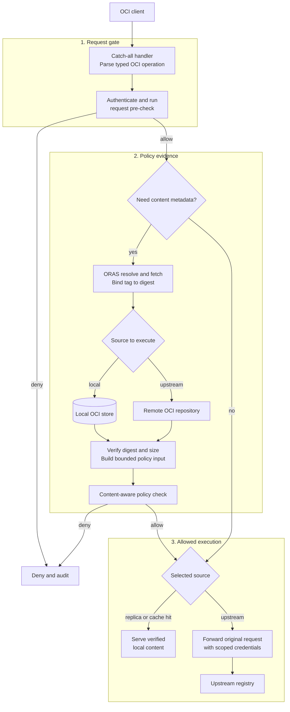
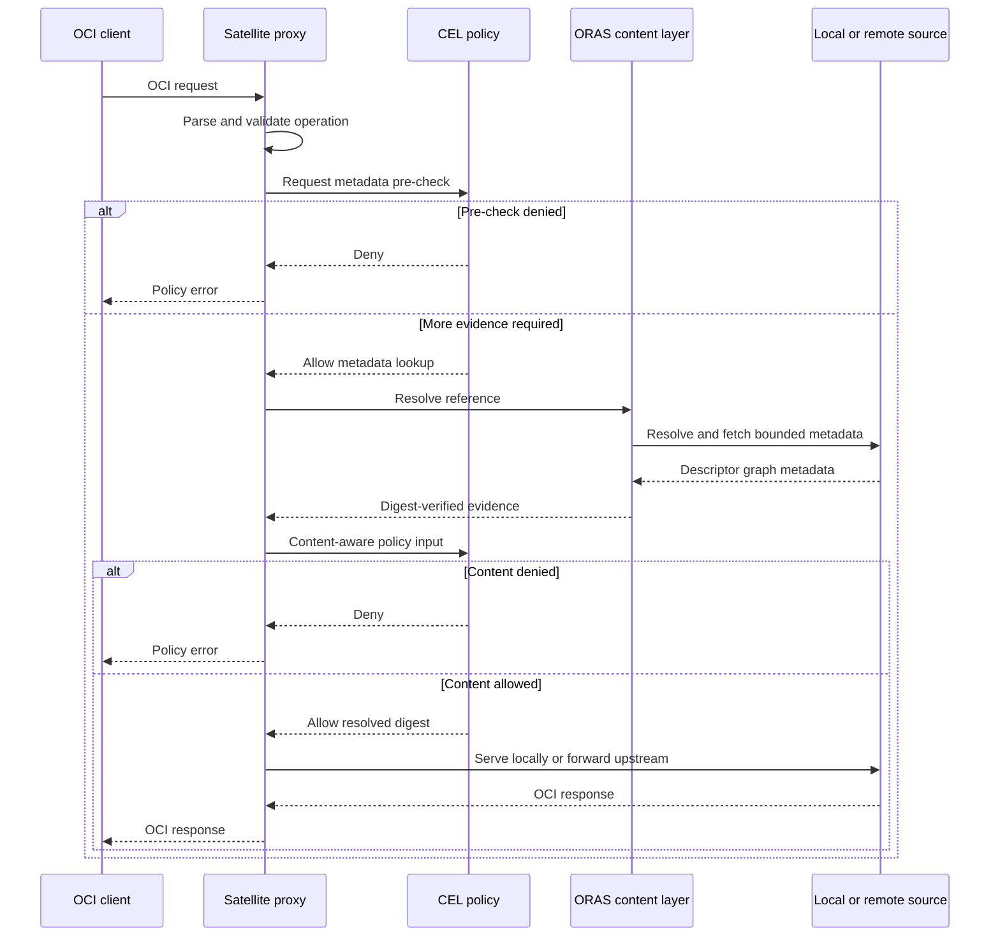

# Build a policy-enforcing transparent OCI registry proxy with ORAS

## Context

Satellite currently uses Crane to replicate selected images into Zot. The revised
goal is a policy-enforcing OCI proxy, not a full registry and not a mandatory
pull-through cache.

The proxy must inspect every OCI request before it reaches an upstream. Request data
such as identity, method, repository, reference, digest, and upstream may be enough
for a decision. When it is not, Satellite must resolve and verify descriptors,
manifests, indexes, configurations, subjects, referrers, or signatures and evaluate
policy again. Only an allowed request is forwarded or served from retained content.

The same design must support container images and arbitrary OCI artifacts, including
Helm charts, SBOMs, signatures, attestations, Wasm modules, models, and unknown valid
media types. It must also keep local replication and caching optional for constrained
edge deployments.

ADR-0009 supersedes the target-state choices in [ADR-0001](0001-skopeo-vs-crane.md)
and [ADR-0002](0002-zot-vs-docker-registries.md). Those records remain historical.

## Decision Drivers

* Policy must run before upstream contact and again when verified content evidence is
  required.
* Allowed requests must preserve OCI Distribution status, headers, ranges,
  conditions, cancellation, and streaming behavior.
* The content model must be OCI descriptor graphs rather than only container images.
* Local and remote content should use one resolve, fetch, copy, and metadata model.
* Proxy-only deployments should require neither a registry process nor persistent
  artifact storage.
* Optional local content should remain interoperable with OCI tooling and avoid an
  unnecessary deduplication database.

## Decision

Satellite will implement a catch-all `net/http` proxy handler that parses each
request into a typed OCI operation. It will perform a request pre-check, acquire
verified metadata through `oras-go` when necessary, perform a content-aware policy
check, and then either deny, forward, or serve retained content.

`oras-go` will replace Crane for registry resolution, OCI graph transfer, metadata
access, and replication. Optional local replica or cache content will use
`oras.land/oras-go/v2/content/oci`. Zot and bbolt are not part of the target
architecture.

ORAS is not the HTTP proxy. Satellite owns request parsing, authentication, policy,
upstream and credential selection, forwarding, body replay, response handling, and
audit. ORAS supplies the content and descriptor abstraction used on both sides of
that boundary.

## Scope

This decision covers:

* transparent proxying of OCI Distribution pull, push, upload, delete, mount, tag,
  listing, and referrer operations as they are implemented;
* typed route parsing and fail-closed policy enforcement;
* local or remote metadata resolution for content-aware decisions;
* arbitrary OCI artifact transfer through ORAS;
* desired-state replication; and
* optional local replica and cache modes backed by an ORAS OCI image layout.

The first delivery remains pull-oriented and adds mutation operations incrementally.
Search, scanning, administration, and other general registry features are included
only when Satellite policy or proxy operation requires them. Vendor-specific routes
require an explicit typed action and policy-controlled pass-through rule.

## Architecture

The request path is split into three visible stages: gate the request, gather only the
evidence needed by policy, and execute the allowed action.



The interaction for a request that needs content evidence is:



Metadata must come from the source that will answer the operation. A local result may
stand in for a remote result only for an exact digest or under an explicit freshness
rule. When policy evaluates a mutable tag, Satellite binds execution to the resolved
digest so that it cannot authorize one graph and return another.

### Operating Modes

| Mode | Behavior |
|---|---|
| `proxy` | Evaluate policy and forward; do not persist passing content |
| `replica` | Serve explicitly replicated content locally and proxy other allowed requests |
| `cache` | Retain selected verified upstream content under admission and retention policy |

`proxy` is the default. Offline access is available only for content retained by
`replica` or `cache` mode. Retained content is derived state and does not make
Satellite the authoritative upstream registry.

### ORAS OCI Storage Layout

Replica and cache modes initially use one Satellite-owned OCI image layout:

```text
<storage-root>/
|-- oci-layout
|-- index.json
|-- blobs/
|   |-- sha256/<digest>
|   `-- <algorithm>/<digest>
`-- ingest/
    `-- <temporary verified writes>
```

Satellite records fully qualified source references so equal repository and tag names
from different registries do not collide. Authorization still uses upstream and
repository provenance; the presence of a digest in the global blob directory does
not grant access to it.

This layout is effective for the initial read-mostly workload because:

* one content-addressable blob path naturally deduplicates equal content without
  bbolt, hardlinks, or per-repository copies;
* ORAS streams content to `ingest/`, verifies digest and size, and renames successful
  blobs into the content-addressable path;
* manifests, layers, configurations, signatures, SBOMs, and other artifacts share
  the same blob model; and
* the layout remains inspectable and transferable with OCI-aware tools.

The store is limited to one Satellite process and writer. ORAS maintains tag and
predecessor information in memory and rewrites `index.json` as references change, so
startup cost, index growth, atomic recovery, and garbage collection must be tested on
target hardware. Satellite will add a small recovery wrapper or upstream durability
improvements if crash tests show they are required. A different sharding or metadata
design requires new measurements and a separate decision.

## Catch-all Proxy Handler

The handler is inspired by olareg's compact `Server.ServeHTTP` dispatcher: one entry
point recognizes an OCI route and delegates a validated operation.

Satellite adopts the pattern, not olareg internals. Its boundary will inspect the
escaped URL before normalization, reject ambiguous or encoded traversal paths, map
each route to a typed policy action, and deny unknown routes unless pass-through is
explicitly configured. The forwarder preserves OCI headers and streaming semantics,
removes hop-by-hop headers, and never sends credentials to another authority without
an explicit rule.

An embedded registry is not selected because the primary operation is controlled
forwarding, not serving authoritative local state:

* **olareg** is the closest lightweight behavior reference, but its server and store
  do not expose the required two-stage policy, multi-upstream, and transparent
  forwarding boundaries as stable extension points.
* **go-containerregistry `pkg/registry`** is useful for tests and small image
  registries, but does not provide the proxy and arbitrary-artifact policy model.
* **Zot** provides a complete registry and mature storage features, but adds another
  server lifecycle and a storage abstraction alongside ORAS.
* **CNCF Distribution** is mature and remains a protocol reference, but its registry
  and storage-driver model is broader than this focused proxy.

These projects remain useful for differential behavior and OCI conformance testing.

## Why ORAS?

OCI content is a graph of descriptors. The root may be an image, index, Helm chart,
SBOM, signature, Wasm module, model, or a future artifact type. ORAS fits this model
without converting content into image-specific objects.

Its main benefits are:

* common `Target`, `ReadOnlyTarget`, `GraphTarget`, OCI layout, and remote repository
  abstractions;
* remote-to-remote, remote-to-local, local-to-remote, and local-to-local graph copy;
* preservation of original manifest bytes, digests, media types, annotations,
  subjects, and artifact types;
* bounded concurrent, streaming transfer; and
* one library for policy metadata, replication, import, export, and future peer
  transfer.

The storage packages have clear roles: `content/oci` is the durable replica or cache,
`content/memory` is limited to bounded tests or short-lived staging, and
`content/file` is for artifact file and working-directory workflows rather than a
restartable registry store.

### Metadata and Policy Verification

ORAS can resolve and fetch descriptors and traverse their successors. Remote
repository APIs can also discover referrers and predecessors where supported. This
gives policy access to digest, size, media type, artifact type, annotations, platform,
configuration, layers, child manifests, subject, signatures, SBOMs, and attestations.

Satellite converts that evidence into bounded typed CEL input. It verifies fetched
bytes against the descriptor digest and size, caps graph depth, node count, metadata
bytes and referrer count, and cryptographically verifies signatures rather than
trusting annotations alone. Unknown media types remain intact and can be allowed or
denied using their structural metadata.

ORAS copy hooks are not the admission boundary by themselves because graph children
may be transferred before their parent is committed. Satellite resolves the evidence
needed by policy before a publishing copy, or copies into quarantine until the final
decision succeeds.

### Why ORAS Over Crane

Crane and `go-containerregistry` are strong container-image tools, but their main
abstractions are images and image indexes. ORAS works directly with arbitrary OCI
descriptor graphs and provides the same interfaces for local and remote content.
That makes it a better fit for replication and policy inspection without media-type
conversion.

ORAS replaces registry resolve, graph copy, tagging, and artifact access. Existing
code that applies image layers into a merged filesystem or emits Docker-save archives
requires a separate migration; `go-containerregistry` may remain in those legacy
paths until they are redesigned.

### Why ORAS Over Zot Storage

Zot storage is capable and more registry-oriented, with filesystem and object-store
drivers, hardlink deduplication, Bolt-backed lookup, garbage collection, and scrub.
Using it alone would still introduce a second storage API and publication model next
to the ORAS APIs used for remote metadata and transfer. Running Zot would additionally
introduce a full registry lifecycle that proxy-only mode does not need.

Using ORAS `content/oci` keeps optional local content in the same descriptor model as
remote access and replication. Its global content-addressable namespace already
deduplicates blobs, so the initial design does not need Zot storage, hardlink modes,
or a bbolt digest cache. Zot remains a reference for durability and maintenance
behavior rather than an embedded dependency.

## Consequences

* Good: Satellite remains a focused policy proxy; storage is optional.
* Good: ORAS provides one arbitrary-artifact model for metadata, replication, local
  content, and future peer transfer.
* Good: Proxy-only mode needs neither Zot, bbolt, nor persistent artifact storage.
* Good: The global OCI blob namespace deduplicates content without a separate lookup
  database.
* Good: Policy can evaluate verified descriptor graphs, subjects, referrers,
  signatures, platforms, and sizes.
* Neutral: Satellite owns HTTP forwarding and conformance behavior; focused protocol
  and differential tests address this risk.
* Neutral: ORAS index recovery and scaling require target testing; a recovery wrapper,
  upstream fixes, or later sharding can address observed limits.
* Neutral: Crane removal is incremental for filesystem export and Docker archive
  workflows outside OCI graph transfer.
* Bad: Satellite must manage the lifecycle of the ORAS store, including index recovery and garbage collection, if it is used for local content.

## Validation

* Pass every claimed OCI Distribution conformance category.
* Compare request and response behavior with olareg, Zot, and Distribution.
* Test Docker, Podman, containerd/nerdctl, Helm, ORAS, and representative vendor
  clients through the proxy.
* Verify that a pre-check denial causes no upstream registry or token request.
* Verify that a metadata-policy denial is neither forwarded nor locally published.
* Bind tag-based decisions to the resolved immutable digest and test concurrent tag
  mutation.
* Round-trip images, indexes, signatures, SBOMs, Helm charts, Wasm, models, and
  unknown valid media types without conversion.
* Fuzz paths, queries, headers, ranges, redirects, uploads, manifests, cancellation,
  and inspected-body replay.
* Test digest mismatch, graph limits, partial transfers, concurrent misses, disk-full
  behavior, restart recovery, index corruption, and garbage collection.
* Measure footprint and storage behavior on representative edge hardware.

## References

* [OCI Distribution Specification](https://github.com/opencontainers/distribution-spec/blob/v1.1.1/spec.md)
* [OCI Image Layout](https://github.com/opencontainers/image-spec/blob/v1.1.1/image-layout.md)
* [ORAS Go v2.6.2](https://github.com/oras-project/oras-go/tree/v2.6.2)
* [ORAS copy implementation](https://github.com/oras-project/oras-go/blob/v2.6.2/copy.go)
* [ORAS OCI store](https://pkg.go.dev/oras.land/oras-go/v2@v2.6.2/content/oci)
* [ORAS OCI storage implementation](https://github.com/oras-project/oras-go/blob/v2.6.2/content/oci/storage.go)
* [ORAS memory store](https://pkg.go.dev/oras.land/oras-go/v2@v2.6.2/content/memory)
* [ORAS file store](https://pkg.go.dev/oras.land/oras-go/v2@v2.6.2/content/file)
* [olareg server dispatch](https://github.com/olareg/olareg/blob/main/olareg.go#L151)
* [go-containerregistry `pkg/registry`](https://github.com/google/go-containerregistry/tree/main/pkg/registry)
* [Zot storage](https://zotregistry.dev/v2.1.18/articles/storage/)
* [Zot storage package](https://pkg.go.dev/zotregistry.dev/zot/v2@v2.1.18/pkg/storage)
* [CNCF Distribution](https://github.com/distribution/distribution)
* [CEL Go](https://github.com/google/cel-go)
