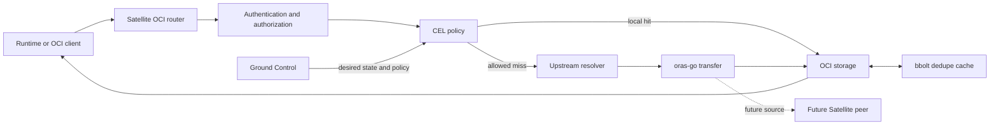

# Evolve Satellite into a policy-enforcing OCI registry proxy

## Context

Satellite currently observes an edge node, reads desired state from Ground Control,
and replicates selected images into Zot. Crane performs the copy and Zot serves the
local registry.

The target is a small, self-managed registry and pull-through proxy. It must:

* work with Harbor, Docker Hub, Quay, JFrog, ECR, GCR, ACR, GHCR, and other
  OCI-compatible registries;
* support images and arbitrary OCI artifacts such as Helm charts, SBOMs, signatures,
  Wasm modules, and models;
* enforce policy before pull, push, delete, mount, tag, and discovery operations;
* run on constrained edge and embedded hardware;
* serve verified local content while offline; and
* leave a clean path to peer-to-peer artifact transfer.

This overview is supported by:

* [0009-satellite-owned-registry-and-oras.md](0009-satellite-owned-registry-and-oras.md)
* [0009-oci-layout-storage-and-optional-dedupe.md](0009-oci-layout-storage-and-optional-dedupe.md)

ADR-0009 supersedes the target-state choices in [ADR-0001](0001-skopeo-vs-crane.md)
and [ADR-0002](0002-zot-vs-docker-registries.md). Those records remain historical.

## Decision

Satellite will become one Go process that owns:

* a focused OCI Distribution Specification registry interface;
* authentication, authorization, and CEL policy enforcement;
* upstream resolution and pull-through caching;
* local OCI storage and garbage collection;
* replication through `oras-go`; and
* a small embedded bbolt cache for deduplication metadata.

Zot and Crane will be removed from the target architecture. No external database,
object store, or cache service is required.

Policy remains configuration, not database state. JSON or YAML is validated and
loaded into Go structures at startup. CEL expressions are compiled once before the
server accepts requests. Invalid policy prevents startup.

## Architecture

| Component | Responsibility |
|---|---|
| OCI router | Parse registry requests and return specification-compliant responses |
| Authentication | Identify local callers and select upstream credentials |
| Policy engine | Decide whether an operation and its content are allowed |
| Upstream resolver | Map a local namespace to an upstream registry and repository |
| ORAS transfer | Copy complete OCI descriptor graphs without assuming image media types |
| Storage | Verify, commit, resolve, and stream OCI content |
| bbolt cache | Map digests to verified paths and lightweight dedupe metadata |
| Reconciler and GC | Recover interrupted work and remove unreachable content |

## Request Flow

Every operation uses the same high-level pipeline:

1. Validate the repository, reference, digest, method, and request limits.
2. Authenticate the caller.
3. Apply operation policy before contacting an upstream.
4. Resolve the request locally.
5. On an allowed miss, select the upstream and credentials.
6. Download into quarantine while hashing.
7. Verify digest, size, descriptor graph, and content policy.
8. Atomically commit the content and update repository metadata.
9. Update the bbolt dedupe cache.
10. Serve the verified manifest or blob.

Policy is evaluated twice when needed:

* **Pre-fetch policy** uses identity, action, repository, tag, upstream, and request
  metadata.
* **Admission policy** uses the verified manifest graph, artifact type, subject,
  signatures, platforms, and sizes.

Denied or incomplete content is never published.

## Storage Modes

Operators choose one mode:

| Mode | Behavior | Main use |
|---|---|---|
| `portable` | Independent complete OCI layouts | Portable fallback |
| `hardlink` | Complete layouts sharing blob inodes | Default local mode |
| `shared` | One blob pool resolved by the storage layer | No-hardlink dedupe |

The bbolt cache accelerates digest lookup and dedupe decisions. It is not the source
of artifact bytes or policy. It can be rebuilt from repository metadata and verified
storage after loss or corruption.

## Authentication

An access token issued for Satellite is not automatically valid for an upstream
registry. Satellite supports:

* anonymous upstream access;
* credentials supplied through environment variables or mounted secrets;
* registry-specific providers for cloud registries; and
* challenge relay or token pass-through only when explicitly configured.

Credentials are never stored in OCI layouts or bbolt. Authorization headers are not
forwarded to another host without explicit configuration.

Users, roles, and policy bindings remain startup configuration for the first release.
If mutable relational metadata is later required, it will receive a separate decision;
bbolt will not be stretched into an application database.

## Failure Rules

* Committed blobs are immutable and verified by digest.
* Tags never point to uncommitted manifests.
* Publication is atomic for readers.
* Interrupted transfers remain uncommitted.
* A missing or corrupt bbolt file is rebuilt from storage.
* Corrupt blob content is quarantined and never served.
* Existing local content remains available during upstream or Ground Control outages,
  subject to offline policy.

## Resource Model

The default deployment uses:

* one Go process;
* bounded workers and request sizes;
* streaming blob I/O;
* immutable files and infrequent metadata writes;
* one embedded bbolt file for dedupe lookup; and
* no external state service.

The design targets one writer process and a local filesystem. Multi-process writers
and shared object storage are separate future decisions.

## Measured Direction

The prototype measurements provide scale, not conformance proof:

* hardlinked OCI layouts stored 80 MiB of logical references in 20.32 MiB, a 74.7%
  reduction from independent copies;
* hardlink layouts and the global-CAS prototype had lookup time within 1.3%;
* the focused router skeleton used a 5.79 MiB binary and 5.46 MiB idle RSS;
* Distribution used a 23.05 MiB binary and 17.50 MiB idle RSS; and
* Zot used a 64.02 MiB binary and 49.66 MiB idle RSS.

These figures must be rechecked on target ARM64, eMMC, and SD-card hardware.

## Delivery

1. Implement pull-only `GET` and `HEAD`, policy checks, one upstream, OCI storage,
   bbolt dedupe caching, and all three storage modes.
2. Add referrers, tag listing, leases, cache eviction, reconciliation, and arbitrary
   artifact tests.
3. Add resumable push, delete, mount, and policy-controlled replication; remove Zot
   and remaining Crane paths.
4. Add cloud credential providers and peer sources.

## Consequences

* Good: Satellite controls policy at every registry boundary.
* Good: Arbitrary OCI media types pass through without image-specific conversion.
* Good: One process owns HTTP, transfer, storage, and recovery.
* Good: Operators can choose portability or stronger deduplication.
* Neutral: bbolt is a local acceleration cache and must be maintained and rebuilt.
* Neutral: Peer transfer reuses OCI descriptors; discovery and trust remain separate.

## Validation

* Pass the claimed OCI Distribution conformance categories.
* Test Docker, Podman, containerd/nerdctl, Helm, and ORAS clients.
* Round-trip images, indexes, signatures, SBOMs, Helm charts, Wasm, and unknown valid
  media types.
* Inject digest mismatches, interrupted transfers, crashes, and concurrent misses.
* Delete and rebuild bbolt, then confirm content remains correct and accessible.
* Validate all storage modes on representative target filesystems and hardware.

## References

* [OCI Distribution Specification](https://github.com/opencontainers/distribution-spec/blob/v1.1.1/spec.md)
* [OCI Image Specification](https://github.com/opencontainers/image-spec)
* [OCI Image Layout](https://github.com/opencontainers/image-spec/blob/v1.1.1/image-layout.md)
* [ORAS Go](https://github.com/oras-project/oras-go)
* [CEL Go](https://github.com/google/cel-go)
* [bbolt](https://github.com/etcd-io/bbolt)
* [Harbor Satellite](https://satellite.container-registry.com/)
