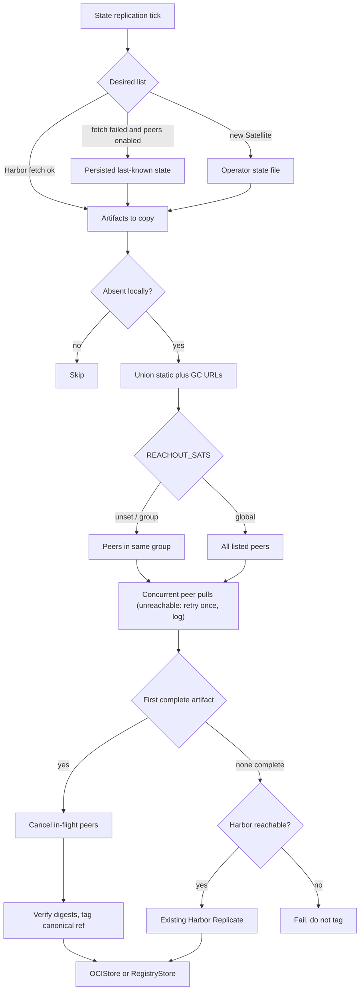
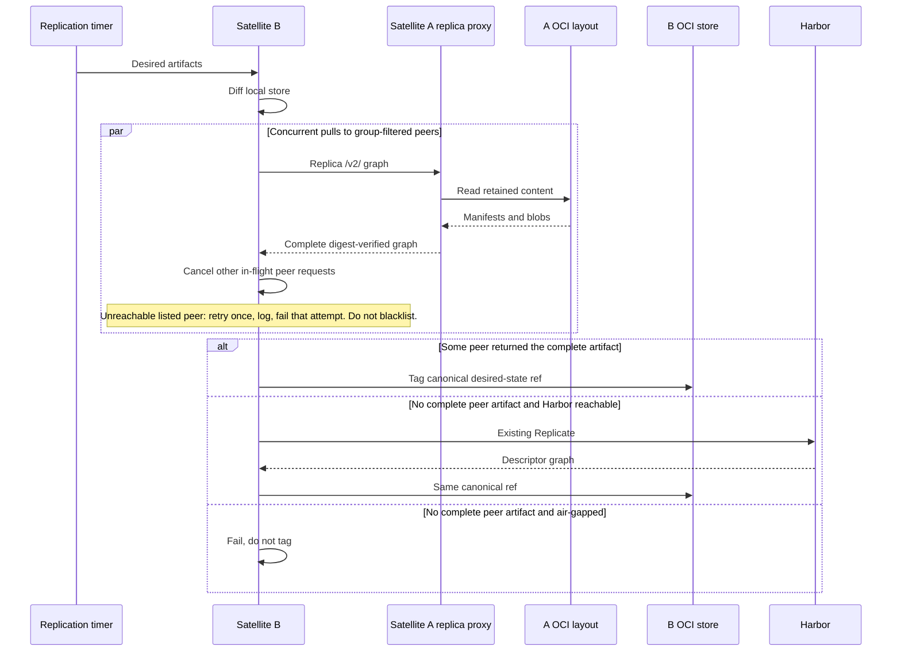

# Copy OCI artifacts between trusted Satellites on an isolated network

## Context

Satellite retains desired-state content in an ORAS OCI image layout
([ADR-0009](0009-transparent-oci-registry-proxy.md), [#648](https://github.com/container-registry/harbor-satellite/pull/648)).
The proxy integration ([#654](https://github.com/container-registry/harbor-satellite/pull/654),
[#669](https://github.com/container-registry/harbor-satellite/pull/669)) exposes that
layout as OCI Distribution on `PROXY_PORT`:

* **replica** — GET/HEAD of retained manifests and blobs; writes 405; no
  pull-through, forwarding, or CRI miss-fill.
* **proxy** — a local miss may fill from upstream (out of scope for peer copy).

`oras-go` copies descriptor graphs between `Target` implementations. The
networked Target is `registry/remote.Repository` (OCI Distribution HTTP). A
default Satellite's `content/oci` store is a directory; `oras.Copy` cannot open
another machine's layout. Replica mode is that HTTP Target over retained
content. Bring-Your-Own registry deployments may already expose a registry URL
as a peer.

When a Satellite needs an artifact that is absent locally, the only sources
without peers are Harbor, Ground Control-driven state fetch, or operator-imported
offline media. Air-gapped and intermittently connected sites often already hold
the missing graph on another trusted Satellite on the same LAN.
[#542](https://github.com/container-registry/harbor-satellite/issues/542) asks
for an opt-in way to copy a requested artifact from a configured peer without
Internet, Harbor, or Ground Control, while preserving digest verification.

Desired-state replication in `FetchAndReplicateStateProcess` fetches group
state from Harbor before any copy. `CanExecute` returns without work when the
state URL or Harbor credentials are missing. Wrapping the store does not
satisfy air-gap by itself: the process never reaches transfer. Peer copy
therefore needs a **degraded list path** (persisted last-known state or an
operator-supplied state file), not a second listen server.

This decision does not replace [ADR-0009](0009-transparent-oci-registry-proxy.md).
Proxy vs replica **modes**, Spegel in-cluster distribution, and full headless
mode ([#227](https://github.com/container-registry/harbor-satellite/issues/227))
remain separate. Peer copy **consumes replica mode**; it does not reimplement
it.

## Decision Drivers

* The feature must work with `store.Store` (`OCIStore` and `RegistryStore`)
  after Zot removal. It must not reintroduce Zot or a second storage API.
* Transfer must use standard OCI Distribution APIs and digest-verified
  `oras.Copy`, including arbitrary OCI artifacts, not only container images.
* Default-mode Satellites (ORAS layout, no sidecar registry) must be able to
  act as peers on an isolated LAN.
* The feature must run when Harbor and Ground Control are unreachable, without
  taking on full headless Satellite mode.
* Copies must not collide with later Harbor reconcile. Local names stay the
  canonical desired-state references.
* The feature is opt-in and off by default. Existing replication is unchanged
  when it is disabled.
* Peer membership starts as an operator allow-list. Groups already on the
  Satellite are the default reachability boundary (colocated, lower latency).
  `REACHOUT_SATS=global` is the explicit override. Cross-group traffic without
  that override must not happen.
* Config must accept a Ground Control-sourced peer list later without a
  breaking change. Static URLs and GC URLs coexist. This term does not require
  shipping GC peer HTTP APIs or latency ranking.
* Ground Control owns peer health when it is present. Satellites must not
  locally blacklist a peer as dead. An unreachable peer that GC still lists
  is retried once, logged, and failed predictably — not silently skipped.
* Concurrent peer work is cancelled only when some peer has returned the
  **complete** artifact (digest-verified graph), not when the first digest
  `Resolve` succeeds.
* A failed or unreachable peer must not publish a partial artifact.
* Listen path is the existing replica proxy. Peer copy must not bind a second
  `/v2/` server.

## Considered Options

* Replica mode as peer `/v2/` and desired-state peer source
* Separate read-only Distribution facade (rejected: duplicates replica mode)
* Bring-Your-Own registry peers only
* Defer peer copy until the transparent proxy ([#234](https://github.com/container-registry/harbor-satellite/issues/234))
* Custom non-OCI transfer protocol
* Group-scoped peers vs always-global vs GC latency ranking
* Static allow-list only vs GC-only roster vs union of both
* Cancel siblings on first digest `Resolve` vs on first complete artifact
* Satellite-local dead-peer skip vs GC-owned health

## Decision Outcome

Chosen option: "Replica mode as peer `/v2/` and desired-state peer source".
Default-mode Satellites can be peers without Zot, transfer stays on
`oras.Copy` and OCI Distribution, and copy stays inside the existing
desired-state replication loop. The HTTP surface is ADR-0009 **replica**
mode on `PROXY_PORT` (proxy integration [#669](https://github.com/container-registry/harbor-satellite/pull/669)).
This ADR does not add a second HTTP server.

Satellite will add opt-in peer distribution **on top of replica mode**:

* **Listen.** Other Satellites pull the holder's replica proxy (`PROXY_PORT`).
  Replica serves retained content only (GET/HEAD; writes 405). It does not
  accept push, delete, pull-through, or CRI miss-fill. BYO deployments may
  list an existing registry as a peer URL; default-mode sites use replica
  mode. Implementing replica/proxy itself is the proxy-integration work, not
  this decision.
* A **source resolver** in front of `store.Store`. The effective peer set is
  the union of static `peer_distribution` URLs and, when present, a
  GC-sourced roster, then **group-filtered** unless `REACHOUT_SATS=global`.
  For each missing desired artifact, Satellite starts concurrent pulls toward
  that set. The **winner is the first peer that returns the complete,
  digest-verified graph**, not the first successful digest `Resolve`. At that
  instant every other in-flight peer request is cancelled.
* **Canonical destination references** (fully qualified desired-state names,
  as `OCIStore` already stores them). The peer is transport. The local tag is
  never the peer hostname.
* **Harbor `Replicate`** only when no peer delivered a complete artifact
  **and** Harbor is reachable. An air-gapped miss fails predictably and does
  not tag. Harbor fallback is not the #542 acceptance test.
* **Health.** Satellites do not mark peers dead. When Ground Control is
  present it only surfaces healthy peers. If a listed peer is unreachable:
  retry that attempt **once**, log, fail that attempt. Do not silently skip
  it off the roster. Other concurrent peers may still win. If none complete
  and Harbor is down, fail and do not tag.
* A **degraded replication path** when Harbor state fetch fails: if the
  feature is on and persisted last-known state exists, continue from that
  list. A new Satellite with an empty disk uses an operator-supplied state
  file. This is not `--headless`, does not skip ZTR or heartbeat as a product
  mode, and does not close [#227](https://github.com/container-registry/harbor-satellite/issues/227).
  Air-gap still uses the static (and last-known) peer URLs; it does not wait
  on GC health APIs.
* **Local** `peer_distribution` config (enablement, static peer URLs,
  `REACHOUT_SATS`, timeouts, retries, probe concurrency, optional per-peer
  credentials and TLS, and a field for a GC-sourced list that may be empty).
  Remote config reconcile preserves it the same way `StateConfig` is
  preserved. GC peer HTTP APIs can fill that field later without renaming
  static URLs.

ORAS remains the content and copy layer. The proxy owns listen address and
replica vs proxy mode. Peer copy owns the union roster, group filter,
full-artifact cancellation, one retry on unreachable listed peers, and the
degraded `CanExecute` path.

### Locked choices

| Topic | Choice |
|---|---|
| Peer reachability | ADR-0009 **replica** mode on `PROXY_PORT` (not a separate facade) |
| Copy trigger | Desired-state replication timer, not CRI miss-fill |
| Air-gap list | Persisted last-known state; operator state file for a new Satellite |
| Local name | Canonical Harbor-style desired-state reference |
| Trust | Static URLs plus optional GC roster; optional credential and TLS; anonymous HTTP only when `use_unsecure` is already set |
| Peer selection | Same Ground Control **group** by default (config groups already exist). `REACHOUT_SATS=global` is the only cross-group override |
| Peer roster | Union of static allow-list and GC-sourced URLs. Empty GC list is valid. No breaking rename when GC APIs land |
| Peer health | GC owns health when present. Satellite does not blacklist. Unreachable listed peer: retry once, log, fail that attempt — not a silent skip |
| Winner / cancel | First **complete** digest-verified artifact wins; then cancel all other in-flight peer requests. Digest `Resolve` alone does not win or cancel |
| Config | Local `peer_distribution` (static URLs, `REACHOUT_SATS`, optional `gc_peers`); preserve on remote reconcile |
| Observability | Zerolog first; Ground Control metrics optional |
| Spegel | Concurrent first-complete-artifact only; no Spegel runtime, DHT, or libp2p |
| #227 / #234 | Out of scope except the degraded list path above |
| Harbor fallback | Only if no peer delivered a complete artifact **and** Harbor is reachable; air-gapped miss does not tag |

## Scope

This decision covers:

* opt-in peer distribution configuration (enablement, static peer URLs,
  `REACHOUT_SATS`, optional GC-sourced list field, timeouts, retries, probe
  concurrency, optional per-peer credentials and TLS);
* using replica mode as the peer Distribution endpoint (no second listen
  process);
* group-scoped filtering of the union roster, with `REACHOUT_SATS=global`
  as the override;
* concurrent peer pulls whose siblings cancel only when a complete
  digest-verified artifact has arrived;
* digest-verified graph copy into `OCIStore` or `RegistryStore`;
* one retry, structured log, and predictable failure for an unreachable
  listed peer (no local dead-peer roster);
* Harbor `Replicate` when no peer delivered a complete artifact and Harbor
  is reachable;
* degraded replication from persisted or operator-supplied desired state when
  Harbor fetch cannot run;
* structured logs and tests, including a multi-Satellite air-gapped case.

This decision does not cover:

* implementing replica or proxy mode (proxy integration);
* a second `/v2/` server beside `PROXY_PORT`;
* implementing Ground Control peer HTTP APIs, dashboards, or RTT ranking
  (satellite config is ready for a GC list; those APIs are follow-on);
* Zot, a second blob store, or replacing ORAS;
* DHT, BitTorrent, multi-source blob swarms, or Spegel;
* untrusted peers or Internet discovery;
* `--headless`, skipping registration, or skipping heartbeat ([#227](https://github.com/container-registry/harbor-satellite/issues/227));
* policy-enforcing pull-through or CRI miss-fill
  ([ADR-0009](0009-transparent-oci-registry-proxy.md),
  [#234](https://github.com/container-registry/harbor-satellite/issues/234)).

## Architecture

Replication stays on the existing scheduler. Peer copy is a second source for
artifacts already in the desired list. The holder serves replica mode; the
requester runs the resolver.

### Why replica mode

`oras.Copy` copies between two `Target` values the current process already
holds. `content/oci.Store` requires a filesystem path. `registry/remote`
requires HTTP Distribution. Two Satellites on a LAN share neither a
filesystem nor, in default mode, a sidecar registry.

Replica mode is that HTTP Target on the holder: GET/HEAD of retained
manifests and blobs from the existing layout. It is not a second copy of the
artifacts, not proxy-mode pull-through, and not a second process. BYO
deployments that already expose a registry may use that endpoint as the peer
URL.

Writes into one `OCIStore` stay serialized under the existing mutex. Probe
concurrency is bounded separately. A failed copy does not publish a tag.
Siblings are cancelled only after a complete graph is in hand, so a fast
`Resolve` cannot abort a slower peer that would have delivered the bytes.

### Trust and configuration

The effective roster is the **union** of:

* operator static URLs in `peer_distribution`;
* an optional GC-sourced list (`gc_peers` or equivalent), empty until those
  APIs exist.

Each URL may carry optional username and password or token, plus TLS.
Anonymous HTTP is allowed only when the Satellite already runs with
`use_unsecure`. SPIFFE between Satellites is out of this decision.

By default only peers in the **same group** (already on the Satellite config)
are probed. Groups are assumed colocated. `REACHOUT_SATS=global` is the only
way to probe listed peers outside the group. Cross-group copies without that
override are out of spec.

When Ground Control is present it decides which peers are healthy and may
populate the GC list. The Satellite does not keep a local dead-peer set.
`peer_distribution` lives in local Satellite config. Remote config reconcile
must not drop static URLs, `REACHOUT_SATS`, or the GC list field.

## Pros and Cons of the Options

### Replica mode as peer `/v2/` and desired-state peer source

Satellite serves retained layout content with ADR-0009 replica mode and
copies on the desired-state path.

* Good, because default-mode Satellites can be peers without Zot or a sidecar
  registry.
* Good, because transfer stays on `oras.Copy` and OCI Distribution.
* Good, because the trigger matches current `FetchAndReplicateStateProcess`.
* Good, because one HTTP stack (`PROXY_PORT`) serves replica clients and
  peers; peer copy does not bind a second port.
* Bad, because the listen port remains attack surface and must stay
  authenticated and read-only in replica mode.

### Separate read-only Distribution facade

A second HTTP server over the same layout, fenced from ADR-0009.

* Neutral, because an early PoC used this to prove pull-based copy.
* Bad, because it duplicates replica mode after the proxy is integrated.
* Bad, because listen flags collide with `PROXY_PORT`.

### Bring-Your-Own registry peers only

Peer URLs point at an existing registry process. No replica listen required.

* Good, because no new serve path, and `oras.Copy` already works
  remote-to-remote.
* Bad, because default air-gapped layouts cannot be sources, which fails the
  #542 default-mode case.

### Defer peer copy until the transparent proxy

Hang peer fill off ADR-0009 **proxy-mode** miss handling or wait for full
[#234](https://github.com/container-registry/harbor-satellite/issues/234).

* Good, because one HTTP stack serves CRI and peers (replica mode already
  provides the serve path).
* Bad, because #234 policy-and-forwarding would still block this term if
  peer copy waited on it.
* Bad, because live CRI miss-fill is a different trigger than desired-state
  copy.

This option is **superseded for the listen path**: replica mode is the serve
path. Peer copy still must not hang off CRI miss-fill or proxy-mode upstream
fill.

### Custom non-OCI transfer protocol

A Satellite-specific RPC or stream as an `oras.Target`.

* Neutral, because a custom `Target` could wrap any transport.
* Bad, because it abandons OCI Distribution, existing ORAS clients, and the
  #542 API constraint.

### Group-scoped peers vs always-global vs GC latency ranking

Default probe set is peers in the same Ground Control group. Groups already
exist on Satellite config. `REACHOUT_SATS=global` probes the full union
roster. GC latency ranking is not this term.

* Good, because colocated Satellites are the common air-gap case and groups
  already encode that boundary without a new GC API.
* Good, because `REACHOUT_SATS=global` is an explicit, operator-visible
  override rather than silent cross-site traffic.
* Neutral, because group membership is an approximation of latency, not a
  measurement.
* Bad, because a mis-grouped Satellite will not see LAN peers until the
  operator sets `REACHOUT_SATS=global` or fixes the group.
* Bad, because RTT-ranked selection would need Ground Control measurements
  this term does not ship.

Always-global probing of the allow-list is rejected as the default: it
ignores the colocated assumption and can pull across WAN links the operator
did not intend. GC RTT ranking is deferred until peer APIs exist.

### Static allow-list only vs GC-only roster vs union of both

The effective roster is the **union** of static `peer_distribution` URLs and
an optional GC-sourced list (`gc_peers` or equivalent). The GC field may be
empty. Static URLs are not renamed when GC APIs land.

* Good, because air-gap and first bring-up still work with only the static
  list (no GC round-trip).
* Good, because Ground Control can later inject near or healthy peers
  without a config schema break.
* Good, because operators can keep a floor of known URLs even when GC is
  wrong or unreachable.
* Neutral, because duplicate URLs in both lists are the same peer and must
  be deduplicated before probe.
* Bad, because two sources can disagree; group filter and GC health still
  apply to the union, they do not pick a winner between lists.
* Bad, because a GC-only roster would fail the #542 air-gap case until
  those APIs exist.

Static-only (no GC field) is rejected: adding the field later would be a
breaking or awkward config change. GC-only is rejected for the same air-gap
reason the degraded list path exists.

### Cancel siblings on first digest `Resolve` vs on first complete artifact

Concurrent pulls stay. Cancellation is **aggressive** only after some peer
has returned the **complete**, digest-verified graph. A successful digest
`Resolve` does not win and does not cancel siblings.

* Good, because the first peer to finish bytes is the one that matters; a
  fast HEAD/`Resolve` on a slow or incomplete holder cannot abort a peer
  that would have delivered the artifact.
* Good, because wasted in-flight copies stop as soon as a winner is in
  hand, which is the point of racing peers.
* Neutral, because more bytes may be in flight until the first complete
  graph lands than if `Resolve` cancelled early.
* Bad, because a peer that only answers `/v2/` and `Resolve` still consumes
  a probe slot until timeout or until another peer completes.

Cancel-on-`Resolve` is rejected: digest presence is not artifact delivery.
Serial probes are rejected: they give up the first-responder latency the
race exists for.

### Satellite-local dead-peer skip vs GC-owned health

Ground Control owns peer health when it is present. It only surfaces
healthy peers on the GC list. The Satellite does not maintain a local
dead-peer set. If a listed peer is unreachable: **retry once, log, fail
that attempt**. Do not silently drop it from the roster. Other concurrent
peers may still win. If none complete and Harbor is down, fail and do not
tag.

* Good, because health is one picture (GC) rather than N independent
  Satellite blacklists that diverge after a flap.
* Good, because an unreachable peer that GC still lists is visible in logs
  instead of disappearing from the next tick.
* Good, because one retry covers a transient LAN glitch without inventing
  Satellite-side health policy.
* Neutral, because when GC is unreachable the static list is used as-is;
  there is no local health oracle to substitute.
* Bad, because a peer that is actually down stays in the probe set until
  GC (or the operator) removes it; each tick pays a retry.
* Bad, because Satellite-local skip would hide GC/Satellite disagreement
  and make air-gapped failures look like "no peers configured".

Silent skip and local blacklist are rejected. Independent Satellite health
probes that persist across ticks are rejected.

## Consequences

* Good: Peer transfer uses the same ORAS graph model as local replication
  (ADR-0009's "future peer transfer").
* Good: Replica mode is the peer `/v2/`; peer copy is only resolver, copy,
  and degraded `CanExecute`.
* Good: Existing Harbor replication remains the online fallback and is
  unchanged when the feature is off.
* Good: Canonical refs keep later Harbor sync from duplicating peer copies.
* Good: Same-group default keeps LAN copies inside the colocated boundary
  operators already manage; `REACHOUT_SATS=global` is the documented
  exception.
* Good: Union roster plus an empty-valid `gc_peers` field lets GC peer APIs
  land later without renaming static URLs or breaking air-gap config.
* Good: Cancelling only on a complete artifact avoids aborting a slower peer
  that would have delivered the graph.
* Good: Unreachable listed peers are retried once and logged; operators and
  GC see the failure instead of a silent skip.
* Neutral: Air-gap for a brand-new Satellite still needs an operator-supplied
  list; this is documented rather than a headless product flag.
* Neutral: Without GC, the static list is the whole roster and is treated as
  healthy; GC health ownership applies when GC is present.
* Bad: Operators must place peer URLs and, where required, credentials in
  local config and keep that block (including `REACHOUT_SATS` and `gc_peers`)
  across Ground Control config pushes.
* Bad: `OCIStore` remains a single-writer store; peer probes scale, local
  graph commits do not.
* Bad: A peer that is down but still listed is probed (and retried once)
  every tick until GC or the operator removes it.
* Bad: Group membership is a latency heuristic, not a measurement; wrong
  groups need `REACHOUT_SATS=global` or a group fix.

## Validation

* Unit tests for peer hit, miss, unreachable peer, digest mismatch, retry,
  online Harbor fallback, and air-gapped miss (no tag).
* `oras.Copy` from a replica-mode `/v2/` over a temporary OCI layout succeeds
  and verifies digests.
* Failed or cancelled copy does not tag the destination reference.
* Canonical destination refs match later Harbor reconcile names.
* Remote config reconcile preserves `peer_distribution`, including static
  URLs, `REACHOUT_SATS`, and the GC list field.
* Degraded path: Harbor fetch failure with persisted state and peers enabled
  still copies.
* `CanExecute` no longer no-ops solely for missing Harbor credentials when
  that degraded path applies.
* Feature disabled: no peer probe; replication identical to current behavior.
  Replica listen remains the proxy's concern (CRI may still use `PROXY_PORT`).
* Group filter: with `REACHOUT_SATS` unset, a listed peer in another group is
  not probed. With `REACHOUT_SATS=global`, it is.
* Union roster: static URLs and a populated `gc_peers` list are both probed
  (after group filter). An empty GC list is equivalent to static-only and is
  not an error.
* Winner / cancel: a peer that only succeeds at digest `Resolve` does not
  cancel siblings and does not count as a hit. The first complete
  digest-verified graph cancels remaining in-flight pulls. Cancelled copies
  do not tag.
* Unreachable listed peer: retry once, emit a structured log, fail that
  attempt. The peer remains on the roster (no local blacklist). If no other
  peer completes and Harbor is down, the artifact is not tagged.
* Integration: Satellite A holds an artifact, Satellite B is configured with
  A as a same-group peer, Harbor and Ground Control are unreachable, B
  obtains the graph, digests match.
* Logs include probe result, transfer outcome, bytes, duration, unreachable
  retry, cancel-on-complete, group-filter skip, and fallback reason.

## More Information

This record was locked in the 7 Sep 2026 design review for LFX Term 3
([#542](https://github.com/container-registry/harbor-satellite/issues/542)).
Revised 21 Sep 2026: the read-only serve path is ADR-0009 replica mode after
proxy integration, not a separate facade. The same revision locks
group-scoped selection (`REACHOUT_SATS=global` override), a union roster
that can accept GC-sourced URLs without a breaking change, cancellation
only on a complete artifact, and GC-owned peer health (retry once, log,
fail — no silent skip). Shipping Ground Control peer HTTP APIs, dashboards,
or RTT ranking remains follow-on work; this record only scaffolds the
Satellite config and behavior those APIs will fill.

Implementation follows as separate PRs **on the proxy-integration line**
([#669](https://github.com/container-registry/harbor-satellite/pull/669)):
configuration (static URLs, `REACHOUT_SATS`, empty-valid `gc_peers`), probe
and copy (`PeerStore`) with first-complete-artifact cancel and one retry on
unreachable listed peers, degraded state path, then tests and operator
documentation. A PoC branch that bound a second listen address is evidence
only and is not merged.

This record should not grow into Spegel, #227, or #234.

## References

* [#542 Air-gapped peer-to-peer OCI image distribution](https://github.com/container-registry/harbor-satellite/issues/542)
* [#648 Generic OCI store interface replacing Zot with ORAS](https://github.com/container-registry/harbor-satellite/pull/648)
* [#654 Integrate proxy into the satellite](https://github.com/container-registry/harbor-satellite/pull/654)
* [#669 Decouple satellite from Ground Control / proxy `serve`](https://github.com/container-registry/harbor-satellite/pull/669)
* [#227 Headless Satellite Mode](https://github.com/container-registry/harbor-satellite/issues/227)
* [#234 Transparent Proxy Mode](https://github.com/container-registry/harbor-satellite/issues/234)
* [ADR-0009 Transparent OCI registry proxy with ORAS](0009-transparent-oci-registry-proxy.md)
* [OCI Distribution Specification](https://github.com/opencontainers/distribution-spec/blob/v1.1.1/spec.md)
* [OCI Image Layout](https://github.com/opencontainers/image-spec/blob/v1.1.1/image-layout.md)
* [ORAS Go v2.6.2](https://github.com/oras-project/oras-go/tree/v2.6.2)
* [ORAS copy implementation](https://github.com/oras-project/oras-go/blob/v2.6.2/copy.go)
* [ORAS OCI store](https://pkg.go.dev/oras.land/oras-go/v2@v2.6.2/content/oci)
* [ORAS remote repository](https://pkg.go.dev/oras.land/oras-go/v2@v2.6.2/registry/remote)
