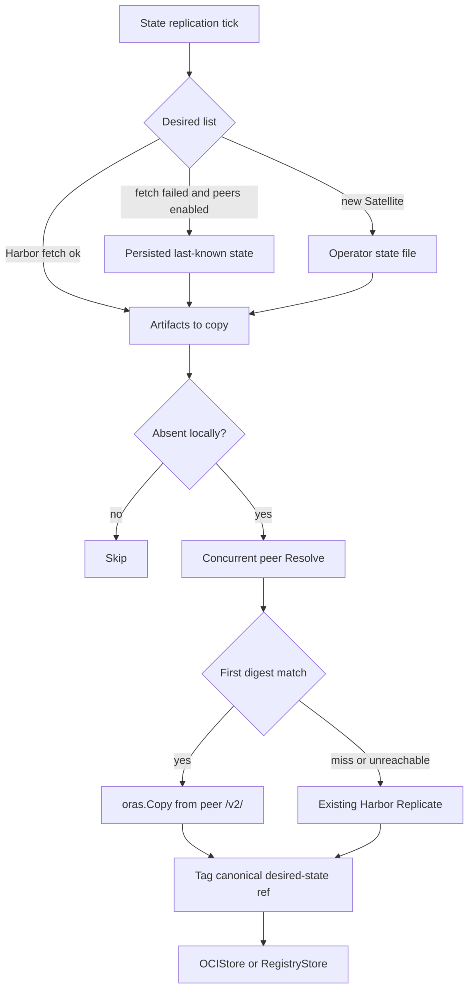
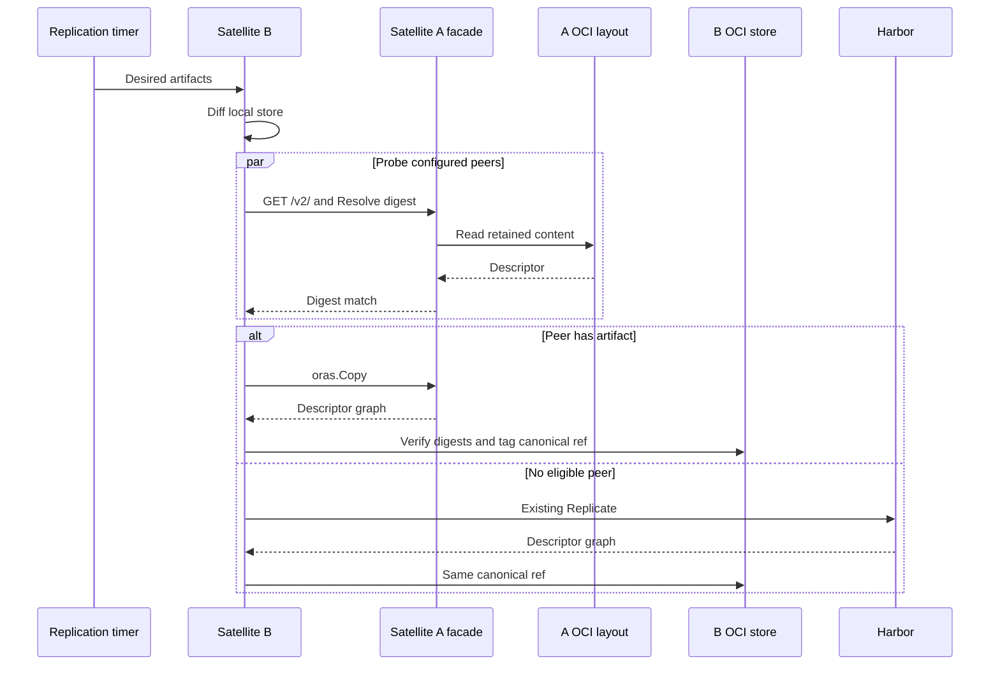

# Copy OCI artifacts between trusted Satellites on an isolated network

## Context

Satellite retains desired-state content in an ORAS OCI image layout
([ADR-0009](0009-transparent-oci-registry-proxy.md), [#648](https://github.com/container-registry/harbor-satellite/pull/648)).
That layout is not an OCI Distribution API endpoint. When a Satellite needs an
artifact that is absent locally, the only sources today are Harbor, Ground
Control-driven state fetch, or operator-imported offline media.

Air-gapped and intermittently connected sites often already hold the missing
graph on another trusted Satellite on the same LAN. Repeating bootstrap media
or waiting for WAN recovery is unnecessary operational work. [#542](https://github.com/container-registry/harbor-satellite/issues/542)
asks for an opt-in way for a Satellite to copy a requested artifact from a
configured peer without Internet, Harbor, or Ground Control, while preserving
digest verification.

`oras-go` already copies descriptor graphs between `Target` implementations.
The networked Target in `oras-go` is `registry/remote.Repository`, which
speaks OCI Distribution HTTP. A default Satellite's `content/oci` store is a
directory. `oras.Copy` cannot open another machine's layout. A peer therefore
needs an HTTP Distribution face over retained content, or it must already
expose a Bring-Your-Own registry.

Desired-state replication in `FetchAndReplicateStateProcess` fetches group
state from Harbor before any copy. `CanExecute` returns without work when the
state URL or Harbor credentials are missing. Wrapping the store does not
satisfy air-gap by itself: the process never reaches transfer.

This decision does not replace [ADR-0009](0009-transparent-oci-registry-proxy.md).
The transparent proxy, Spegel in-cluster distribution, and full headless mode
([#227](https://github.com/container-registry/harbor-satellite/issues/227))
remain separate.

## Decision Drivers

* The feature must work with `store.Store` (`OCIStore` and `RegistryStore`)
  after Zot removal. It must not reintroduce Zot or a second storage API.
* Transfer must use standard OCI Distribution APIs and digest-verified
  `oras.Copy`, including arbitrary OCI artifacts, not only container images.
* Default-mode Satellites (ORAS layout, no sidecar registry) must be able to
  act as peers on an isolated LAN.
* The feature must run when Harbor and Ground Control are unreachable, without
  taking on full headless Satellite mode.
* Copies must not collide with later Harbor reconcile. Local names stay the
  canonical desired-state references.
* The feature is opt-in and off by default. Existing replication is unchanged
  when it is disabled.
* Peer membership is an operator allow-list. This term does not add Ground
  Control peer APIs, discovery, or untrusted federation.
* A failed or unreachable peer must not publish a partial artifact.

## Considered Options

* Read-only Distribution facade and desired-state peer source
* Bring-Your-Own registry peers only
* Defer peer copy until the transparent proxy ([#234](https://github.com/container-registry/harbor-satellite/issues/234))
* Custom non-OCI transfer protocol

## Decision Outcome

Chosen option: "Read-only Distribution facade and desired-state peer source",
because it is the only option that lets a default-mode Satellite be a peer,
keeps transfer on `oras.Copy` and OCI Distribution, and stays inside the
existing desired-state replication loop.

Satellite will add opt-in peer distribution:

* A **read-only** OCI Distribution HTTP facade over the local ORAS layout,
  bound only when the feature is enabled. It serves retained manifests and
  blobs. It does not accept push, delete, pull-through, forwarding, or CRI
  traffic. This is not the ADR-0009 proxy.
* A **source resolver** in front of `store.Store`. For each missing desired
  artifact, Satellite probes configured peers concurrently (`Resolve` digest),
  takes the first match, cancels the rest, and copies with `oras.Copy`.
* **Canonical destination references** (fully qualified desired-state names,
  as `OCIStore` already stores them). The peer is transport. The local tag is
  never the peer hostname.
* A **degraded replication path** when Harbor state fetch fails: if the
  feature is on and persisted last-known state exists, continue from that
  list. A new Satellite with an empty disk uses an operator-supplied state
  file. This is not `--headless`, does not skip ZTR or heartbeat as a product
  mode, and does not close [#227](https://github.com/container-registry/harbor-satellite/issues/227).
* **Local** `peer_distribution` config. Remote config reconcile preserves it
  the same way `StateConfig` is preserved. Ground Control does not manage
  peers this term.
* Structured logs for probe, hit, miss, bytes, duration, retry, and fallback.
  Heartbeat fields to Ground Control are optional and are not required for
  air-gap operation.

ORAS remains the content and copy layer. Satellite owns listen address,
authentication on the facade, peer allow-list, probe cancellation, and the
degraded `CanExecute` path.

### Locked choices

| Topic | Choice |
|---|---|
| Peer reachability | Read-only `/v2/` over the OCI layout |
| Copy trigger | Desired-state replication timer, not CRI miss-fill |
| Air-gap list | Persisted last-known state; operator state file for a new Satellite |
| Local name | Canonical Harbor-style desired-state reference |
| Trust | Static URLs; optional credential and TLS; anonymous HTTP only when `use_unsecure` is already set |
| Config | Local `peer_distribution`; preserve on remote reconcile |
| Observability | Zerolog first; Ground Control metrics optional |
| Spegel | Concurrent first-hit lookup only; no Spegel runtime, DHT, or libp2p |
| #227 / #234 | Out of scope except the degraded list path above |

## Scope

This decision covers:

* opt-in peer distribution configuration (enablement, listen address, peer
  URLs, timeouts, retries, probe concurrency, optional per-peer credentials
  and TLS);
* a read-only Distribution facade over retained OCI layout content;
* concurrent peer eligibility and digest `Resolve`;
* digest-verified graph copy into `OCIStore` or `RegistryStore`;
* fallback to existing upstream `Replicate` when no peer is eligible;
* degraded replication from persisted or operator-supplied desired state when
  Harbor fetch cannot run;
* structured logs and tests, including a multi-Satellite air-gapped case.

This decision does not cover:

* Zot, a second blob store, or replacing ORAS;
* DHT, BitTorrent, multi-source blob swarms, or Spegel;
* untrusted peers or Internet discovery;
* Ground Control peer scheduling, policy, or dashboards;
* `--headless`, skipping registration, or skipping heartbeat ([#227](https://github.com/container-registry/harbor-satellite/issues/227));
* policy-enforcing transparent proxying, pull-through, or CRI miss-fill
  ([ADR-0009](0009-transparent-oci-registry-proxy.md),
  [#234](https://github.com/container-registry/harbor-satellite/issues/234)).

## Architecture

Replication stays on the existing scheduler. Peer copy is a second source for
artifacts already in the desired list.

### Why a facade

`oras.Copy` copies between two `Target` values the current process already
holds. `content/oci.Store` requires a filesystem path. `registry/remote`
requires HTTP Distribution. Two Satellites on a LAN share neither a
filesystem nor, in default mode, a registry port.

The facade is that HTTP Target on the holder: `GET` of retained manifests and
blobs from the existing layout. It is not a second copy of the artifacts and
not a registry product. BYO deployments that already expose a registry may
use that endpoint as the peer URL; the facade is required so default-mode
sites can participate.

Writes into one `OCIStore` stay serialized under the existing mutex. Probe
concurrency is bounded separately. A failed copy does not publish a tag.

### Trust and configuration

Peers are an operator allow-list of URLs. Each peer may carry optional
username and password or token, plus TLS. Anonymous HTTP is allowed only when
the Satellite already runs with `use_unsecure`. SPIFFE between Satellites is
out of this decision.

`peer_distribution` lives in local Satellite config. Remote config reconcile
must not drop it. A later Ground Control peer roster would be a separate
decision.

## Pros and Cons of the Options

### Read-only Distribution facade and desired-state peer source

Satellite serves retained layout content over `/v2/` and copies on the
desired-state path.

* Good, because default-mode Satellites can be peers without Zot or a sidecar
  registry.
* Good, because transfer stays on `oras.Copy` and OCI Distribution.
* Good, because the trigger matches current `FetchAndReplicateStateProcess`.
* Neutral, because Satellite must own a small HTTP surface and keep it
  fenced from ADR-0009.
* Bad, because a listen port is new attack surface and must be authenticated
  and read-only.

### Bring-Your-Own registry peers only

Peer URLs point at an existing registry process. No new HTTP server in
Satellite.

* Good, because no new serve path, and `oras.Copy` already works
  remote-to-remote.
* Bad, because default air-gapped layouts cannot be sources, which fails the
  #542 default-mode case.

### Defer peer copy until the transparent proxy

Hang peer fill off ADR-0009 miss handling.

* Good, because one HTTP stack could later serve CRI and peers.
* Bad, because #234 is a larger policy-and-forwarding project and would block
  this term.
* Bad, because live CRI miss-fill is a different trigger than desired-state
  copy.

### Custom non-OCI transfer protocol

A Satellite-specific RPC or stream as an `oras.Target`.

* Neutral, because a custom `Target` could wrap any transport.
* Bad, because it abandons OCI Distribution, existing ORAS clients, and the
  #542 API constraint.

## Consequences

* Good: Peer transfer uses the same ORAS graph model as local replication
  (ADR-0009's "future peer transfer").
* Good: Existing Harbor replication remains the fallback and is unchanged
  when the feature is off.
* Good: Canonical refs keep later Harbor sync from duplicating peer copies.
* Neutral: The facade is a new, narrowly scoped HTTP path. Protocol tests
  against `oras` and `remote.Repository` address this.
* Neutral: Air-gap for a brand-new Satellite still needs an operator-supplied
  list; this is documented rather than a headless product flag.
* Bad: Operators must place peer URLs and, where required, credentials in
  local config and keep that block across Ground Control config pushes.
* Bad: `OCIStore` remains a single-writer store; peer probes scale, local
  graph commits do not.

## Validation

* Unit tests for peer hit, miss, unreachable peer, digest mismatch, retry,
  and fallback to existing `Replicate`.
* `oras.Copy` from the facade over a temporary OCI layout succeeds and
  verifies digests.
* Failed or cancelled copy does not tag the destination reference.
* Canonical destination refs match later Harbor reconcile names.
* Remote config reconcile preserves `peer_distribution`.
* Degraded path: Harbor fetch failure with persisted state and peers enabled
  still copies.
* `CanExecute` no longer no-ops solely for missing Harbor credentials when
  that degraded path applies.
* Feature disabled: no listen port, no probe, replication identical to
  current behavior.
* Integration: Satellite A holds an artifact, Satellite B is configured with
  A as a peer, Harbor and Ground Control are unreachable, B obtains the
  graph, digests match.
* Logs include probe result, transfer outcome, bytes, duration, and fallback
  reason.

## More Information

This record was locked in the 7 Sep 2026 design review for LFX Term 3
([#542](https://github.com/container-registry/harbor-satellite/issues/542)).
Implementation follows as separate PRs: configuration, facade, probe and
copy, degraded state path, then tests and operator documentation.

Revisit if ADR-0009's proxy later absorbs the read-only serve path, or if
Ground Control is later asked to distribute peer lists. Either change needs
a new decision. This record should not grow into Spegel, #227, or #234.

## References

* [#542 Air-gapped peer-to-peer OCI image distribution](https://github.com/container-registry/harbor-satellite/issues/542)
* [#648 Generic OCI store interface replacing Zot with ORAS](https://github.com/container-registry/harbor-satellite/pull/648)
* [#227 Headless Satellite Mode](https://github.com/container-registry/harbor-satellite/issues/227)
* [#234 Transparent Proxy Mode](https://github.com/container-registry/harbor-satellite/issues/234)
* [ADR-0009 Transparent OCI registry proxy with ORAS](0009-transparent-oci-registry-proxy.md)
* [OCI Distribution Specification](https://github.com/opencontainers/distribution-spec/blob/v1.1.1/spec.md)
* [OCI Image Layout](https://github.com/opencontainers/image-spec/blob/v1.1.1/image-layout.md)
* [ORAS Go v2.6.2](https://github.com/oras-project/oras-go/tree/v2.6.2)
* [ORAS copy implementation](https://github.com/oras-project/oras-go/blob/v2.6.2/copy.go)
* [ORAS OCI store](https://pkg.go.dev/oras.land/oras-go/v2@v2.6.2/content/oci)
* [ORAS remote repository](https://pkg.go.dev/oras.land/oras-go/v2@v2.6.2/registry/remote)
* [olareg server dispatch](https://github.com/olareg/olareg/blob/main/olareg.go#L151)
