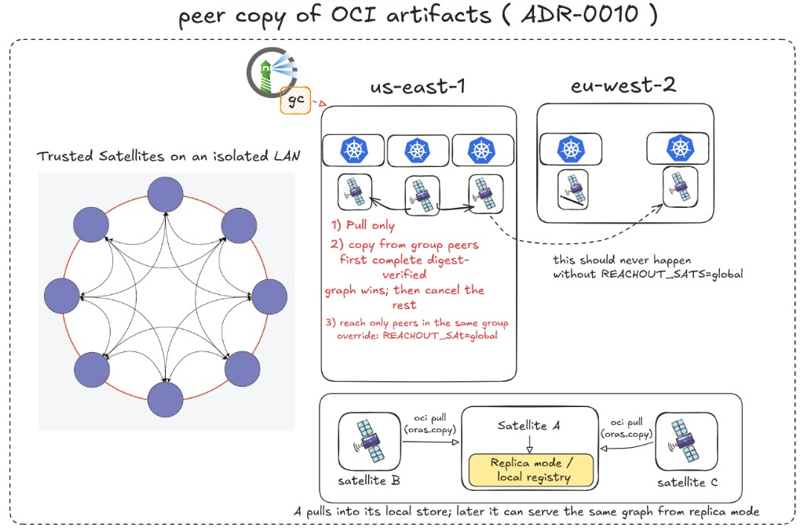

# Copy OCI artifacts between trusted Satellites on an isolated network

## Context

Satellite retains desired-state content in an ORAS OCI image layout
([ADR-0009](0009-transparent-oci-registry-proxy.md), [#648](https://github.com/container-registry/harbor-satellite/pull/648)).
The proxy integration ([#654](https://github.com/container-registry/harbor-satellite/pull/654),
[#669](https://github.com/container-registry/harbor-satellite/pull/669)) exposes that
layout as OCI Distribution on `PROXY_PORT`:

* **replica**: GET/HEAD of retained manifests and blobs; writes 405; no
  pull-through, forwarding, or CRI miss-fill.
* **proxy**: a local miss may fill from upstream (out of scope for peer copy).

For this decision, a replica miss returns OCI not-found and never contacts an
upstream. This narrows ADR-0009's replica-mode row and depends on [#669](https://github.com/container-registry/harbor-satellite/pull/669);
proxy mode remains the only mode that may fill a miss.

`oras-go` copies descriptor graphs between `Target` implementations. The
networked Target is `registry/remote.Repository` (OCI Distribution HTTP). A
default Satellite's `content/oci` store is a directory; `oras.Copy` cannot open
another machine's layout. Replica mode is that HTTP Target over retained
content. Bring-Your-Own registry deployments may already expose a registry URL
as a peer.

When a Satellite needs an artifact that is absent locally, the only sources
without peers are Harbor, Ground Control-driven state fetch, or operator-imported
offline media. Air-gapped and intermittently connected sites often already hold
the missing graph on another trusted Satellite on the same LAN.
[#542](https://github.com/container-registry/harbor-satellite/issues/542) asks
for an opt-in way to copy a requested artifact from a configured peer without
Internet, Harbor, or Ground Control, while preserving digest verification.

Desired-state replication in `FetchAndReplicateStateProcess` fetches group
state from Harbor before any copy. `CanExecute` returns without work when the
state URL or Harbor credentials are missing. Wrapping the store does not
satisfy air-gap by itself: the process never reaches transfer. Peer copy
therefore needs a **degraded list path** (persisted last-known state or a
bootstrap desired-state file), not a second listen server.

This decision supersedes only ADR-0009's replica-miss behavior. Its other
decisions, Spegel in-cluster distribution, and full headless mode
([#227](https://github.com/container-registry/harbor-satellite/issues/227))
remain separate. Peer copy **consumes replica mode**; it does not reimplement
it.

## Decision Drivers

* The feature must work with `store.Store` (`OCIStore` and `RegistryStore`)
  after Zot removal. It must not reintroduce Zot or a second storage API.
* Transfer must use standard OCI Distribution APIs and digest-verified
  `oras.Copy`, including arbitrary OCI artifacts, not only container images.
* Default-mode Satellites (ORAS layout, no sidecar registry) must be able to
  act as peers on an isolated LAN.
* The feature must run when Harbor and Ground Control are unreachable, without
  taking on full headless Satellite mode.
* Copies must not collide with later Harbor reconcile. Local names stay the
  canonical desired-state references.
* The feature is opt-in and off by default. Existing replication is unchanged
  when it is disabled.
* Peer membership starts as an operator allow-list. Each static peer descriptor
  carries a stable identity, URL, and operator-declared Ground Control group
  IDs; the Satellite does not infer membership from a URL or peer self-report.
  A peer is eligible by default only when its groups intersect the Satellite's
  locally configured and persisted group IDs. Unknown or non-matching
  membership fails closed. `REACHOUT_SATS=global` is the explicit override.
* Config must accept a Ground Control-sourced peer list later without a
  breaking change. Static and GC descriptors coexist. This term does not
  require shipping GC peer HTTP APIs or latency ranking.
* Ground Control owns health for GC-sourced peers. Static peers remain an
  operator-controlled floor. Satellites must not locally blacklist a peer as
  dead. An unreachable eligible peer is retried once, logged, and failed
  predictably, not silently skipped.
* Concurrent peer work is cancelled only when some peer has returned the
  **complete** artifact (digest-verified graph), not when the first digest
  `Resolve` succeeds.
* A failed or unreachable peer must not publish a partial artifact.
* A complete peer graph must pass content policy (ADR-0009), or
  remain untagged in quarantine, before Satellite publishes a canonical
  desired-state reference.
* Listen path is the existing replica proxy. Peer copy must not bind a second
  `/v2/` server.

## Considered Options

* Replica mode as peer `/v2/` and desired-state peer source
* Separate read-only Distribution facade (rejected: duplicates replica mode)
* Bring-Your-Own registry peers only
* Defer peer copy until the transparent proxy ([#234](https://github.com/container-registry/harbor-satellite/issues/234))
* Custom non-OCI transfer protocol
* Group-scoped peers vs always-global vs GC latency ranking
* Operator/GC group metadata vs URL inference or peer self-report
* Static allow-list only vs GC-only roster vs union of both
* Cancel siblings on first digest `Resolve` vs on first complete artifact
* Satellite-local dead-peer skip vs GC-owned health

## Decision Outcome

Chosen option: "Replica mode as peer `/v2/` and desired-state peer source".
Default-mode Satellites can be peers without Zot, transfer stays on
`oras.Copy` and OCI Distribution, and copy stays inside the existing
desired-state replication loop. The HTTP surface is ADR-0009 **replica**
mode on `PROXY_PORT` (proxy integration [#669](https://github.com/container-registry/harbor-satellite/pull/669)).
This ADR does not add a second HTTP server.

Satellite will add opt-in peer distribution **on top of replica mode**:

* **Listen.** Other Satellites pull the holder's replica proxy (`PROXY_PORT`).
  Replica serves retained content only (GET/HEAD; writes 405). It does not
  accept push, delete, pull-through, or CRI miss-fill. BYO deployments may
  list an existing registry as a peer URL; default-mode sites use replica
  mode. Implementing replica/proxy itself is the proxy-integration work, not
  this decision.
* A **source resolver** in front of `store.Store`. It **builds a unique peer
  list** from operator static peers and, later, an optional Ground Control
  list (`gc_peers`, same schema, empty until those APIs exist). The same
  Satellite appears once (stable `id`, then canonical URL). Then the list is
  **group-filtered** unless `REACHOUT_SATS=global`. Static group membership is
  operator-declared; future GC membership is supplied through authenticated
  GC configuration and is authoritative when the two sources conflict. A
  static entry stays on the list if GC omits it or marks it unhealthy. No
  group claim is read from the peer endpoint.
  For each missing desired artifact, Satellite starts concurrent pulls toward
  that set. The **winner is the first peer that returns the complete,
  digest-verified graph**, not the first successful digest `Resolve`. At that
  instant every other in-flight peer request is cancelled.
* **Policy admission before publication.** The complete peer graph is
  digest-verified and evaluated using ADR-0009's bounded content evidence
  before publication. An implementation may evaluate before copying into the
  durable store, or copy into untagged quarantine and promote only after
  approval. Rejection is terminal for that graph: quarantine or delete it,
  fail the artifact, and do not fall back to Harbor to publish the same graph.
  This admission boundary does not add policy-enforcing pull-through or CRI
  miss-fill; both remain out of scope.
* **Canonical destination references** (fully qualified desired-state names,
  as `OCIStore` already stores them) are tagged only after policy approval.
  The peer is transport. The local tag is never the peer hostname.
* **Harbor `Replicate`** only when no peer delivered a complete artifact
  **and** Harbor is reachable. An air-gapped miss fails predictably and does
  not tag. Harbor fallback is not the #542 acceptance test.
* **Health.** Satellites do not mark peers dead. Ground Control surfaces
  healthy GC peers and may influence ordering, but omission or an unhealthy
  verdict does not remove an operator-configured static peer. If an eligible
  peer is unreachable: retry that attempt **once**, log, fail that attempt.
  Do not locally blacklist it. Other concurrent peers may still win. If none
  complete and Harbor is down, fail and do not tag.
* A **degraded replication path** when Harbor state fetch fails: if the
  feature is on and persisted last-known state exists, continue from that
  list. A new Satellite with an empty disk uses a bootstrap desired-state
  file. This is not `--headless`, does not skip ZTR or heartbeat as a product
  mode, and does not close [#227](https://github.com/container-registry/harbor-satellite/issues/227).
  Air-gap still uses static and last-known peer descriptors; it does not wait
  on GC health APIs.
* **Local** `peer_distribution` config (enablement, persisted `local_groups`,
  static peer descriptors with identity, URL, group IDs, optional credentials
  and TLS, `REACHOUT_SATS`, timeouts, retries, probe concurrency, and a field
  for a GC-sourced list that may be empty). Initially the operator supplies
  `local_groups` and static membership. Future authenticated GC configuration
  may refresh both without changing the schema. Remote config reconcile must
  not drop the last authenticated or operator-supplied values, so the filter
  remains enforceable while air-gapped.

ORAS remains the content and copy layer. The proxy owns listen address and
replica vs proxy mode. Peer copy owns the unique peer list, group filter,
full-artifact cancellation, one retry on unreachable listed peers, and the
degraded `CanExecute` path.

### Locked choices

| Topic | Choice |
|---|---|
| Peer reachability | **Replica** mode on `PROXY_PORT`; local miss returns not-found without upstream contact (narrowing ADR-0009 via #669), not a separate facade |
| Copy trigger | Desired-state replication timer, not CRI miss-fill |
| Air-gap list | Persisted last-known state; bootstrap desired-state file for a new Satellite |
| Local name | Canonical Harbor-style desired-state reference |
| Trust | Group claims come only from operator config or authenticated GC data. For peer requests, `use_unsecure` permits credential-free HTTP only; credentials require HTTPS with certificate verification enabled |
| Peer selection | A peer is eligible by default only when `local_groups` intersects its group IDs. Missing or non-matching membership fails closed. `REACHOUT_SATS=global` explicitly admits listed cross-group and unknown-group peers |
| Unique peer list | Combine static peers with an optional later GC list (`gc_peers`; empty is valid). Same `id` or URL appears once; GC omission does not remove the static floor |
| Peer health | GC health selects/orders GC-sourced peers but never removes the static floor. Satellite does not blacklist; unreachable eligible peer: retry once, log, fail that attempt |
| Winner / cancel | First **complete** digest-verified artifact wins; then cancel all other in-flight peer requests. Digest `Resolve` alone does not win or cancel |
| Policy admission | Apply ADR-0009 content-aware admission before tagging. Pre-admit or use untagged quarantine; rejected graphs are quarantined/deleted and never receive the canonical reference |
| Config | Local `peer_distribution` (`local_groups`, static peer descriptors, `REACHOUT_SATS`, optional `gc_peers`); preserve group metadata on remote reconcile and across air-gap |
| Observability | Zerolog first; Ground Control metrics optional |
| Spegel | Concurrent first-complete-artifact only; no Spegel runtime, DHT, or libp2p |
| #227 / #234 | Out of scope except the degraded list path above |
| Harbor fallback | Only if no peer delivered a complete artifact **and** Harbor is reachable; air-gapped miss does not tag |

## Scope

This decision covers:

* opt-in peer distribution configuration (enablement, persisted local group
  IDs, static peer descriptors, `REACHOUT_SATS`, optional GC-sourced list
  field, timeouts, retries, probe concurrency, optional per-peer credentials
  and TLS);
* using replica mode as the peer Distribution endpoint (no second listen
  process);
* group-scoped filtering of the unique peer list, with `REACHOUT_SATS=global`
  as the override;
* concurrent peer pulls whose siblings cancel only when a complete
  digest-verified artifact has arrived;
* digest-verified graph copy into `OCIStore` or `RegistryStore`, with
  content policy (ADR-0009) or untagged quarantine before canonical tagging;
* one retry, structured log, and predictable failure for an unreachable
  listed peer (no local dead-peer roster);
* Harbor `Replicate` when no peer delivered a complete artifact and Harbor
  is reachable;
* degraded replication from persisted last-known state or a bootstrap
  desired-state file when Harbor fetch cannot run;
* structured logs and tests, including a multi-Satellite air-gapped case.

This decision does not cover:

* implementing replica or proxy mode (proxy integration);
* a second `/v2/` server beside `PROXY_PORT`;
* implementing Ground Control peer HTTP APIs, dashboards, or RTT ranking
  (satellite config is ready for a GC list; those APIs are follow-on);
* Zot, a second blob store, or replacing ORAS;
* DHT, BitTorrent, multi-source blob swarms, or Spegel;
* untrusted peers or Internet discovery;
* `--headless`, skipping registration, or skipping heartbeat ([#227](https://github.com/container-registry/harbor-satellite/issues/227));
* policy-enforcing pull-through or CRI miss-fill
  ([ADR-0009](0009-transparent-oci-registry-proxy.md),
  [#234](https://github.com/container-registry/harbor-satellite/issues/234)).

## Architecture

Replication stays on the existing scheduler. Peer copy is a second source for
artifacts already in the desired list. The holder serves replica mode; the
requester runs the resolver.



Group-local pull from a peer replica; cross-group only with `REACHOUT_SATS=global`.

```mermaid
flowchart TB
    tick[State replication tick]
    list{Desired list}

    tick --> list

    list -->|Harbor fetch ok| artifacts[Artifacts to copy]
    list -->|fetch failed and peers enabled| persisted[Persisted last-known state]
    list -->|new Satellite| localFile[Bootstrap desired-state file]
    persisted --> artifacts
    localFile --> artifacts

    artifacts --> missing{Absent locally?}
    missing -->|no| skip[Skip]
    missing -->|yes| roster[Build unique peer list]
    roster --> scope{REACHOUT_SATS}
    scope -->|unset / group| group["Group IDs intersect; unknown fails closed"]
    scope -->|global| all[All listed peers, including unknown group]
    group --> probe["Concurrent peer pulls (unreachable: retry once, log)"]
    all --> probe

    probe --> hit{First complete artifact}
    hit -->|yes| cancel[Cancel in-flight peers]
    cancel --> copyPeer["Verify complete graph in staging / quarantine"]
    copyPeer --> admit{Content policy (ADR-0009)}
    admit -->|allow| publish[Tag canonical ref]
    admit -->|deny| reject["Quarantine / delete; fail; do not tag"]
    hit -->|none complete| online{Harbor reachable?}
    online -->|yes| harbor[Existing Harbor Replicate]
    online -->|no| fail[Fail, do not tag]

    publish --> store[OCIStore or RegistryStore]
    harbor --> store
```

### Why replica mode

`oras.Copy` copies between two `Target` values the current process already
holds. `content/oci.Store` requires a filesystem path. `registry/remote`
requires HTTP Distribution. Two Satellites on a LAN share neither a
filesystem nor, in default mode, a sidecar registry.

Replica mode is that HTTP Target on the holder: GET/HEAD of retained
manifests and blobs from the existing layout. It is not a second copy of the
artifacts, not proxy-mode pull-through, and not a second process. BYO
deployments that already expose a registry may use that endpoint as the peer
URL.

Writes into one `OCIStore` stay serialized under the existing mutex. Probe
concurrency is bounded separately. A failed copy does not publish a tag.
Siblings are cancelled only after a complete graph is in hand, so a fast
`Resolve` cannot abort a slower peer that would have delivered the bytes.
Completion wins the peer race; it does not imply policy approval. ADR-0009
requires either resolving the bounded evidence needed by policy before a
publishing copy, or copying into untagged quarantine until admission succeeds.
Only an approved graph receives the canonical desired-state reference.

### Trust and configuration

The **unique peer list** combines:

* operator-supplied static peers in `peer_distribution` (this term);
* an optional later Ground Control list (`gc_peers` or equivalent), empty
  until those APIs exist.

Both sources use the same record: stable peer identity, Distribution URL,
Ground Control group IDs, and optional credentials and TLS. The same
Satellite appears once (stable identity, then canonical URL). When the sources
conflict, authenticated GC group membership is authoritative, but a static
entry keeps its operator provenance. GC omission or health may select or
order GC-sourced peers but does not remove an operator-configured static
peer. Local trust settings are not silently weakened. Anonymous HTTP is
allowed only when the Satellite already runs with `use_unsecure`.
Credential-bearing peer requests require HTTPS with certificate validation
enabled (`skip_verify=false`); invalid combinations fail config validation
before probing. SPIFFE between Satellites is out of this decision.

The configuration shape is:

```json
{
  "peer_distribution": {
    "local_groups": ["edge-site-a"],
    "static_peers": [
      {
        "id": "satellite-a",
        "url": "https://satellite-a.example:5000",
        "groups": ["edge-site-a"]
      }
    ],
    "gc_peers": [],
    "reachout_sats": "group"
  }
}
```

`id` is the stable deduplication and audit identity. The URL-to-identity and
group binding is trusted because it came from local operator configuration or
authenticated GC configuration; it is never learned by calling the peer.
Configured TLS and credentials authenticate the endpoint when enabled.

`local_groups` is persisted in local `peer_distribution` config. Initially it
is operator-supplied; future authenticated GC configuration may refresh it.
Static peer group IDs are operator-declared. Future GC peer descriptors carry
GC-declared IDs. The Satellite neither infers groups from URLs nor accepts a
peer's self-reported group claim.

With `REACHOUT_SATS` unset or set to `group`, a peer is eligible only when
`local_groups` and the peer's group IDs have a non-empty intersection. Missing
local groups, missing peer groups, and non-matching groups fail closed: the
peer is not probed. `REACHOUT_SATS=global` explicitly admits listed cross-group
and unknown-group peers; it does not bypass the allow-list, authentication,
TLS, health, or digest verification.

Groups are a desired-content membership boundary and may encode colocation by
operator convention; they are not measured latency.

Ground Control owns health for GC-sourced peers and may populate or order the
GC list. The Satellite does not keep a local dead-peer set. Remote config
reconcile must not drop `local_groups`, static descriptors, `REACHOUT_SATS`,
or the GC list field; the last authenticated or operator-supplied group
metadata remains usable while air-gapped.

## Pros and Cons of the Options

### Replica mode as peer `/v2/` and desired-state peer source

Satellite serves retained layout content with ADR-0009 replica mode and
copies on the desired-state path.

* Good, because default-mode Satellites can be peers without Zot or a sidecar
  registry.
* Good, because transfer stays on `oras.Copy` and OCI Distribution.
* Good, because the trigger matches current `FetchAndReplicateStateProcess`.
* Good, because one HTTP stack (`PROXY_PORT`) serves replica clients and
  peers; peer copy does not bind a second port.
* Bad, because the listen port remains attack surface and must stay
  authenticated and read-only in replica mode.

### Separate read-only Distribution facade

A second HTTP server over the same layout, fenced from ADR-0009.

* Neutral, because an early PoC used this to prove pull-based copy.
* Bad, because it duplicates replica mode after the proxy is integrated.
* Bad, because listen flags collide with `PROXY_PORT`.

### Bring-Your-Own registry peers only

Peer URLs point at an existing registry process. No replica listen required.

* Good, because no new serve path, and `oras.Copy` already works
  remote-to-remote.
* Bad, because default air-gapped layouts cannot be sources, which fails the
  #542 default-mode case.

### Defer peer copy until the transparent proxy

Hang peer fill off ADR-0009 **proxy-mode** miss handling or wait for full
[#234](https://github.com/container-registry/harbor-satellite/issues/234).

* Good, because one HTTP stack serves CRI and peers (replica mode already
  provides the serve path).
* Bad, because #234 policy-and-forwarding would still block this term if
  peer copy waited on it.
* Bad, because live CRI miss-fill is a different trigger than desired-state
  copy.

This option is **superseded for the listen path**: replica mode is the serve
path. Peer copy still must not hang off CRI miss-fill or proxy-mode upstream
fill.

### Custom non-OCI transfer protocol

A Satellite-specific RPC or stream as an `oras.Target`.

* Neutral, because a custom `Target` could wrap any transport.
* Bad, because it abandons OCI Distribution, existing ORAS clients, and the
  #542 API constraint.

### Group-scoped peers vs always-global vs GC latency ranking

Same-group is the default because it is enforceable offline from operator
metadata. Always-global is rejected as the default: it can pull across links
the operator did not intend. URL inference and peer self-report are rejected.
GC latency ranking waits on peer APIs this term does not ship.

### Static allow-list only vs GC-only roster vs union of both

The unique list keeps a static floor and an empty-valid `gc_peers` field.
Static-only is rejected because adding the field later breaks config.
GC-only is rejected because air-gap and first bring-up have no GC round-trip.

### Cancel siblings on first digest `Resolve` vs on first complete artifact

Cancel-on-`Resolve` is rejected: digest presence is not delivery, and a fast
HEAD can abort a slower peer that has the bytes. Serial probes are rejected
because they give up the race.

### Satellite-local dead-peer skip vs GC-owned health

A local blacklist is rejected. Independent Satellite health pictures diverge
after a flap, and a silent skip makes an air-gapped failure look like "no
peers configured". GC owns health for GC-sourced peers. An unreachable
eligible peer is retried once, logged, and failed for that attempt.

## Consequences

* Good: Peer transfer uses the same ORAS graph model as local replication
  (ADR-0009's "future peer transfer").
* Good: Replica mode is the peer `/v2/`; peer copy is only resolver, copy,
  and degraded `CanExecute`.
* Good: Existing Harbor replication remains the online fallback and is
  unchanged when the feature is off.
* Good: Canonical refs keep later Harbor sync from duplicating peer copies.
* Good: Explicit group metadata makes the same-group default enforceable
  offline. Unknown and non-matching membership fails closed;
  `REACHOUT_SATS=global` is the documented exception.
* Good: Unique peer list plus an empty-valid `gc_peers` field lets GC peer
  APIs land later without renaming static peers or breaking air-gap config.
* Good: Cancelling only on a complete artifact avoids aborting a slower peer
  that would have delivered the graph.
* Good: Peer transport cannot bypass ADR-0009 policy; canonical references
  expose only admitted graphs.
* Good: Unreachable listed peers are retried once and logged; operators and
  GC see the failure instead of a silent skip.
* Neutral: Air-gap for a brand-new Satellite still needs an operator-supplied
  list; this is documented rather than a headless product flag.
* Neutral: Without GC, the static list is the whole roster and is treated as
  healthy; GC health ownership applies when GC is present.
* Bad: Until authenticated GC configuration supplies membership, operators
  must maintain `local_groups` and each static peer's identity, URL, group IDs,
  and credentials. Incorrect metadata can exclude a valid peer.
* Bad: `OCIStore` remains a single-writer store; peer probes scale, local
  graph commits do not.
* Bad: Policies that need complete-graph evidence require either a bounded
  pre-admission fetch or temporary untagged quarantine storage.
* Bad: A peer that is down but still listed is probed (and retried once)
  every tick until GC or the operator removes it.
* Bad: Group membership is a content boundary, not measured topology; using it
  as a locality hint depends on operator placement. Wrong or missing metadata
  needs `REACHOUT_SATS=global` or a group fix.

## Validation

* Unit tests for peer hit, miss, unreachable peer, digest mismatch, retry,
  online Harbor fallback, and air-gapped miss (no tag).
* `oras.Copy` from a replica-mode `/v2/` over a temporary OCI layout succeeds
  and verifies digests.
* Failed or cancelled copy does not tag the destination reference.
* Approved peer graph: digest and size verification completes, ADR-0009
  content-aware policy allows it, and only then the canonical desired-state
  reference is tagged.
* Rejected peer graph: policy denial leaves no canonical reference; staged
  content is quarantined or deleted, the artifact fails predictably, and
  Harbor fallback does not publish the same rejected graph.
* Canonical destination refs match later Harbor reconcile names.
* Remote config reconcile preserves `peer_distribution`, including
  `local_groups`, static peer descriptors, `REACHOUT_SATS`, and the GC list
  field. The last authenticated or operator-supplied group metadata survives
  an air-gap.
* Degraded path: Harbor fetch failure with persisted state and peers enabled
  still copies.
* `CanExecute` no longer no-ops solely for missing Harbor credentials when
  that degraded path applies.
* Feature disabled: no peer probe; replication identical to current behavior.
  Replica listen remains the proxy's concern (CRI may still use `PROXY_PORT`).
* Peer transport: anonymous HTTP requires `use_unsecure`; HTTP with credentials
  and HTTPS with credentials plus `skip_verify=true` are rejected; verified
  HTTPS with credentials is accepted.
* Group filter: with `REACHOUT_SATS` unset or `group`, only peers whose group
  IDs intersect `local_groups` are probed. Missing local groups, missing peer
  groups, and non-matching groups are not probed.
* Global override: `REACHOUT_SATS=global` admits listed cross-group and
  unknown-group peers but does not bypass allow-list, authentication, TLS,
  health, or digest verification.
* Membership source: static group IDs are operator-declared; authenticated GC
  values are authoritative when static and GC descriptors disagree. Group
  claims returned by a peer endpoint are ignored.
* Unique peer list: static peers and a populated `gc_peers` list are both
  considered; the same `id` or URL appears once, and a static entry keeps
  operator provenance. An empty GC list is equivalent to static-only and is
  not an error.
* GC health: omission or an unhealthy verdict can exclude a GC-only entry but
  not a matching static entry. GC metadata may order eligible peers. Group
  filtering still applies to the unique peer list afterward.
* Winner / cancel: a peer that only succeeds at digest `Resolve` does not
  cancel siblings and does not count as a hit. The first complete
  digest-verified graph cancels remaining in-flight pulls. Cancelled copies
  do not tag.
* Unreachable listed peer: retry once, emit a structured log, fail that
  attempt. The peer remains on the roster (no local blacklist). If no other
  peer completes and Harbor is down, the artifact is not tagged.
* Integration: Satellite A holds an artifact, Satellite B has a persisted
  local group matching A's operator-declared group, Harbor and Ground Control
  are unreachable, B obtains the graph, digests match. Removing either side's
  group metadata prevents the default probe.
* Logs include probe result, transfer outcome, bytes, duration, unreachable
  retry, cancel-on-complete, group-filter skip, and fallback reason.

## More Information

Implementation follows as separate PRs on the proxy-integration line
([#669](https://github.com/container-registry/harbor-satellite/pull/669)):
configuration, probe and copy with first-complete-artifact cancel and one
retry on unreachable listed peers, the degraded state path, then tests and
operator documentation. A PoC that bound a second listen address is evidence
only and is not merged.

Ground Control peer HTTP APIs, dashboards, and RTT ranking are follow-on.
This record should not grow into Spegel, #227, or #234.

## References

* [#542 Air-gapped peer-to-peer OCI image distribution](https://github.com/container-registry/harbor-satellite/issues/542)
* [#648 Generic OCI store interface replacing Zot with ORAS](https://github.com/container-registry/harbor-satellite/pull/648)
* [#654 Integrate proxy into the satellite](https://github.com/container-registry/harbor-satellite/pull/654)
* [#669 Decouple satellite from Ground Control / proxy `serve`](https://github.com/container-registry/harbor-satellite/pull/669)
* [#227 Headless Satellite Mode](https://github.com/container-registry/harbor-satellite/issues/227)
* [#234 Transparent Proxy Mode](https://github.com/container-registry/harbor-satellite/issues/234)
* [ADR-0009 Transparent OCI registry proxy with ORAS](0009-transparent-oci-registry-proxy.md)
* [OCI Distribution Specification](https://github.com/opencontainers/distribution-spec/blob/v1.1.1/spec.md)
* [OCI Image Layout](https://github.com/opencontainers/image-spec/blob/v1.1.1/image-layout.md)
* [ORAS Go v2.6.2](https://github.com/oras-project/oras-go/tree/v2.6.2)
* [ORAS copy implementation](https://github.com/oras-project/oras-go/blob/v2.6.2/copy.go)
* [ORAS OCI store](https://pkg.go.dev/oras.land/oras-go/v2@v2.6.2/content/oci)
* [ORAS remote repository](https://pkg.go.dev/oras.land/oras-go/v2@v2.6.2/registry/remote)
