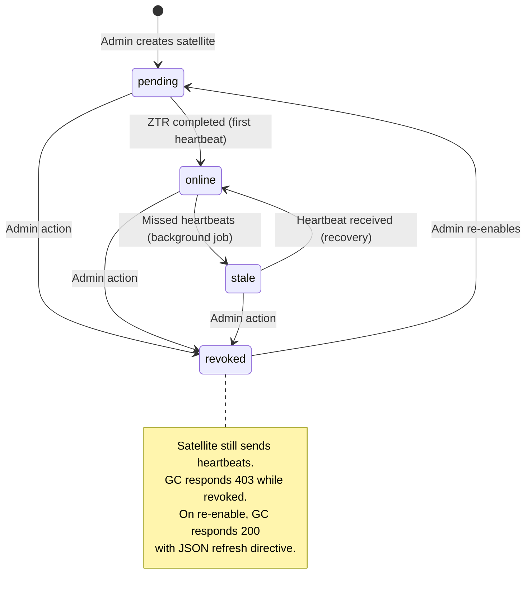
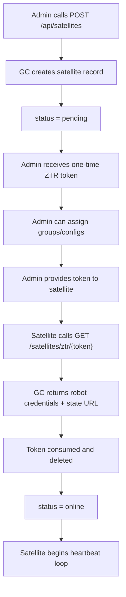
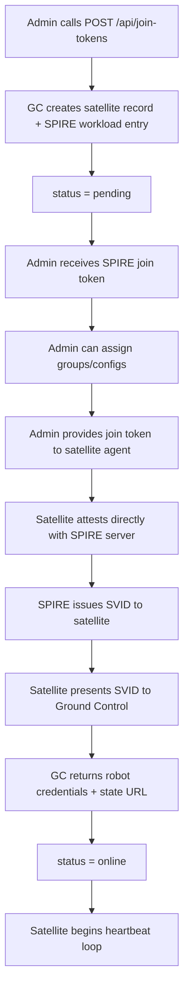
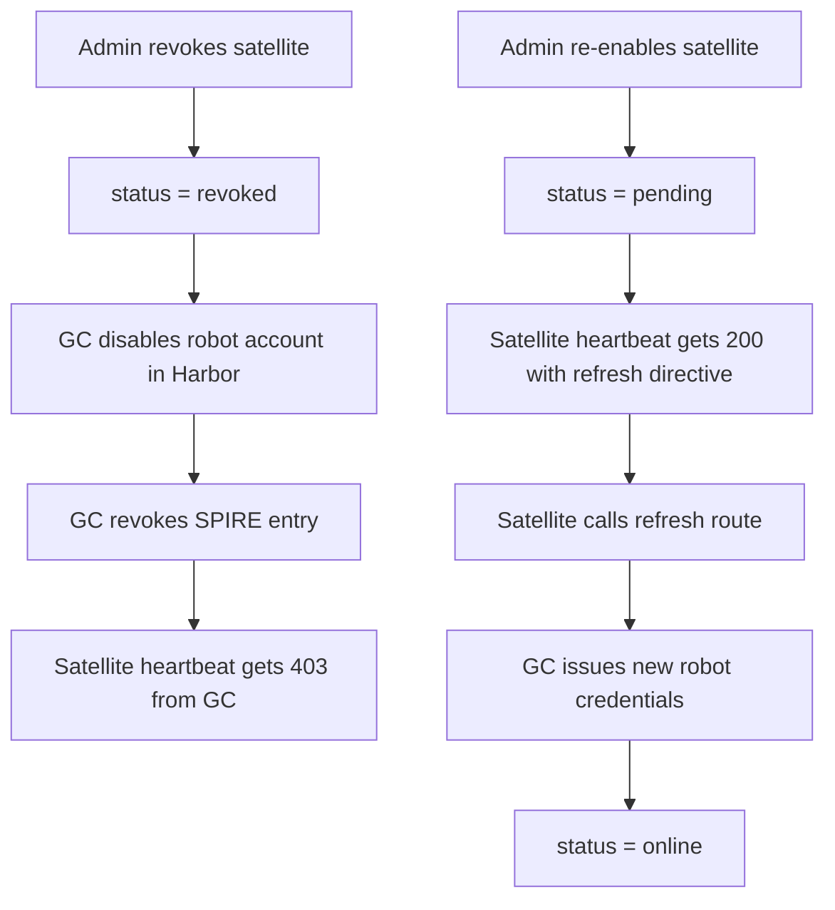
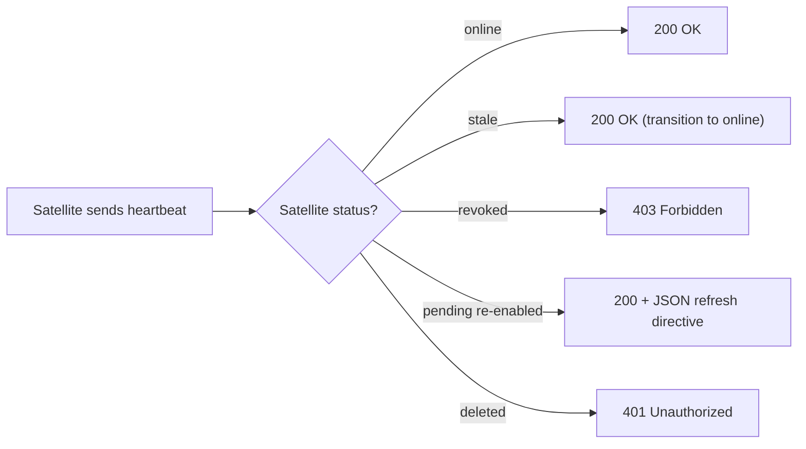

# Satellite Lifecycle States

Tracks: [#268](https://github.com/container-registry/harbor-satellite/issues/268)

## Context and Problem Statement

Harbor Satellite currently has no explicit lifecycle state for satellites. Whether a satellite is waiting for onboarding, actively heartbeating, unreachable, or administratively blocked is determined implicitly through ad-hoc queries (`GetStaleSatellites`, `GetActiveSatellites`) against `last_seen` timestamps. There is no way to revoke a compromised satellite or distinguish a newly registered satellite from one that has been operating normally.

How should Ground Control model satellite lifecycle so it can enforce access control per-state, surface accurate fleet status to operators, and support administrative actions like revoking a compromised edge device?

## Decision Drivers

* Operators need clear visibility into satellite fleet health at a glance.
* Compromised or decommissioned satellites must be explicitly blocked, not just ignored.
* The state model should align with established IoT fleet management patterns.
* Terminology should follow SPIFFE/PKI conventions since the project uses SPIRE for identity.
* States should reflect what Ground Control can actually observe (heartbeat presence), not what it cannot (whether a process is running).

## Considered Options

* Four-state enum: `pending`, `online`, `stale`, `revoked` (deletion as separate boolean)
* Four-state enum using `running` instead of `online`
* Three-state enum without `revoked` (rely on deletion only)
* Five-state enum with `deleted` as a terminal lifecycle state

## Decision Outcome

Chosen option: "Four-state enum with deletion as a separate concern", because it covers all observable satellite conditions, aligns with IoT fleet management conventions, uses SPIFFE/PKI terminology, and keeps deletion out of the state machine.

### Consequences

* Good, because operators get clear fleet-wide visibility into satellite health.
* Good, because compromised or decommissioned satellites can be explicitly revoked.
* Good, because terminology aligns with SPIFFE/PKI conventions used by the project.
* Good, because soft delete preserves audit trail without complicating the state machine.
* Good, because distinct HTTP responses (401/403) let the satellite react appropriately per state.
* Neutral, because stale detection logic already exists via `GetStaleSatellites`; this formalizes it as a background job with a status column.
* Bad, because it requires a migration to add `status` and `deleted` columns.
* Bad, because existing satellite creation flow needs to be updated to set initial status.
* Bad, because a new refresh route needs to be built for the re-enable flow.

## Pros and Cons of the Options

### Four-state enum: pending, online, stale, revoked

* Good, because `online` accurately reflects heartbeat-based observation rather than process state.
* Good, because `revoked` aligns with SPIFFE/PKI terminology (you revoke certificates, you revoke identities).
* Good, because deletion as a separate boolean keeps the state machine clean.
* Good, because it maps closely to AWS IoT (PENDING/ACTIVE/INACTIVE/DISABLED).
* Neutral, because stale detection moves from query-time computation to a background job.

### Four-state enum using running instead of online

* Good, because `running` is an intuitive term.
* Bad, because `running` implies Ground Control knows the satellite process is alive. It does not. Ground Control only knows a satellite communicated recently.

### Three-state enum without revoked

* Good, because it is simpler with fewer states.
* Bad, because there is no way to block a compromised satellite without deleting it entirely.
* Bad, because deletion is permanent and loses the ability to re-enable a satellite.

### Five-state enum with deleted as a terminal state

* Good, because it is a single field to check.
* Bad, because `deleted` is not a state the satellite transitions through. It pollutes the state machine.
* Bad, because queries must always filter for both status and deletion, defeating the purpose of a single field.

## Validation

Implementation will be validated by:
* Database migration adding `status` enum and `deleted` boolean to `satellites` table.
* Unit tests for each state transition (pending->online, online->stale, stale->online, any->revoked, revoked->pending).
* Integration tests verifying heartbeat HTTP responses per state (200, 403, 401).
* Background job correctly marking satellites as stale after missed heartbeats.

## More Information

### State Definitions

## pending

Satellite record created via `POST /api/satellites` (normal) or `POST /api/join-tokens` (SPIFFE). Token issued, SPIRE workload entry created (SPIFFE flow). Satellite has not yet completed Zero-Touch Registration. Admins can pre-assign groups and configs at this point.

## online

ZTR completed and satellite is heartbeating within the expected threshold. Normal operating state.

Transitions:
* `pending -> online`: first heartbeat received after ZTR.
* `stale -> online`: heartbeat received again after a gap.

## stale

Was online but missed heartbeats beyond the threshold. Threshold: 3 missed heartbeats (configurable). Currently `GetStaleSatellites` uses `3 * heartbeat_interval` or 15 min default. Could indicate a network issue, satellite crash, or edge site power loss. Not terminal. Detected by a background job that periodically scans and updates the status column.

Transition: `online -> stale` (missed heartbeats beyond threshold).

## revoked

Admin has explicitly blocked this satellite. Robot account disabled in Harbor, SPIRE entry revoked. Satellite is rejected on reconnect (heartbeat returns `403 Forbidden`). Visible in GC UI with a revoked badge. Use cases: compromised edge device, decommissioned site, leaked token.

Transitions:
* Any state -> `revoked` (admin action).
* `revoked -> pending` (admin re-enables).

### Deletion as a Separate Concern

Deletion is not a lifecycle state. It is handled via a `deleted` boolean column on the `satellites` table:

* On delete: `deleted = true`, full cleanup of robot account, SPIRE entry, and group/config assignments.
* Deleted satellites are hidden from the GC UI but retained in the DB for audit.
* Heartbeat from a deleted satellite returns `401 Unauthorized` (credentials invalidated).
* No recovery path. Deletion is permanent from the operator's perspective.

### State Transition Diagram

Note: Any state can be soft-deleted (`deleted = true`). This is not a state transition but a separate operation that hides the satellite from the GC UI and cleans up all associated resources.

### Onboarding Flows

Both flows coexist long-term as deployment options. Both start at `pending` and transition to `online` upon ZTR completion.

## Normal ZTR Flow

## SPIFFE ZTR Flow

## Revoke and Re-enable Flow

### Heartbeat Response by State

| Satellite Status | HTTP Response | Behavior |
|---|---|---|
| `online` | `200 OK` | Normal heartbeat acknowledged |
| `stale` | `200 OK` | Heartbeat acknowledged, transition to `online` |
| `revoked` | `403 Forbidden` | Access denied, satellite should back off |
| `pending` (re-enabled) | `200` + JSON refresh directive | Satellite should call refresh route for new credentials |
| `deleted` | `401 Unauthorized` | Credentials invalidated, no recovery |

### What Needs to Change

1. Add `status` enum column (`pending`, `online`, `stale`, `revoked`) to `satellites` table.
2. Add `deleted` boolean column to `satellites` table (default `false`).
3. `updated_at` (already exists) tracks when status last changed.
4. Both `POST /api/satellites` and `POST /api/join-tokens` create satellite with `status = pending`.
5. ZTR handler transitions `pending -> online` on successful completion (both flows).
6. Heartbeat (`POST /satellites/sync`) keeps satellite `online`, or transitions `stale -> online`.
7. Heartbeat returns `403` for revoked, `401` for deleted, `200` + refresh directive for re-enabled pending.
8. Background job transitions `online -> stale` on missed heartbeats (configurable, default: 3 missed heartbeats).
9. Admin endpoints to revoke and re-enable satellites.
10. On revoke: disable robot account in Harbor, revoke SPIRE entry.
11. On re-enable: set status to `pending`, satellite refreshes via new refresh route.
12. Build refresh route for satellites to obtain new credentials after re-enable.
13. On delete: set `deleted = true`, full cleanup of robot account, SPIRE entry, and assignments.
14. All queries filter out deleted satellites by default.
15. Revoked satellites remain visible in GC UI with a revoked badge.

### Industry Comparison

| System | States |
|---|---|
| AWS IoT | PENDING, ACTIVE, INACTIVE, DISABLED |
| Kubernetes nodes | Ready, NotReady, Unknown + taints |
| Consul agents | alive, leaving, left, failed |
| SPIRE agents | attested, expired, banned |

The IoT platform model fits best since Harbor Satellite is fleet management for edge registries. The four-state model (`pending`, `online`, `stale`, `revoked`) maps closely to the AWS IoT pattern.
