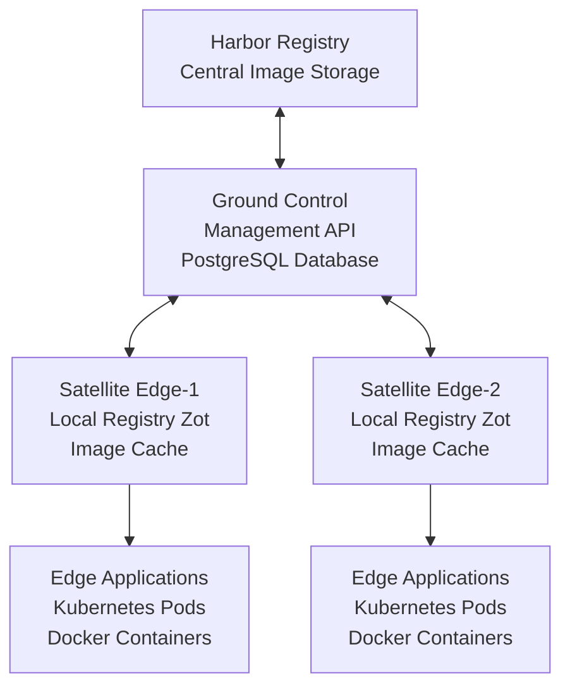

# Getting Started with Harbor Satellite

This comprehensive guide will walk you through setting up Harbor Satellite from initial installation to running your first satellite deployment. Harbor Satellite extends Harbor container registry to edge computing environments with centralized management and local image serving.

## Overview

Harbor Satellite consists of two main components:

- **Ground Control** — Central management service that orchestrates satellite configurations, manages image distribution policies, and provides a REST API for administration
- **Satellite** — Lightweight edge registry that runs at remote locations, automatically syncs with Ground Control, and serves images locally to reduce latency and bandwidth usage

## Prerequisites

### Required Components

- **Harbor Registry** with satellite adapter installed
  - Download from [harbor-next satellite branch](https://github.com/container-registry/harbor-next/tree/satellite)
  - Must have admin credentials for robot account management
- **PostgreSQL Database** for Ground Control state storage
- **Network connectivity** between Ground Control and edge locations

### Development Tools

Choose your preferred deployment method:
- **Docker & Docker Compose** (recommended for getting started)
- **Go 1.21+** for building from source
- **Dagger** for development builds ([installation guide](https://docs.dagger.io/install))

### System Requirements

**Ground Control:**
- CPU: 1-2 cores
- Memory: 512MB - 1GB
- Storage: Minimal (database dependent)
- Network: Access to Harbor registry

**Satellite (per edge location):**
- CPU: 1-2 cores  
- Memory: 1-2GB
- Storage: Varies by image cache requirements (recommend 50GB+)
- Network: Reliable connection to Ground Control (periodic sync)

## Architecture Overview



## Step 1: Deploy Ground Control

Ground Control manages all satellites and serves as the central coordination point.

### Option A: Docker Compose (Recommended)

1. **Clone and setup:**
   ```bash
   git clone https://github.com/container-registry/harbor-satellite.git
   cd harbor-satellite/ground-control
   ```

2. **Configure environment:**
   ```bash
   cp .env.example .env
   ```

3. **Edit `.env` file:**
   ```env
   # Harbor Registry Configuration
   HARBOR_USERNAME=admin
   HARBOR_PASSWORD=Harbor12345
   HARBOR_URL=https://harbor.example.com
   
   # Ground Control Settings  
   PORT=8080
   ADMIN_PASSWORD=SecurePass123
   SESSION_DURATION_HOURS=24
   
   # Database Configuration
   DB_HOST=postgres
   DB_DATABASE=groundcontrol
   DB_USERNAME=postgres
   DB_PASSWORD=strongPassword123
   
   # Security Settings
   PASSWORD_MIN_LENGTH=8
   PASSWORD_REQUIRE_UPPERCASE=true
   PASSWORD_REQUIRE_NUMBER=true
   ```

4. **Start services:**
   ```bash
   docker compose up -d
   ```

5. **Verify deployment:**
   ```bash
   # Check health
   curl http://localhost:8080/health
   # Expected: HTTP 200 OK
   
   # Check logs
   docker compose logs -f groundcontrol
   ```

### Option B: Binary Installation

1. **Build Ground Control:**
   ```bash
   cd ground-control
   go build -o ground-control main.go
   ```

2. **Setup PostgreSQL database separately**

3. **Run Ground Control:**
   ```bash
   export HARBOR_URL="https://harbor.example.com"
   export HARBOR_USERNAME="admin"
   export HARBOR_PASSWORD="Harbor12345"
   export DB_HOST="localhost"
   export ADMIN_PASSWORD="SecurePass123"
   
   ./ground-control
   ```

## Step 2: Configure Ground Control

### Authenticate with Ground Control

```bash
# Login and get session token
TOKEN=$(curl -s -X POST http://localhost:8080/login \
  -H "Content-Type: application/json" \
  -d '{"username":"admin","password":"SecurePass123"}' \
  | jq -r .token)

echo "Session token: $TOKEN"
```

### Create Image Groups

Groups define collections of images that satellites should replicate:

```bash
# Create a group for production applications
curl -X POST http://localhost:8080/api/groups/sync \
  -H "Authorization: Bearer $TOKEN" \
  -H "Content-Type: application/json" \
  -d '{
    "group": "production-apps",
    "registry": "https://harbor.example.com",
    "artifacts": [
      {
        "repository": "library/nginx",
        "tag": ["latest", "1.21-alpine"],
        "type": "docker",
        "digest": "sha256:5a6ee6c36824d527a0fe91a2a7c160c2e286bbeae46cd931c337ac769f1bd930",
        "deleted": false
      },
      {
        "repository": "library/redis", 
        "tag": ["7-alpine"],
        "type": "docker",
        "digest": "sha256:8b6b682f3a25d7b4e8f0c3a2b1e9f8d4c3a2b1e9f8d4c3a2b1e9f8d4c3a2b1e9",
        "deleted": false
      }
    ]
  }'
```

> **Note**: Use `docker inspect <image>` or Harbor UI to find image digests

### Create Satellite Configuration

Configurations define how satellites behave:

```bash
# Create configuration for edge deployments
curl -X POST http://localhost:8080/api/configs \
  -H "Authorization: Bearer $TOKEN" \
  -H "Content-Type: application/json" \
  -d '{
    "config_name": "edge-standard",
    "config": {
      "state_config": {},
      "app_config": {
        "ground_control_url": "http://ground-control.example.com:8080",
        "log_level": "info",
        "use_unsecure": false,
        "state_replication_interval": "@every 00h05m00s",
        "register_satellite_interval": "@every 00h01m00s", 
        "heartbeat_interval": "@every 00h01m00s",
        "local_registry": {
          "url": "http://0.0.0.0:8585"
        },
        "metrics": {
          "collect_cpu": true,
          "collect_memory": true,
          "collect_storage": true
        }
      },
      "zot_config": {
        "distSpecVersion": "1.1.0",
        "storage": {
          "rootDirectory": "/var/lib/satellite/zot"
        },
        "http": {
          "address": "0.0.0.0",
          "port": "8585"
        },
        "log": {
          "level": "info"
        }
      }
    }
  }'
```

## Step 3: Register Satellite

Each satellite needs registration to receive its authentication credentials:

```bash
# Register satellite for west coast edge location
SATELLITE_TOKEN=$(curl -s -X POST http://localhost:8080/api/satellites \
  -H "Authorization: Bearer $TOKEN" \
  -H "Content-Type: application/json" \
  -d '{
    "name": "edge-west-1",
    "groups": ["production-apps"],
    "config_name": "edge-standard"
  }' | jq -r .token)

echo "Satellite token: $SATELLITE_TOKEN"
```

> **Critical**: Save the satellite token securely - it cannot be retrieved again and is required for satellite startup.

## Step 4: Deploy Satellite

Deploy the satellite at your edge location using the token from Step 3.

### Option A: Docker Compose (Recommended)

1. **Navigate to project root:**
   ```bash
   cd .. # Back to harbor-satellite root directory
   ```

2. **Create environment file:**
   ```bash
   cat > .env << EOF
   GROUND_CONTROL_URL=http://ground-control.example.com:8080  
   TOKEN=$SATELLITE_TOKEN
   USE_UNSECURE=false
   EOF
   ```

3. **Start satellite:**
   ```bash
   docker compose up -d satellite
   ```

4. **Verify satellite is running:**
   ```bash
   # Check container status
   docker compose ps satellite
   
   # Check satellite logs  
   docker compose logs -f satellite
   
   # Verify local registry
   curl http://localhost:8585/v2/_catalog
   ```

### Option B: Binary Installation

1. **Build satellite:**
   ```bash
   go build -o bin/satellite cmd/main.go
   ```

2. **Run satellite:**
   ```bash
   ./bin/satellite \
     --token "$SATELLITE_TOKEN" \
     --ground-control-url "http://ground-control.example.com:8080"
   ```

### Option C: Docker Run

```bash
docker run -d \
  --name satellite-edge-west-1 \
  -e TOKEN="$SATELLITE_TOKEN" \
  -e GROUND_CONTROL_URL="http://ground-control.example.com:8080" \
  -p 8585:8585 \
  -v satellite-data:/var/lib/satellite/zot \
  harbor-satellite:latest
```

## Step 5: Configure Container Runtime (Optional)

Configure your container runtime to use the local satellite as a registry mirror:

### Docker

```bash
# Configure Docker daemon to use satellite as mirror
sudo tee /etc/docker/daemon.json << 'EOF'
{
  "registry-mirrors": ["http://localhost:8585"],
  "insecure-registries": ["localhost:8585"]
}
EOF

sudo systemctl restart docker
```

### Containerd

```bash
# Configure containerd to use satellite as mirror
sudo mkdir -p /etc/containerd/certs.d/docker.io

sudo tee /etc/containerd/certs.d/docker.io/hosts.toml << 'EOF'
server = "https://docker.io"

[host."http://localhost:8585"]
  capabilities = ["pull", "resolve"]
EOF

sudo systemctl restart containerd
```

### Automatic Configuration

Harbor Satellite can automatically configure container runtimes:

```bash
# For Docker
./satellite --mirrors=docker:true

# For multiple runtimes
./satellite --mirrors=containerd:docker.io,quay.io --mirrors=podman:docker.io
```

> **Supported CRIs**: Docker, containerd, CRI-O, Podman

## Step 6: Verify Complete Setup

### Check Ground Control Status

```bash
# Verify Ground Control health
curl http://localhost:8080/health

# List all satellites
curl -H "Authorization: Bearer $TOKEN" \
  http://localhost:8080/api/satellites

# Check satellite status
curl -H "Authorization: Bearer $TOKEN" \
  http://localhost:8080/api/satellites/edge-west-1/status
```

### Check Satellite Operations

```bash
# Verify local registry catalog
curl http://localhost:8585/v2/_catalog

# Check specific image replication  
curl http://localhost:8585/v2/library/nginx/tags/list

# Test pulling through satellite registry
docker pull localhost:8585/library/nginx:latest
```

### Monitor Image Synchronization

```bash
# Check cached images on satellite
curl -H "Authorization: Bearer $TOKEN" \
  http://localhost:8080/api/satellites/edge-west-1/images

# Verify image availability
curl http://localhost:8585/v2/library/nginx/manifests/latest \
  -H "Accept: application/vnd.docker.distribution.manifest.v2+json"
```

## Step 7: Test Image Pulls

Test that applications can successfully pull images through the satellite:

```bash
# Pull image through satellite registry
docker pull localhost:8585/library/nginx:latest

# Run container using satellite registry
docker run -d --name test-nginx \
  localhost:8585/library/nginx:latest

# Verify container is running
docker ps | grep test-nginx

# Clean up test
docker stop test-nginx && docker rm test-nginx
```

## Common Configuration Patterns

### Development Environment

Quick setup for development:

```bash
# Use insecure connections for local testing
curl -X POST http://localhost:8080/api/configs \
  -H "Authorization: Bearer $TOKEN" \
  -H "Content-Type: application/json" \
  -d '{
    "config_name": "dev-config",
    "config": {
      "app_config": {
        "ground_control_url": "http://localhost:8080",
        "log_level": "debug",
        "use_unsecure": true,
        "state_replication_interval": "@every 00h00m10s"
      }
    }
  }'
```

### Production Environment

Secure configuration for production:

```bash
curl -X POST http://localhost:8080/api/configs \
  -H "Authorization: Bearer $TOKEN" \
  -H "Content-Type: application/json" \
  -d '{
    "config_name": "prod-config",
    "config": {
      "app_config": {
        "ground_control_url": "https://ground-control.company.com",
        "log_level": "info",
        "use_unsecure": false,
        "state_replication_interval": "@every 00h15m00s",
        "heartbeat_interval": "@every 00h05m00s"
      }
    }
  }'
```

### Air-Gapped Environment

Configuration for disconnected environments:

```bash
curl -X POST http://localhost:8080/api/configs \
  -H "Authorization: Bearer $TOKEN" \
  -H "Content-Type: application/json" \
  -d '{
    "config_name": "airgap-config", 
    "config": {
      "app_config": {
        "ground_control_url": "https://ground-control.internal",
        "state_replication_interval": "@every 01h00m00s",
        "heartbeat_interval": "@every 00h30m00s"
      }
    }
  }'
```

## Troubleshooting Quick Start

### Ground Control Issues

```bash
# Check Ground Control logs
docker compose logs groundcontrol

# Verify database connection
docker compose exec postgres psql -U postgres -d groundcontrol -c "SELECT 1;"

# Test Harbor connectivity
curl -u admin:Harbor12345 https://harbor.example.com/api/v2.0/users/current
```

### Satellite Issues

```bash
# Check satellite logs
docker compose logs satellite

# Verify token validity (should return configuration)
curl http://localhost:8080/satellites/ztr/$SATELLITE_TOKEN

# Test Ground Control connectivity  
curl http://ground-control.example.com:8080/health

# Check local registry 
curl http://localhost:8585/v2/_catalog
```

### Network Connectivity

```bash
# Test from satellite to Ground Control
docker run --rm curlimages/curl \
  curl -f http://ground-control.example.com:8080/health

# Test from Ground Control to Harbor
docker compose exec groundcontrol \
  curl -f https://harbor.example.com/api/v2.0/systeminfo
```

## Next Steps

Now that you have Harbor Satellite running:

### Production Deployment
- **Security**: Configure TLS certificates and secure authentication
- **Monitoring**: Set up metrics collection and alerting
- **Backup**: Implement backup strategies for Ground Control database
- **Scaling**: Deploy additional satellites at other edge locations

### Advanced Configuration
- **[Configuration Reference](configuration.md)** - Complete configuration options
- **[API Reference](api-reference.md)** - Full API documentation for automation
- **[Architecture Guide](architecture.md)** - Deep dive into system design

### Deployment Guides
- **[Docker Deployment](deployment/docker.md)** - Production Docker setup
- **[Kubernetes Deployment](deployment/kubernetes.md)** - K8s deployment manifests

### Operations
- **[Troubleshooting Guide](troubleshooting.md)** - Common issues and solutions
- **[Monitoring Setup](../examples/)** - Example monitoring configurations

## Getting Help

- **Documentation**: [Complete documentation](https://docs.goharbor.io)
- **Community**: [Harbor community forums](https://community.goharbor.io)
- **Issues**: [GitHub issues](https://github.com/container-registry/harbor-satellite/issues)
- **Slack**: [#harbor-satellite on CNCF Slack](https://cloud-native.slack.com/archives/C06NE6EJBU1)