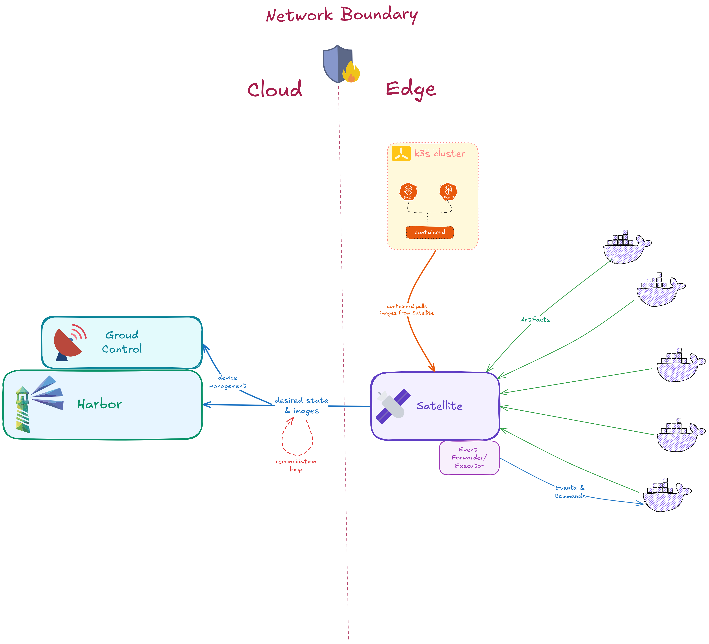
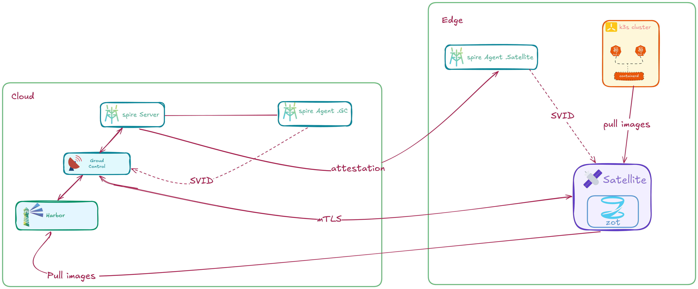

<div align="center">

# K3s & Harbor Satellite
### End-to-End Reference Guide and Architecture

[](https://satellite.container-registry.com)
[](https://k3s.io)
[](https://github.com/suse)

*A comprehensive reference architecture covering network topology, SPIFFE/SPIRE security, end-to-end setup procedures, enterprise use cases, and ecosystem alignment for deploying Harbor Satellite with K3s.*
</div>

---

## Table of Contents

| # | Section |
|---|---|
| 1 | [Introduction & Challenges Addressed](#1-introduction--challenges-addressed) |
| 2 | [Reference Architecture](#2-reference-architecture) |
| 3 | [Security Model : SPIFFE/SPIRE Integration](#3-security-model--spiffespire-integration) |
| 4 | [Connectivity Model](#4-connectivity-model) |
| 5 | [Setup Guide : Method 1: Network-Based Registry Mirror](#5-setup-guide) |
| 6 | [Setup Guide : Method 2: Absolute Air-Gap via Disk Auto-Import](#6-setup-guide) |
| 7 | [Enterprise Use Cases](#7-enterprise-use-cases) |
| 8 | [Ecosystem Alignment](#8-ecosystem-alignment) |
| 9 | [References & Further Reading](#9-references--further-reading) |

---

## 1. Introduction & Challenges Addressed

Deploying Kubernetes at the edge introduces architectural challenges that are not present in centralized cloud datacenters. Edge nodes frequently operate in resource-constrained environments constrained by intermittent, low-bandwidth, or highly metered network connections. When orchestrating K3s across thousands of remote sites, relying on a centralized container registry over a Wide Area Network (WAN) introduces a critical single point of failure.

**Harbor Satellite** an edge extension of the CNCF-graduated Harbor registry mitigates this vulnerability by distributing a lightweight, localized OCI registry directly to each edge site. Powered by [Zot](https://zotregistry.dev/), it continuously synchronizes cryptographic image layers from a Central Harbor registry during optimal network conditions, subsequently serving them to local K3s workloads with zero external network dependency.

### Challenges & Solutions

| Edge Challenge | Harbor Satellite Solution |
|---|---|
| **Workload failures during network partitions** | Local Zot cache serves images over the loopback interface; WAN status becomes irrelevant. |
| **High bandwidth costs on metered links** | Layer-diff synchronization transfers only modified image layers, drastically reducing payload sizes. |
| **Bootstrapping restricted clusters** | Disk-based auto-importing requires zero network configuration at deploy time. |
| **Credential management at scale** | SPIFFE/SPIRE Zero-Touch Registration (ZTR) eliminates all static secrets from edge devices. |
| **Widespread certificate rotation** | SPIRE Workload API rotates X.509 SVIDs automatically without application downtime. |

---

## 2. Reference Architecture

### 2.1 Network Topology

The architecture is strictly divided into two distinct operational planes, separated by a geographic network boundary:

- **Cloud / Datacenter Plane:** Central registry, fleet management, and identity authority.
- **Edge Site Plane:** Localized caching, workload runtime, and device attestation.



**Diagram Workflow:**

| Flow | Description |
|---|---|
| **Desired State** | Satellite polls Ground Control for image assignments, then pulls required OCI layers directly from Harbor over mTLS. |
| **Reconciliation Loop** | Satellite continuously compares local state against the cloud state, pulling new layers and pruning stale data. |
| **Containerd Mirroring** | K3s containerd intercepts upstream image requests and redirects them to `127.0.0.1:5050`, ensuring localized delivery. |
| **Event Streaming** | The Event Forwarder/Executor handles bidirectional telemetry and execution commands between the Edge and Ground Control. |

### 2.2 Component Placement

| Component | Deployment Location | Primary Role |
|---|---|---|
| **Central Harbor** | Cloud | Immutable source of truth for enterprise container images. |
| **Ground Control** | Cloud | Fleet management, sync policy orchestration, and credential brokering. |
| **SPIRE Server** | Cloud | Central X.509 identity authority and root of the trust domain. |
| **SPIRE Agent (GC)** | Cloud (co-located) | Attests and issues SVIDs to Ground Control. |
| **SPIRE Agent (Edge)**| Edge Node | Attests the physical edge machine and issues SVIDs to Harbor Satellite. |
| **Harbor Satellite** | Edge Node | Autonomous local OCI registry cache and state replication engine. |
| **K3s + containerd** | Edge Node | Lightweight Kubernetes runtime natively configured to consume the localized mirror. |

### 2.3 Image Synchronization Flow

```text
╔══════════════════════════════════════════════════════════╗
║  SYNC PHASE (Optimal Network Conditions)                 ║
╠══════════════════════════════════════════════════════════╣
║                                                          ║
║  Central Harbor                                          ║
║    └──► Ground Control assigns images to Edge Group      ║
║            └──► Satellite pulls layers over mTLS         ║
║                  └──► Layers stored in local Zot (:5050) ║
║                                                          ║
╠══════════════════════════════════════════════════════════╣
║  EXECUTION PHASE (Fully Autonomous / Offline Capable)    ║
╠══════════════════════════════════════════════════════════╣
║                                                          ║
║  K3s containerd Engine                                   ║
║    └──► Intercept via Mirror: 127.0.0.1:5050             ║
║            └──► Zot serves layers from local disk cache  ║
║                  └──► Workload starts (Zero WAN latency) ║
║                                                          ║
╚══════════════════════════════════════════════════════════╝
```

---

## 3. Security Model : SPIFFE/SPIRE Integration

Distributing static registry credentials (`docker login` tokens) to thousands of edge devices is a critical security anti-pattern; a single compromised physical device exposes the credentials for the entire fleet. This architecture replaces all static secrets with **cryptographic identity** utilizing SPIFFE/SPIRE and **Zero-Touch Registration (ZTR)**.




### 3.1 Zero-Touch Registration (ZTR) Provisioning Flow

1. **Token Generation:** Administrator registers a new Satellite in Ground Control. The SPIRE Server generates a secure, one-time Join Token.
2. **Device Attestation:** The SPIRE Agent deployed on the edge node consumes the Join Token. It is permanently invalidated, and the Agent receives a certificate-based identity.
3. **Workload Identity:** The Harbor Satellite binary starts, connects to the local SPIRE Agent via a Unix socket, and is issued an X.509 SVID.
4. **Credential Brokering:** Satellite presents its SVID to Ground Control over mTLS. Ground Control verifies the SPIFFE ID and automatically provisions a highly scoped Harbor Robot Account.
5. **Steady State:** The Satellite encrypts the Robot Account credentials using a hardware-bound fingerprint and operates autonomously.

### 3.2 Certificate Rotation & Device-Bound Encryption

* **Automated Rotation:** SVIDs maintain a strict Time-To-Live (TTL). The SPIRE Workload API seamlessly renews certificates before expiration, eliminating maintenance windows and human intervention.
* **Hardware-Change Protection:** Credentials are encrypted at rest using a device fingerprint derived from the `machine-id`, MAC address, and disk serial number. If an edge device is physically stolen or its storage is cloned, the credentials become unreadable.

---

## 4. Connectivity Model

> **Architectural Principle:** Harbor Satellite treats WAN connectivity as an optional enhancement, not an operational requirement.

### 4.1 Background Schedulers

The Satellite utilizes three concurrent scheduling loops:

| Scheduler | Default Interval | Behavior |
| --- | --- | --- |
| **State Replication** | 10 seconds | Fetches the desired state from Harbor; pulls missing layers; purges stale artifacts. |
| **Telemetry Heartbeat** | 30 seconds | Transmits CPU, memory, disk utilization, and local inventory to Ground Control. |
| **Registration** | 30 seconds (Retry) | Re-authenticates via ZTR to refresh Harbor credentials if required. |

### 4.2 Bandwidth Optimization (Layer-Diff Strategy)

Instead of downloading monolithic images, the Satellite employs an OCI layer-diff approach:

1. Fetches lightweight metadata manifests from Harbor.
2. Compares individual layer SHA256 digests against the local Zot cache.
3. Downloads **only** missing or modified layers over the network.

### 4.3 Network Outage Behavior

During a WAN partition, the State Replication and Heartbeat schedulers enter a silent retry loop. The local Zot registry remains fully operational on port `5050`. K3s `containerd` continues to pull images locally, guaranteeing **zero disruption** to pod rescheduling or workload scaling during the outage.

---

## 5. Setup Guide 
## Method 1: Network-Based Registry Mirror

This guide provides end-to-end instructions on how to integrate Harbor Satellite with K3s. By the end of this guide, you will have a resilient Edge node capable of deploying container workloads even when completely disconnected from the central cloud registry.

### Prerequisites

* A Linux machine (Edge Node) with **K3s** installed.
* **Docker** and **Docker Compose** installed.
* Access to deploy a Central Harbor Registry.

---

### Step 1: Prepare the Central Harbor & Seed Image

First, we need a working Central Harbor registry and an image to test with.

1. **Install Harbor:** Ensure Central Harbor (v2.10+) is running on your network at `http://<CENTRAL_HARBOR_IP>:80`.
2. **Push a Test Image:** Pull a standard image from Docker Hub and push it into your Central Harbor instance.

```bash
# Pull the standard Nginx image
docker pull nginx:alpine

# Tag it for your Central Harbor
docker tag nginx:alpine <CENTRAL_HARBOR_IP>:80/library/nginx:alpine

# Login and push the image to Central Harbor
docker login -u admin -p <HARBOR_PASSWORD> <CENTRAL_HARBOR_IP>:80
docker push <CENTRAL_HARBOR_IP>:80/library/nginx:alpine

# Remove local copies to ensure a clean test later
docker rmi nginx:alpine
docker rmi <CENTRAL_HARBOR_IP>:80/library/nginx:alpine
```

---

### Step 2: Configure K3s Registry Mirror

We must instruct the K3s `containerd` engine to intercept requests for standard `docker.io` images and route them to our local Harbor Satellite (which will run on port `5050`).

1. **Create the K3s Configuration:**

```bash
sudo mkdir -p /etc/rancher/k3s
sudo cat <<EOF > /etc/rancher/k3s/registries.yaml
mirrors:
  "docker.io":
    endpoint:
      - "http://127.0.0.1:5050"
EOF
```

2. **Restart K3s and Clear Cache:**

```bash
# Apply the new mirror settings
sudo systemctl restart k3s

# Force K3s to forget any previously cached images
sudo k3s crictl rmi --prune
```

---

### Step 3: Deploy Ground Control & Satellite (Zero-Touch)

Deploy the Harbor Satellite components. This utilizes SPIFFE/SPIRE for Zero-Touch Registration (ZTR), automatically authenticating the Edge node without manual secrets.

1. **Start Ground Control:**

```bash
cd harbor-satellite/deploy/quickstart/spiffe/join-token/external/gc
HARBOR_URL=http://<CENTRAL_HARBOR_IP>:80 ./setup.sh
```

*(Wait until Ground Control logs indicate it is fully ready and connected to Harbor).*

2. **Start Harbor Satellite:**

```bash
cd ../sat
./setup.sh
```

**Verification:** Check the Ground Control logs to confirm the SPIFFE identity was verified and a Robot Account was created automatically.

```bash
docker logs ground-control | grep "SPIFFE ZTR"
```

---

### Step 4: Sync Content to the Edge

Use the Ground Control API to assign the `nginx:alpine` image to your Edge Satellite.

1. **Retrieve Auth Token & Image Digest:**

```bash
# Get Ground Control Bearer Token
TOKEN=$(curl -sk -X POST "https://localhost:9080/login" -d '{"username":"admin","password":"<HARBOR_PASSWORD>"}' | grep -o '"token":"[^"]*"' | cut -d'"' -f4)

# Get the SHA256 Digest from Central Harbor
DIGEST=$(curl -sk -u "admin:<HARBOR_PASSWORD>" "http://<CENTRAL_HARBOR_IP>/api/v2.0/projects/library/repositories/nginx/artifacts?q=tags%3Dalpine&page_size=1" | grep -m1 '"digest":' | cut -d'"' -f4)
```

2. **Create Sync Group & Assign Satellite:**

```bash
# Create the Edge Group
curl -sk -X POST "https://localhost:9080/api/groups/sync" \
  -H "Content-Type: application/json" \
  -H "Authorization: Bearer ${TOKEN}" \
  -d "{\"group\": \"edge-group\", \"registry\": \"http://<CENTRAL_HARBOR_IP>:80\", \"artifacts\": [{\"repository\": \"library/nginx\", \"tag\": [\"alpine\"], \"type\": \"image\", \"digest\": \"${DIGEST}\"}]}"

# Link the Satellite to the Group
curl -sk -X POST "https://localhost:9080/api/groups/satellite" \
  -H "Content-Type: application/json" \
  -H "Authorization: Bearer ${TOKEN}" \
  -d '{"satellite": "edge-01", "group": "edge-group"}'
```

3. **Verify Download:** Wait 30-60 seconds, then check the local Satellite catalog to ensure the image was downloaded.

```bash
curl -s http://127.0.0.1:5050/v2/_catalog
# Expected Output: {"repositories":["library/nginx"]}
```

---

### Step 5: The Air-Gap Verification Test

To prove the architecture works, we will sever the connection to the Central Harbor and deploy the workload purely from the Edge cache.

1. **Simulate Total Network Outage:** Stop the central components.

```bash
docker stop harbor-core ground-control harbor-db redis registry registryctl harbor-portal harbor-log harbor-jobservice nginx
```

2. **Deploy the Pod:** Notice we are requesting the standard `nginx:alpine` image.

```bash
kubectl run true-airgap-test --image=nginx:alpine
```

### Proving the Architecture (Verification)

To confirm the image was pulled dynamically from the local Satellite mirror and not a hidden local cache, check the following:

**1. Check K3s Events:**

```bash
kubectl describe pod true-airgap-test | grep -A 5 "Events:"
```

*You should see `Pulling image "nginx:alpine"`, proving K3s had to actively fetch it over the network.*

**2. Check Satellite Network Logs:**

```bash
docker logs satellite | grep "nginx/blobs"
```

*You should see `GET` requests with a `200` status code and the User-Agent `containerd/v2.x.x-k3s1`. This is undeniable proof that K3s routed the request to the local Harbor Satellite via the `registries.yaml` mirror configuration.*

---

## 6. Setup Guide 
## Method 2: Absolute Air-Gap via Disk Auto-Import

This guide details the **Disk-Based Auto-Import** method for integrating Harbor Satellite with K3s. This method relies entirely on the local filesystem and K3s's native containerd auto-import capabilities, providing an absolute air-gapped solution that survives total network outages and local registry failures.

### Architectural Concept: Upstream Registry Retagging

Before exporting an image for offline use, it must be retagged to match the Central Harbor URL.

**Why is this required?**
In enterprise environments, Kubernetes Deployment manifests typically hardcode the upstream registry URL (e.g., `image: <CENTRAL_HARBOR_IP>:80/library/nginx:alpine`). When K3s is entirely offline and has no active registry mirror, it relies on a strict string-matching policy.

If the image inside the tarball is labeled as `localhost:5050/...`, K3s will fail to match it with the deployment manifest's request for `<CENTRAL_HARBOR_IP>:80/...` and will attempt to reach the dead network. By retagging the image locally *before* creating the tarball, we satisfy K3s's strict string-matching requirements without needing to alter the original infrastructure-as-code manifests.

---

### Prerequisites

* A Linux Edge node running **K3s**.
* Harbor Satellite deployed and successfully synced with the required image (`library/nginx:alpine`) on port `5050`.
* Root privileges to write to the K3s agent directory.

---

### Step 1: Retrieve and Retag the Image Locally

First, pull the synced image from the local Harbor Satellite instance and apply the upstream registry tag.

```bash
# Pull the image from the local Edge Satellite
docker pull localhost:5050/library/nginx:alpine

# Retag the image to match the upstream Central Harbor URL
docker tag localhost:5050/library/nginx:alpine <CENTRAL_HARBOR_IP>:80/library/nginx:alpine
```

---

### Step 2: Export to the K3s Auto-Import Directory

K3s includes a built-in filesystem watcher that monitors the `/var/lib/rancher/k3s/agent/images/` directory. Any `.tar` archives placed in this directory are automatically unpacked and loaded into the local containerd image store.

```bash
# Ensure the K3s auto-import directory exists
sudo mkdir -p /var/lib/rancher/k3s/agent/images/

# Export the retagged image directly into the auto-import directory
sudo docker save <CENTRAL_HARBOR_IP>:80/library/nginx:alpine -o /var/lib/rancher/k3s/agent/images/nginx-offline.tar
```

*(Note: Allow 10–15 seconds for the K3s background process to detect and import the archive).*

---

### Step 3: Clean Up Local Evidence (Optional but Recommended for Testing)

To definitively prove the architecture relies on the auto-imported tarball and not the local Docker daemon cache, remove the images from the Docker engine.

```bash
docker rmi -f <CENTRAL_HARBOR_IP>:80/library/nginx:alpine
docker rmi -f localhost:5050/library/nginx:alpine
```

---

### Step 4: Simulate Air-Gap and Deploy

We will now sever all network components and attempt to deploy the pod utilizing the original Cloud URL.

1. **Simulate Total Infrastructure Outage:**
   Stop the Harbor Satellite and Ground Control containers to simulate a localized outage.

```bash
docker stop satellite spire-agent-satellite
```

2. **Deploy the Workload:**
   Request the original upstream image. K3s will automatically utilize the archive loaded from the auto-import directory.

```bash
kubectl run edge-offline-pod --image=<CENTRAL_HARBOR_IP>:80/library/nginx:alpine
```

3. **Verify Deployment:**

```bash
kubectl get pods
```

*The pod will transition to a `Running` state despite the network and local registry being entirely offline.*

### Verification Logging

You can further verify the offline pull by checking the pod's event logs:

```bash
kubectl describe pod edge-offline-pod | grep "Container image"
```

*You should see the event: `Container image "<CENTRAL_HARBOR_IP>:80/library/nginx:alpine" already present on machine`, confirming a successful offline cache hit.*

---

## 7. Enterprise Use Cases

### 7.1 Retail / Point-of-Sale (POS)

* **Challenge:** A WAN outage at a retail store prevents POS terminals from restarting, halting revenue.
* **Solution:** Satellites cache critical POS images locally. If the WAN fails, terminals pull from `127.0.0.1:5050`. Updates are staged geographically via Ground Control groups to prevent global WAN saturation.

### 7.2 Industrial IoT / Manufacturing (SUSE + Bosch Private 5G)

SUSE and Bosch have pioneered a hybrid cloud control architecture for Industrial IoT (IIoT), deploying highly complex microservices directly onto the factory floor via **K3s**.

* **The Edge Workloads:** The factory operates a local **Private 5G Network** (Open5gs, AMF, SMF, UPF components) combined with advanced service meshes (Istio/Envoy), networking policies (Cilium/eBPF), and observability stacks (Prometheus/Grafana).
* **The Challenge:** These factory environments are heavily restricted or entirely air-gapped for security. A severed fiber link to the central cloud cannot be allowed to halt robotic manufacturing lines. If a local K3s node restarts, it must be able to pull these complex 5G and security images immediately to restore the control plane.
* **The Solution:** Harbor Satellite acts as the localized OCI registry layer within this architecture. During authorized maintenance windows, Ground Control synchronizes the required 5G Core and security images to the local Satellite. If the WAN drops during production, K3s pulls the critical Open5gs, Cilium, and Istio images directly from `127.0.0.1:5050`. For fully isolated environments, **Method 2 (Tarball Drop)** injects these updates via secure USB media, ensuring continuous, uninterrupted manufacturing operations. *(Reference: [SUSE + Bosch Joint Architecture](https://www.suse.com/c/suse-and-bosch-pioneering-industrial-iot-with-a-hybrid-cloud-control-and-monitoring-architecture/))*

### 7.3 Remote Fleet Management (Energy/Telecom)

* **Challenge:** Remote SCADA systems operate over expensive, metered cellular links.
* **Solution:** The Satellite Layer-Diff synchronization transfers only modified layers, slashing bandwidth consumption. Ground Control Heartbeats provide real-time visibility into edge inventory states before initiating cutovers.

### 7.4 Smart Agriculture / Remote Monitoring

* **Challenge:** Agricultural IoT edge nodes running complex sensor processing or AI camera inference operate on strictly metered, highly intermittent cellular or satellite links.
* **Solution:** Large inference model containers are pre-synchronized during narrow connectivity windows. K3s operates autonomously from the local Zot cache during extended offline periods. When connectivity returns, Layer-Diff sync ensures only new algorithmic weights are downloaded, preserving expensive bandwidth. Additionally, device-bound encryption ensures Harbor credentials remain secure even if an edge device is physically compromised in a remote field.

---

## 8. Ecosystem Alignment

Harbor Satellite serves as a critical **registry layer** within the broader SUSE and CNCF Edge ecosystems. As an official extension of Harbor (a graduated CNCF project), Satellite perfectly complements existing enterprise stacks:

| Component | Integration Value |
| --- | --- |
| **K3s** | Native integration via `registries.yaml` or auto-import; requires zero external CRDs or operators. |
| **SLE Micro** | Harbor Satellite executes seamlessly atop immutable, read-only operating systems. |
| **Rancher Fleet** | While Fleet synchronizes GitOps YAML manifests, Satellite guarantees the binary image blobs are physically present at the edge site before execution. |
| **Elemental** | Node provisioning automatically registers the Harbor Satellite via ZTR, providing end-to-end zero-touch edge bootstrapping. |
| **SPIFFE/SPIRE** | Replaces all rigid credential arrays with ephemeral cryptographic machine identities. |

---

## 9. References & Further Reading

To explore the underlying technologies and concepts discussed in this reference architecture, consult the following official resources:

### Harbor Satellite & Local Caching

* **[Harbor Satellite Official Documentation](https://satellite.container-registry.com/docs/)** : *Comprehensive guides on architecture, deployment patterns, and Ground Control API usage.*
* **[Harbor Satellite GitHub Repository](https://github.com/container-registry/harbor-satellite)** : *Source code, issue tracking, and technical contribution guidelines.*
* **[Project Zot](https://zotregistry.dev/)** : *Details on the embedded, CNCF-hosted lightweight OCI registry that powers the Satellite cache.*

### K3s & SUSE Edge Ecosystem

* **[K3s Private Registry Configuration](https://docs.k3s.io/installation/private-registry)**  : *Official Rancher/K3s documentation detailing how to configure `registries.yaml` for mirror routing and auto-importing.*
* **[SUSE + Bosch IIoT Architecture](https://www.suse.com/c/suse-and-bosch-pioneering-industrial-iot-with-a-hybrid-cloud-control-and-monitoring-architecture/)** : *The real-world enterprise case study demonstrating K3s running mission-critical workloads on restricted factory floors.*
* **[SUSE Edge Framework](https://documentation.suse.com/suse-edge/3.4/single-html/edge/edge.html)** : *Broader documentation on integrating SLE Micro, K3s, and GitOps at the edge.*

### Security & Identity (Zero-Trust)

* **[SPIFFE & SPIRE Architecture](https://spiffe.io/docs/latest/spire-about/)** : *Foundational reading on how SPIFFE cryptographic identities and SPIRE workload attestation replace static secrets at scale.*

---