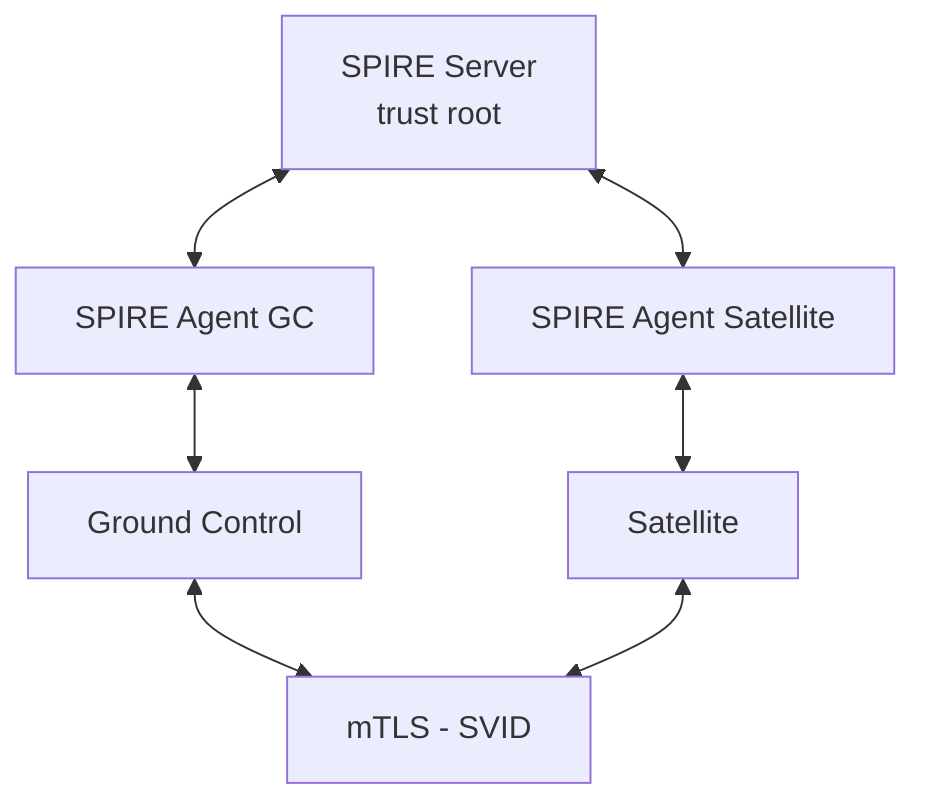

# SPIFFE/SPIRE Quickstart

Harbor Satellite uses SPIFFE for zero-trust identity between Ground Control and Satellites. SPIRE provides the runtime that issues and rotates X.509 SVIDs for mTLS.

This page holds the steps shared by all attestation methods. Start with the method guide, then continue here once the satellite is registered and running:

| Method | Description | Use Case |
|--------|-------------|----------|
| [join-token](join-token/) | One-time tokens from SPIRE server | Development, testing, CI/CD |
| [x509pop](x509pop/) | Pre-provisioned X.509 certificates | Production, existing PKI |
| [sshpop](sshpop/) | SSH host certificates | Environments with SSH CA infrastructure |

For the token-based setup without SPIRE and the host ports, see the [quickstart index](../README.md).

## Architecture



Ground Control gets the SPIFFE ID `spiffe://harbor-satellite.local/ground-control`. `POST /api/satellites/register` gives each satellite `spiffe://harbor-satellite.local/satellite/region/<region>/<name>`. The region defaults to `default` when the request omits it. Ground Control derives the satellite name from the last path segment.

## Environment Variables

The compose files use defaults that assume Harbor runs on the Docker host at port 8080. Export these before running `docker compose` or `setup.sh` if your setup differs:

| Variable | Used by | Default | Description |
|----------|---------|---------|-------------|
| `HARBOR_URL` | `external/gc` | `http://host.docker.internal:8080` | Harbor URL used by Ground Control |
| `HARBOR_USERNAME` | `external/gc` | `admin` | Harbor user allowed to create projects and robot accounts |
| `HARBOR_PASSWORD` | `external/gc` | `Harbor12345` | Password for `HARBOR_USERNAME` |
| `ADMIN_PASSWORD` | `external/gc` | `Harbor12345` | Password of the Ground Control `admin` user, created on first startup |
| `SKIP_HARBOR_HEALTH_CHECK` | `external/gc` | `false` | Skip the Harbor health check at Ground Control startup (testing only) |
| `GC_HOST_PORT` | `external/gc` | `9080` | Host port for Ground Control |
| `SPIRE_HOST_PORT` | `external/gc` | `9081` | Host port for the SPIRE server |
| `HARBOR_REGISTRY_URL` | `external/sat` | `http://host.docker.internal:8080` | Harbor address as reachable from the satellite container. Replaces the scheme and host of the Harbor URL that Ground Control hands out. The satellite exits without it. |

```bash
export HARBOR_URL=http://host.docker.internal:8080
export HARBOR_USERNAME=admin
export HARBOR_PASSWORD=Harbor12345
export ADMIN_PASSWORD=Harbor12345
export HARBOR_REGISTRY_URL=http://host.docker.internal:8080
```

`ADMIN_PASSWORD` must satisfy the password policy (default: at least 8 characters with an uppercase letter, a lowercase letter and a number). Ground Control exits on startup if it is missing or invalid.

## Deployment Modes

### External SPIRE

SPIRE server and agents run as separate containers alongside Ground Control and the satellite. Each method has an `external/` directory with separate `gc/` and `sat/` setups. All quickstarts use this mode.

### Embedded SPIRE

- Ground Control side is implemented. Set `EMBEDDED_SPIRE_ENABLED=true` and Ground Control starts `spire-server run` as a child process on port 8081. The `spire-server` binary must be on `PATH`; the Ground Control image does not include it. Related settings: `SPIRE_DATA_DIR` (default `/tmp/spire-data`), `SPIRE_TRUST_DOMAIN` (default `harbor-satellite.local`), `SPIRE_BIND_ADDRESS` (default `127.0.0.1`).
- Satellite side (embedded SPIRE agent) is not implemented. Satellites still need a separate SPIRE agent.

No quickstart ships for embedded mode yet.

## Shared Steps

Run these after the method guide has started Ground Control and the satellite. Commands assume the default host port 9080.

### Health checks

Ground Control serves HTTPS when SPIFFE is enabled. Use `-k` to skip certificate verification.

```bash
curl -sk https://localhost:9080/ping
docker exec spire-server /opt/spire/bin/spire-server healthcheck \
    -socketPath /tmp/spire-server/private/api.sock
```

### Log in

All management endpoints are under `/api` and need an `Authorization` header. Log in as `admin` with `ADMIN_PASSWORD`:

```bash
LOGIN_RESP=$(curl -sk -X POST https://localhost:9080/login \
    -H "Content-Type: application/json" \
    -d "{\"username\":\"admin\",\"password\":\"${ADMIN_PASSWORD:-Harbor12345}\"}")
AUTH_TOKEN=$(echo "$LOGIN_RESP" | grep -o '"token":"[^"]*"' | cut -d'"' -f4)
```

The session lasts 24 hours by default (`SESSION_DURATION`). `POST /api/satellites/register` requires the `system_admin` role, which the bootstrap `admin` user has.

### Create and assign a config (optional)

`POST /api/satellites/register` already assigned the satellite a config named `default`, creating it if missing. Creating another config named `default` returns `409 Conflict`. To use custom settings, create a config with a different name and assign it:

```bash
curl -sk -X POST https://localhost:9080/api/configs \
    -H "Content-Type: application/json" \
    -H "Authorization: Bearer ${AUTH_TOKEN}" \
    -d '{
      "config_name": "edge-config",
      "config": {
        "app_config": {
          "log_level": "info",
          "state_replication_interval": "@every 00h00m30s",
          "register_satellite_interval": "@every 00h00m05s",
          "heartbeat_interval": "@every 00h00m30s",
          "metrics": {
            "collect_cpu": true,
            "collect_memory": true,
            "collect_storage": true
          }
        }
      }
    }'

curl -sk -X POST https://localhost:9080/api/configs/satellite \
    -H "Content-Type: application/json" \
    -H "Authorization: Bearer ${AUTH_TOKEN}" \
    -d '{"satellite": "edge-01", "config_name": "edge-config"}'
```

### Create and assign a group

Push an image to Harbor if it is not already there:

```bash
docker pull nginx:alpine
docker tag nginx:alpine localhost:8080/library/nginx:alpine
docker push localhost:8080/library/nginx:alpine
```

Create a group with the image and assign it to the satellite. Ground Control always uses its `HARBOR_URL` as the source registry, so the request has no `registry` field. `digest` is optional: with it the satellite replicates exactly that digest (use the one `docker push` printed), without it the satellite follows the tag.

```bash
curl -sk -X POST https://localhost:9080/api/groups/sync \
    -H "Content-Type: application/json" \
    -H "Authorization: Bearer ${AUTH_TOKEN}" \
    -d '{
      "group": "edge-images",
      "artifacts": [
        {
          "repository": "library/nginx",
          "tag": ["alpine"],
          "type": "image",
          "digest": "sha256:YOUR_DIGEST_HERE"
        }
      ]
    }'

curl -sk -X POST https://localhost:9080/api/groups/satellite \
    -H "Content-Type: application/json" \
    -H "Authorization: Bearer ${AUTH_TOKEN}" \
    -d '{"satellite": "edge-01", "group": "edge-images"}'
```

### Verify

Check the satellite logs for SPIFFE ZTR and replication:

```bash
docker logs satellite
```

The satellite stores replicated images in an OCI image layout in the `satellite-data` volume (`CONFIG_DIR=/data`, so the layout is at `/data/oci`). It does not serve images over HTTP, so verify the layout instead of pulling. See [Where Replicated Images Go](../README.md#where-replicated-images-go).

```bash
docker exec satellite test -f /data/oci/oci-layout
docker exec satellite sh -c \
  'grep -o "org.opencontainers.image.ref.name[^}]*" /data/oci/index.json'
```

Check SPIRE agents and the satellite in Ground Control:

```bash
docker exec spire-server /opt/spire/bin/spire-server agent list \
    -socketPath /tmp/spire-server/private/api.sock

curl -sk https://localhost:9080/api/satellites \
    -H "Authorization: Bearer ${AUTH_TOKEN}"
curl -sk https://localhost:9080/api/satellites/edge-01/images \
    -H "Authorization: Bearer ${AUTH_TOKEN}"
```

### Automated setup

Each method ships `setup.sh` scripts that run the method-specific steps (certificates or tokens, agents, workload registration, satellite registration):

```bash
cd <method>/external/gc && ./setup.sh
cd ../sat && ./setup.sh
```

The scripts do not create configs or groups. Run [Log in](#log-in) and [Create and assign a group](#create-and-assign-a-group) afterwards.

### Cleanup

Clean up the satellite first, since it depends on the Ground Control Docker network:

```bash
cd <method>/external/sat && ./cleanup.sh
cd ../gc && ./cleanup.sh
```

## Troubleshooting

### SPIRE server not starting

```bash
docker logs spire-server
```

### Agent not attesting

```bash
docker logs spire-agent-gc
docker logs spire-agent-satellite
docker exec spire-server /opt/spire/bin/spire-server agent list \
    -socketPath /tmp/spire-server/private/api.sock
```

### Workload not receiving SVID

```bash
docker exec spire-server /opt/spire/bin/spire-server entry show \
    -socketPath /tmp/spire-server/private/api.sock
```

### Satellite exits on startup

The satellite requires `HARBOR_REGISTRY_URL`. Check that it is set and reachable from the satellite container.

## Directory Structure

```
spiffe/
  join-token/
    README.md              # Method guide
    external/
      gc/                  # Ground Control + SPIRE server + agent
      sat/                 # Satellite + SPIRE agent
  x509pop/
    README.md
    external/
      gc/
      sat/
  sshpop/
    README.md
    external/
      gc/
      sat/
```
