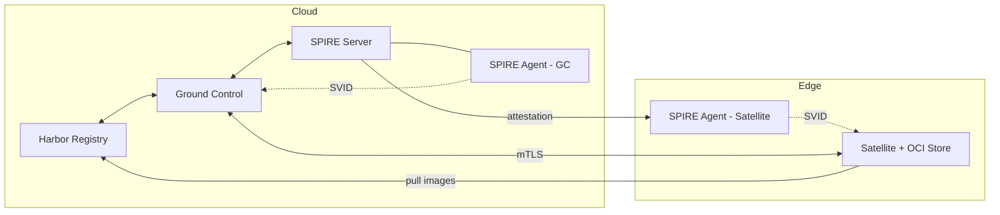
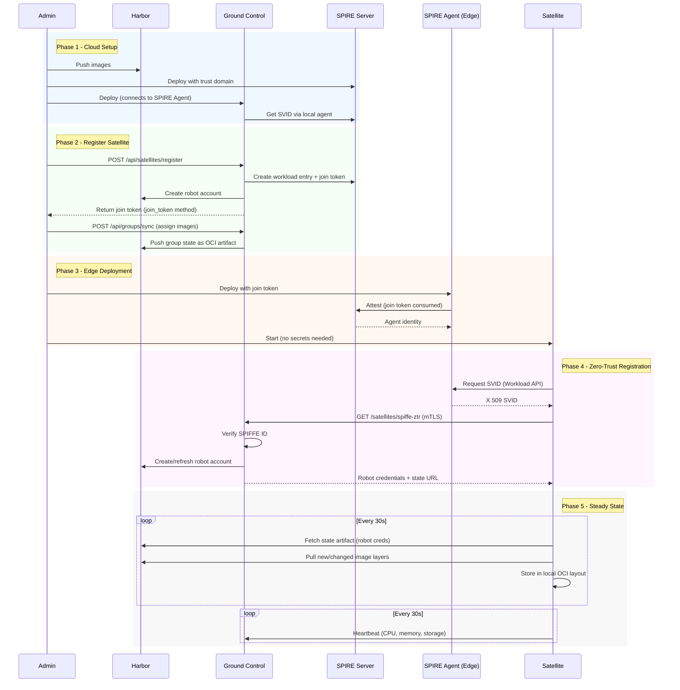

This document walks through the complete flow of Harbor Satellite - from deploying the cloud components to a satellite replicating images at the edge.



## Key Terms

- **SPIFFE** - Secure Production Identity Framework for Everyone. An open standard for service identity.
- **SPIRE** - The SPIFFE Runtime Environment. The software that implements SPIFFE.
- **SVID** - SPIFFE Verifiable Identity Document. An X.509 certificate that contains a service's SPIFFE ID.
- **mTLS** - Mutual TLS. Both the client and server present certificates and verify each other's identity.
- **Trust Domain** - A SPIFFE trust boundary (e.g., `harbor-satellite.local`). All identities within a trust domain share the same root of trust.
- **Workload Entry** - A SPIRE registration that maps a workload to a SPIFFE ID using selectors (e.g., Docker labels, Kubernetes pod properties).
- **Selectors** - Attributes SPIRE uses to identify workloads (e.g., `docker:label:service:satellite`, `k8s:pod-label:app:satellite`).
- **Robot Account** - A Harbor service account with scoped pull/push permissions, used by satellites to access images.
- **OCI Artifact** - A generic blob stored in an OCI-compliant registry. Harbor Satellite uses OCI artifacts to store state and config alongside container images.
- **ZTR** - Zero-Touch Registration. The process by which a satellite registers with Ground Control and receives its Harbor credentials, using either a single-use registration token or its SPIFFE identity.

## Components at a Glance

| Component | Where | Role |
|-----------|-------|------|
| Harbor | Cloud | Central container registry holding all images |
| Ground Control | Cloud | Fleet management, identity, credential rotation |
| SPIRE Server | Cloud | Issues and manages X.509 identities |
| SPIRE Agent (GC) | Cloud | Provides identity to Ground Control |
| SPIRE Agent (Satellite) | Edge | Provides identity to Satellite |
| Satellite | Edge | ORAS OCI layout + image replication |

## The Complete Flow

### Phase 1: Cloud Deployment

Deploy these components in your cloud environment:

#### Step 1 - Deploy Harbor

Set up your Harbor registry with the images you want to distribute. For example, push `nginx:latest` and `alpine:latest` to a project in Harbor.

#### Step 2 - Deploy SPIRE Server and Agent

Deploy a SPIRE server and a SPIRE agent in the cloud. The SPIRE agent runs alongside Ground Control and provides it with an X.509 identity (SVID).

The SPIRE server configuration uses a trust domain (e.g., `harbor-satellite.local`) and supports multiple attestation methods:

- **Join Token** - One-time tokens for bootstrapping agents (simplest)
- **X.509 PoP** - Pre-provisioned certificates (production PKI)
- **SSH PoP** - SSH host certificates (existing SSH CA infrastructure)

#### Step 3 - Deploy Ground Control

Ground Control starts up, connects to the local SPIRE agent, and gets its own identity. The SPIFFE ID comes from the workload entry you create for Ground Control; the examples use:
```text
spiffe://harbor-satellite.local/ground-control
```

Satellites can pin this ID with `--spiffe-expected-server-id`.

Ground Control also needs Harbor credentials (`HARBOR_USERNAME`, `HARBOR_PASSWORD`, `HARBOR_URL`) so it can:

- Create robot accounts for satellites
- Push state and config artifacts to Harbor
- Manage image group assignments

### Phase 2: Register a Satellite

With the cloud side running, register your first satellite through Ground Control's API.

#### Step 4 - Create a Satellite

Register a satellite in Ground Control with `POST /api/satellites/register` (system admin only). You provide:

- A name (e.g., `edge-us-east-01`)
- Optional region (e.g., `us-east`, defaults to `default`)
- The attestation method of the edge SPIRE agent: `join_token`, `x509pop` or `sshpop`
- SPIFFE workload selectors (e.g., `docker:label:com.docker.compose.service:satellite`, `unix:uid:1000`)

Ground Control:

1. Creates a SPIRE workload entry for the satellite with SPIFFE ID:
   ```text
   spiffe://harbor-satellite.local/satellite/region/us-east/edge-us-east-01
   ```
2. Finds the parent SPIRE agent: for `join_token` it generates a join token (default TTL 600 seconds) for agent ID `spiffe://harbor-satellite.local/agent/<name>`; for `x509pop` it looks up the attested agent whose certificate CN equals the satellite name (or uses `parent_agent_id`); for `sshpop` `parent_agent_id` is required
3. Creates a robot account in Harbor with pull permissions
4. Assigns the `default` config, creating it if it does not exist

#### Step 5 - Create a Group and Assign Images

Create a group (e.g., `us-east-group`) and add images to it:

- `library/nginx:latest`
- `library/alpine:latest`

Then assign this group to the satellite. A satellite can belong to multiple groups, and a group can be assigned to multiple satellites.

Ground Control stores the group state as an OCI artifact in Harbor at:
```text
harbor.example.com/satellite/group-state/us-east-group/state:latest
```

The satellite's root state (which groups it belongs to and its config) is stored at:
```text
harbor.example.com/satellite/satellite-state/edge-us-east-01/state:latest
```

### Phase 3: Edge Deployment

#### Step 6 - Deploy SPIRE Agent at the Edge

Deploy a SPIRE agent on the edge device. Configure it with:

- The SPIRE server address (TCP port 8081 must be reachable from the edge device)
- The join token generated during satellite registration (or the X.509 / SSH host certificate for the PoP methods)

The join token is a one-time bootstrap credential. Once the SPIRE agent uses it to attest, the token becomes invalid. After attestation, the agent receives a proper certificate-based identity that automatically rotates. This is the only secret that needs to be transported to the edge, and it is single-use.

The agent connects to the SPIRE server, attests itself, and becomes ready to issue SVIDs to local workloads.

#### Step 7 - Start the Satellite

Run the satellite binary with the Ground Control and Harbor URLs and the SPIRE agent socket:
```bash
harbor-satellite --ground-control-url https://gc.example.com \
                 --harbor-registry-url https://harbor.example.com \
                 --spiffe-enabled \
                 --spiffe-endpoint-socket unix:///run/spire/sockets/agent.sock
```

No secrets. No credentials. No config files to manage.

### Phase 4: Zero-Trust Registration

When the satellite starts, it goes through Zero-Touch Registration (ZTR):

#### Step 8 - Get Identity

The satellite connects to the local SPIRE agent through the Workload API socket. The SPIRE agent issues an X.509 SVID containing the satellite's SPIFFE ID:
```text
spiffe://harbor-satellite.local/satellite/region/us-east/edge-us-east-01
```

#### Step 9 - Register with Ground Control

The satellite creates an mTLS HTTP client using its SVID and sends a request to Ground Control:
```text
GET https://gc.example.com/satellites/spiffe-ztr
```

Ground Control:

1. Extracts the SPIFFE ID from the mTLS client certificate
2. Parses the satellite name and region from the SPIFFE ID path
3. Looks up (or auto-registers) the satellite in its database
4. Creates or refreshes a robot account in Harbor
5. Returns a `StateConfig` containing:
   - The satellite's root state URL (pointing to Harbor)
   - Robot account credentials (username + password)
   - Harbor registry URL

The satellite writes this config to `config.json` in its config directory. When `encrypt_config` is enabled in the satellite config, it is encrypted with AES-256-GCM using a key derived from a device fingerprint (machine-id, MAC address and disk serial, Linux only). Encryption is off by default.

### Phase 5: Steady State

The satellite runs three concurrent schedulers:

**Registration Scheduler** (retries every 5s until success, `register_satellite_interval`)

- Runs ZTR to obtain robot account credentials (`POST /satellites/ztr` with a token, or `GET /satellites/spiffe-ztr` over mTLS)
- On failure, retries on the next cycle
- Once registration succeeds and the satellite has valid credentials, the scheduler completes and stops

**State Replication Scheduler** (default: every 30s, `state_replication_interval`)

1. Fetches the root satellite state artifact from Harbor (list of group URLs + config URL)
2. For each group, fetches the group state artifact (list of images)
3. Compares current state vs desired state
4. Deletes images that were removed from groups
5. Replicates new or changed OCI content from Harbor to the selected store
6. Fetches and applies config changes, including replication intervals

**Heartbeat Scheduler** (default: every 30s, `heartbeat_interval`)

- Reports satellite status to Ground Control: CPU, memory and storage when enabled under `metrics` in the satellite config, and the cached image list in BYO registry mode
- Endpoint: `POST /satellites/sync`, authenticated with the satellite's SVID (SPIFFE) or its robot account credentials (HTTP Basic auth)
- The response can carry a `refresh_credentials` event when the robot account expires within two heartbeat intervals. The satellite then requests a new robot secret from Ground Control

## Zero-Trust Identity

Traditional approach:
```text
Admin generates credentials --> copies to every edge device --> rotates manually
```

Harbor Satellite approach:
```text
One-time join token --> SPIRE agent attests --> automatic SVID identity --> mTLS to Ground Control
```

With the join-token method, the only secret transported to the edge is a one-time SPIRE join token used to bootstrap the SPIRE agent. Once used, the token is invalidated. With X.509 PoP or SSH PoP, the bootstrap material is a pre-provisioned certificate and key. After that, the satellite's identity comes from its SVID, which is automatically issued and rotated by SPIRE. No registry credentials are shipped to the device.

Ground Control trusts the satellite because SPIRE vouches for it. Ground Control also has privileged access to the SPIRE server API, allowing it to create workload entries and generate join tokens for new satellites.

Robot account credentials (used to pull images from Harbor) are:

- Created automatically by Ground Control, valid for `ROBOT_DURATION_DAYS` (default 30)
- Delivered over the mTLS connection
- Stored in the satellite's `config.json`, encrypted with the device fingerprint only when `encrypt_config` is enabled
- Given a new secret each time the satellite runs ZTR, and refreshed when Ground Control signals `refresh_credentials` in a heartbeat response

With encryption enabled, if the satellite's hardware changes (different machine), the encrypted config becomes unreadable and the satellite re-does ZTR with its new SVID.

## State Replication

State is stored as OCI artifacts in Harbor. There are three types:

**Satellite State** - `satellite/satellite-state/{name}/state:latest`
```json
{
  "states": [
    "harbor.example.com/satellite/group-state/us-east-group/state:latest"
  ],
  "config": "harbor.example.com/satellite/config-state/default/state:latest"
}
```

**Group State** - `satellite/group-state/{group}/state:latest`
```json
{
  "group": "us-east-group",
  "artifacts": [
    {
      "repository": "library/nginx",
      "tag": ["latest"],
      "digest": "sha256:abc123...",
      "type": "image"
    }
  ]
}
```

**Config State** - `satellite/config-state/{config}/state:latest`
```json
{
  "app_config": {
    "log_level": "info",
    "state_replication_interval": "@every 00h00m30s",
    "heartbeat_interval": "@every 00h00m30s",
    "bring_own_registry": false
  }
}
```

The satellite fetches these artifacts using `crane` (from go-containerregistry), authenticating with its robot account credentials.

## Image Replication

When the satellite detects new content in its desired state, it copies the complete OCI descriptor graph from Harbor to its store with ORAS. The default store is an OCI image layout at `<config-dir>/oci` (`--registry-data-dir` overrides it). In BYO mode the store is the external registry:

1. Resolve the artifact manifest from Harbor
2. Check if the destination reference already has the same digest
3. If it exists, skip it (no work needed)
4. If not, copy missing manifests, configs, and blobs through ORAS
5. Tag the root descriptor in the store

This approach minimizes bandwidth usage - if an image update only changes one layer, only that layer gets transferred.

### Offline Behavior

If the satellite cannot reach Harbor or Ground Control, retained content remains on disk and the state replication scheduler retries on the next interval. The local OCI layout is not currently exposed through the Distribution API. Use BYO registry mode or experimental direct delivery when workloads need to consume retained content before the transparent proxy is implemented.

## Container Runtime Mirroring

Container runtime mirroring currently requires BYO registry mode. In the default mode, Satellite skips mirror configuration with a warning because the local OCI layout has no registry endpoint.

Supported runtimes:

- **containerd** - Writes `/etc/containerd/certs.d/<registry>/hosts.toml` and sets `config_path` in `/etc/containerd/config.toml`
- **Docker** - Configures `registry-mirrors` in `/etc/docker/daemon.json` (docker.io only)
- **CRI-O** - Configures mirrors in `/etc/containers/registries.conf`
- **Podman** - Configures mirrors in `/etc/containers/registries.conf`

Configure mirroring with the `--mirrors` flag:
```bash
harbor-satellite --byo-registry --registry-url registry.edge:5000 \
  --mirrors=containerd:docker.io,quay.io --mirrors=podman:docker.io ...
```

For k3s and RKE2 nodes, experimental direct delivery (`--direct-delivery`) writes image tarballs into the agent images directory instead, without any registry endpoint.

## Full End-to-End Flow


