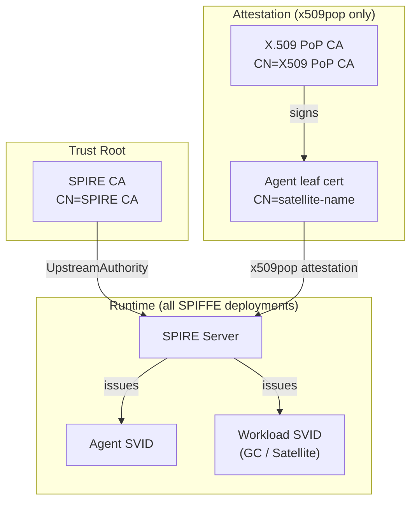

Harbor Satellite uses multiple X.509 certificate layers when SPIFFE/SPIRE is enabled. Each layer has its own **issuer** — the CA that signed the certificate. Understanding who issues what is essential for troubleshooting mTLS failures, rotating CAs, and integrating with an existing PKI.

## Certificate Layers at a Glance

| Layer | Issuer | Purpose | Lifetime |
|-------|--------|---------|----------|
| SPIRE upstream authority CA | Self-signed (or your org root CA) | Trust root for all SPIFFE identities | Long-lived (e.g., 1 year) |
| X.509 PoP CA | Self-signed bootstrap CA | Signs agent attestation certificates (x509pop only) | Long-lived |
| Agent attestation cert | X.509 PoP CA | Proves node identity to SPIRE server at bootstrap | Long-lived |
| Agent SPIFFE ID cert | SPIRE server CA | SPIRE agent identity after attestation | Short-lived, auto-rotated |
| Workload SVID | SPIRE server CA | mTLS identity for GC and Satellite workloads | Short-lived, auto-rotated |



## Layer 1: SPIRE Upstream Authority CA

Every SPIFFE deployment needs a trust root. Harbor Satellite examples generate a self-signed CA:

```text
Subject: CN=SPIRE CA, O=Harbor Satellite
Issuer:  CN=SPIRE CA, O=Harbor Satellite   (self-signed)
```

SPIRE server loads this CA via the `UpstreamAuthority "disk"` plugin:

```hcl
UpstreamAuthority "disk" {
    plugin_data {
        key_file_path = "/opt/spire/conf/server/ca.key"
        cert_file_path = "/opt/spire/conf/server/ca.crt"
    }
}
```

SPIRE uses this CA to sign its intermediate CA, which in turn issues all SVIDs. Agents and workloads trust this same CA bundle when verifying peers.

**Production tip:** Replace the example self-signed CA with a certificate signed by your organization's root CA. Mount the key and cert into the SPIRE server config the same way.

## Layer 2: X.509 PoP CA (x509pop attestation only)

When using [X.509 PoP attestation](/docs/quickstart/), agents prove their identity with pre-provisioned certificates instead of join tokens. A separate CA signs these attestation certificates:

```text
Subject: CN=X509 PoP CA, O=Harbor Satellite
Issuer:  CN=X509 PoP CA, O=Harbor Satellite   (self-signed)
```

SPIRE server trusts this CA via the x509pop node attestor:

```hcl
NodeAttestor "x509pop" {
    plugin_data {
        ca_bundle_path = "/opt/spire/conf/server/x509pop-ca.crt"
    }
}
```

This CA is **only** used for initial node attestation. It does not issue SVIDs and is not involved in mTLS between Ground Control and Satellite.

Join-token and SSH PoP deployments do not use this layer.

## Layer 3: Agent Attestation Certificates

Each SPIRE agent gets a leaf certificate signed by the X.509 PoP CA:

```text
Subject: CN=agent-satellite, O=Harbor Satellite
Issuer:  CN=X509 PoP CA, O=Harbor Satellite
```

The CN must match `satellite_name` in the Ground Control registration API. Ground Control matches x509pop agents with selector `x509pop:subject:cn:<satellite_name>`. In the x509pop example, `generate-certs.sh` sets `CN=agent-satellite` and `setup.sh` registers `satellite_name: agent-satellite`.

Key requirements:

- **CN must match `satellite_name`** used during registration in Ground Control
- **SPIFFE URI SAN** identifies the agent type (e.g., `spiffe://harbor-satellite.local/agent/satellite`)
- **`authorityKeyIdentifier=keyid,issuer`** extension links the leaf cert back to the PoP CA

After attestation, SPIRE assigns the agent a SPIFFE ID based on the certificate fingerprint:

```text
spiffe://harbor-satellite.local/spire/agent/x509pop/<fingerprint>
```

By default, SPIRE's x509pop plugin uses the certificate DER **SHA-1** fingerprint in the agent path. A different hash requires an explicit `agent_path_template` in the SPIRE server config.

## Layer 4: Workload SVIDs (mTLS Identity)

Once attested, SPIRE issues short-lived X.509 SVIDs to workloads (Ground Control and Satellite). These are the certificates used for mTLS:

```text
Subject: CN=spiffe://harbor-satellite.local/ground-control
Issuer:  CN=SPIRE Intermediate CA   (signed by SPIRE CA)
```

Example workload SPIFFE IDs:

| Workload | SPIFFE ID |
|----------|-----------|
| Ground Control | `spiffe://harbor-satellite.local/ground-control` |
| Satellite | `spiffe://harbor-satellite.local/satellite/region/<region>/<name>` |

SVIDs rotate automatically (default TTL: 1 hour). You do not manage these certificates manually.

## Inspecting Certificate Issuers

Use `openssl` to inspect any certificate in the chain:

```bash
# Show issuer and subject (x509pop example: agent-satellite.crt)
openssl x509 -in certs/agent-satellite.crt -noout -issuer -subject

# Full certificate details
openssl x509 -in certs/agent-satellite.crt -noout -text | grep -A1 "Issuer\|Subject\|URI"
```

Example output for an agent attestation certificate:

```text
issuer=CN=X509 PoP CA, O=Harbor Satellite, L=City, ST=State, C=US
subject=CN=agent-satellite, O=Harbor Satellite, L=City, ST=State, C=US
```

Verify a leaf certificate chains to the PoP CA:

```bash
openssl verify -CAfile certs/x509pop-ca.crt certs/agent-satellite.crt
```

List attested agents and their SPIFFE IDs:

```bash
docker exec spire-server /opt/spire/bin/spire-server agent list \
    -socketPath /tmp/spire-server/private/api.sock
```

## Attestation Method Comparison

| Method | Attestation issuer | SVID issuer | Secrets transported to edge |
|--------|-------------------|-------------|-------------------------------|
| Join token | SPIRE server (one-time token) | SPIRE server CA | Join token (single-use) |
| X.509 PoP | X.509 PoP CA | SPIRE server CA | Agent cert + key |
| SSH PoP | SSH CA | SPIRE server CA | SSH host key + host certificate |

For SSH PoP, the host private key and host certificate (signed by the SSH CA) are generated on the cloud/Ground Control side by `generate-certs.sh` and pre-provisioned to the edge device together.

In all cases, ongoing mTLS between Ground Control and Satellite uses SVIDs issued by the SPIRE server CA.

## Common Issues

### Agent fails to attest (x509pop)

- **Issuer mismatch:** Leaf cert not signed by the CA in SPIRE server's `ca_bundle_path`. Run `openssl verify -CAfile certs/x509pop-ca.crt certs/<agent>.crt`.
- **CN mismatch:** Certificate CN does not match `satellite_name` in the registration API call.
- **Expired cert:** Check `openssl x509 -in certs/<agent>.crt -noout -dates`.

### mTLS handshake fails between GC and Satellite

- **Trust bundle mismatch:** Both sides must trust the same SPIRE upstream authority CA. Verify agents use the correct `trust_bundle_path`.
- **Workload entry missing:** SVID is issued only after a SPIRE workload entry maps the agent to a SPIFFE ID. Check with `spire-server entry show`.
- **SVID expired:** SPIRE rotates SVIDs automatically. If rotation is broken, check SPIRE agent logs.

### SPIRE server CA rotation

Rotating the upstream authority is a staged process. The steps below apply to Harbor Satellite's `UpstreamAuthority "disk"` deployments (SPIRE 1.14.x). For SPIRE-managed local signing keys, use `spire-server localauthority x509 prepare` and `spire-server localauthority x509 activate`. See the [SPIRE Upstream Authority documentation](https://spiffe.io/docs/latest/deploying/upstream_authorities/) for your deployment model.

1. **Prepare** a new upstream authority key pair (`ca.crt` / `ca.key`, or an org-signed equivalent).
2. **Overlap trust bundles:** Add the new root CA to every SPIRE agent trust bundle while keeping the old root. Restart agents and confirm they remain healthy.
3. **Switch server authority:** For the disk plugin, replace the `UpstreamAuthority "disk"` cert and key files on disk (the plugin reloads them on the next CSR; no server restart required). For other plugins, update server config and restart as documented.
4. **Verify issuance:** Confirm new SVIDs chain to the new authority (`spire-server bundle show`, check agent SVID renewal in logs).
5. **Taint and revoke old authority:** After agents accept the new bundle and new signatures are issued, taint then revoke the old upstream CA (`spire-server upstreamauthority taint`, `spire-server upstreamauthority revoke`). For SPIRE-managed local keys, use `spire-server localauthority x509 taint` / `revoke` on the old key.
6. **Retire old CA from bundles:** Remove the old root from agent trust bundles only after all agents have renewed SVIDs under the new authority.
7. **Rollback:** If the new authority cannot sign intermediates or agents fail to attest, revert the upstream cert/key files (or server config), restore the original agent trust bundles, and restart the server then agents.

Plan rotation before the CA expires. Expired upstream CAs prevent SVID issuance for the entire fleet.

## Related Documentation

- [Quickstart](/docs/quickstart/) — End-to-end x509pop deployment with certificate generation
- [Architecture](/docs/architecture/) — Full SPIFFE registration and mTLS flow
- [X.509 PoP example](https://github.com/container-registry/harbor-satellite/tree/main/examples/deploy/spiffe/x509pop) — `generate-certs.sh` and Docker Compose setup
- [ADR 0005: SPIFFE Identity and Security](https://github.com/container-registry/harbor-satellite/blob/main/docs/decisions/0005-spiffe-identity-and-security.md) — Design decisions
