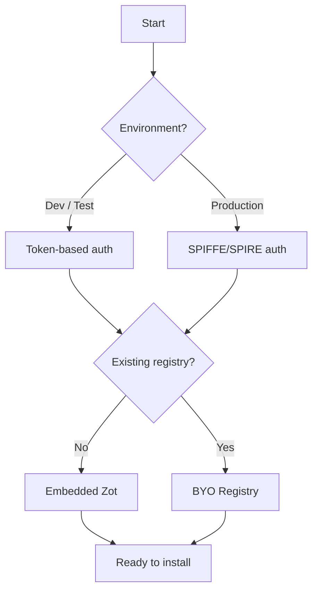
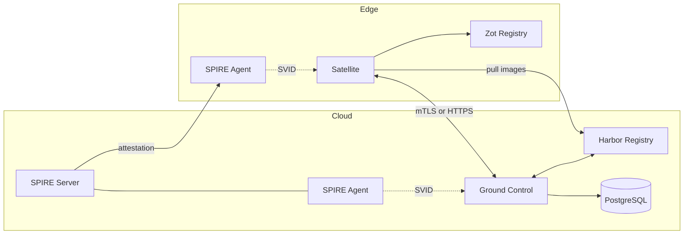
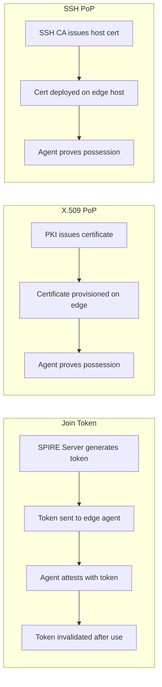

# Overview

Harbor Satellite extends Harbor to edge computing environments. For a full introduction, see the [home page](index.md). This page covers deployment options, supported platforms, and how to choose the right setup for your environment.

## Deployment Models

Harbor Satellite supports two authentication flows and two registry modes. Pick the combination that fits your environment.

### Authentication: Token-based vs SPIFFE

- **Token-based** - Ground Control issues a static token when you register a satellite. Pass it to the satellite binary with `--token`. Best for development, testing, and simple deployments where managing SPIFFE infrastructure is unnecessary.

- **SPIFFE/SPIRE** - Zero-trust identity using X.509 SVIDs. A SPIRE server issues cryptographic identities to satellites via SPIRE agents. Ground Control verifies identity over mTLS and automatically provisions Harbor robot account credentials. Best for production, multi-tenant, or security-sensitive environments.

### Registry: Embedded Zot vs BYO

- **Embedded Zot** (default) - Satellite runs an embedded [Zot](https://zotregistry.dev) OCI registry. No external registry needed. Images are stored locally and served to workloads.

- **Bring Your Own (BYO) Registry** - Point satellite at an existing registry with `--byo-registry --registry-url <url>`. Satellite replicates images to your registry instead of running its own.

### Choosing a Deployment Model



## Component Architecture

Harbor Satellite has cloud-side and edge-side components that communicate over HTTPS (token-based) or mTLS (SPIFFE).



| Component | Location | Role |
|-----------|----------|------|
| Harbor | Cloud | Central container registry holding all images |
| Ground Control | Cloud | Fleet management, satellite onboarding, credential rotation |
| PostgreSQL | Cloud | Ground Control database |
| SPIRE Server | Cloud | Issues X.509 identities (SPIFFE deployments only) |
| SPIRE Agent (GC) | Cloud | Provides identity to Ground Control (SPIFFE only) |
| SPIRE Agent (Sat) | Edge | Provides identity to Satellite (SPIFFE only) |
| Satellite | Edge | Replicates images, serves local registry |
| Zot | Edge | Embedded OCI registry (or BYO alternative) |

## Supported Platforms

Built from the GoReleaser configuration:

| OS | Architectures |
|----|---------------|
| Linux | amd64, arm64, 386, ppc64le, s390x, riscv64, mips, mipsle, mips64, mips64le, loong64 |
| macOS (Darwin) | amd64, arm64 |

Package formats: tar.gz, rpm, deb, apk, archlinux.

Container images:

- Satellite: `registry.goharbor.io/harbor-satellite/satellite`
- Ground Control: `registry.goharbor.io/harbor-satellite/ground-control`

## Supported Container Runtimes

Satellite can configure local container runtimes to use its registry as a mirror. Workloads pull from the local registry first, falling back to the upstream registry.

| Runtime | Mirror Config Location | Notes |
|---------|----------------------|-------|
| containerd | `/etc/containerd/config.toml` | Mirrors any registry |
| Docker | `/etc/docker/daemon.json` | Mirrors docker.io only |
| CRI-O | `/etc/crio/crio.conf.d/` | Mirrors any registry |
| Podman | `/etc/containers/registries.conf` | Mirrors any registry |

Usage:

```bash
satellite --mirrors=containerd:docker.io,quay.io --mirrors=podman:docker.io
```

Docker only supports mirroring docker.io. Use `--mirrors=docker:true` to enable.

## SPIFFE Attestation Methods

When using SPIFFE/SPIRE, the SPIRE agent at the edge must attest (prove its identity) to the SPIRE server. Three methods are supported:



| Method | Use Case | Bootstrap Secret |
|--------|----------|-----------------|
| Join Token | Simplest setup, dev/test | One-time token (invalidated after use) |
| X.509 PoP | Production with existing PKI | Pre-provisioned X.509 certificate |
| SSH PoP | Environments with SSH CA infrastructure | SSH host certificate |

## Next Steps

- [Installation](installation.md) - Install Ground Control and Satellite
- [Architecture](architecture.md) - Detailed flow of all components
- [Quickstart](quickstart.md) - End-to-end SPIFFE deployment walkthrough
